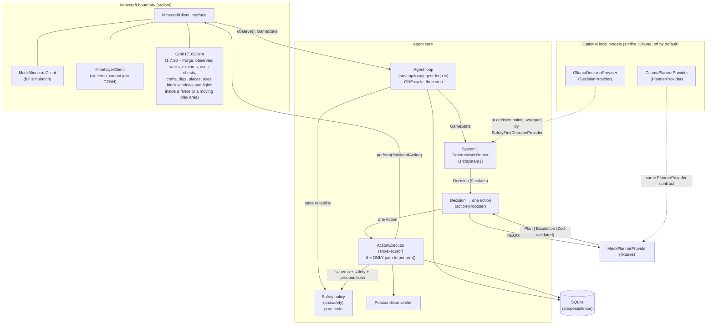

# Architecture

A typed, safety-first agent core that runs one observe → decide → validate → execute → verify
cycle against a mock Minecraft world or a private test server (and bounded runs of such cycles).
Local models (Ollama) can make the decisions and write plans, opt-in; they only ever propose
(see [local-llm-integration.md](local-llm-integration.md)).

## Components



## Roles

| Component                                                        | Role                                                                                                                                                                                                                                    | Authority                                                                                                                                                   |
| ---------------------------------------------------------------- | --------------------------------------------------------------------------------------------------------------------------------------------------------------------------------------------------------------------------------------- | ----------------------------------------------------------------------------------------------------------------------------------------------------------- |
| **MinecraftClient** (`src/bot`)                                  | The only boundary to the game. `observe()` returns a normalized `GameState`; `perform()` takes a `ValidatedAction` token.                                                                                                               | Performs actions, but only ones minted by the executor (runtime-checked).                                                                                   |
| **Safety policy** (`src/safety`)                                 | Pure functions: state reliability, dangers, per-action rules, protected items, boundaries, forbidden-modification denylist, repeated-failure cap.                                                                                       | **Veto over everything.** No model can override it.                                                                                                         |
| **Deterministic router** (`src/system1/deterministic-router.ts`) | System 1: prioritized, transparent rules that map a state to one of 9 bounded decisions, with confidence, reason codes and facts.                                                                                                       | Chooses _what kind_ of step; cannot execute.                                                                                                                |
| **System-1 model** (`src/llm/ollama-decision-provider.ts`)       | Opt-in (`decisions.provider: ollama`): a local model picks one of the 9 decisions from facts computed by code, by default only at decision points (see [System 1](#system-1-who-decides-each-cycle)).                                   | Always wrapped in `SafetyFirstDecisionProvider`: the router's safety decisions and every pause win, invalid output becomes PAUSE.                           |
| **Action proposer** (`src/system1/action-proposer.ts`)           | Turns one decision into exactly one allowlisted action (approaching a target first if it is out of reach).                                                                                                                              | Proposes only.                                                                                                                                              |
| **LLM planner** (`src/llm/ollama-planner-provider.ts`)           | Opt-in (`planner.provider: ollama`): returns a strict `Plan` or an `Escalation`. Called only for `REQUEST_PLANNER`, and only when the task has no open plan.                                                                            | **None.** Plans are validated and stored; one step per cycle goes through the executor like any other action. Plans that ask for approval wait for a human. |
| **ActionExecutor** (`src/executor`)                              | The single controlled path: schema → safety → preconditions → persist → execute → observe → verify → persist.                                                                                                                           | Sole minter of `ValidatedAction` (lint-enforced).                                                                                                           |
| **Persistence** (`src/persistence`)                              | SQLite (better-sqlite3): tasks, checkpoints, plans with their progress, state snapshots, action logs, an append-only event log, safety violations, named locations, protected items, world memory (what the agent has seen, per chunk). | Audit trail; failure history feeds the repeated-failure rule.                                                                                               |

## One cycle

1. Observe (or receive) a `GameState`; reject it if it fails schema validation.
2. Overlay agent memory (a paused/blocked task stays halted; last action) and persist a snapshot.
3. Hard safety check of the _state_: unknown, stale or inconsistent → forced `PAUSE_AND_ASK_USER`,
   whatever any decision provider says.
4. Ask the `DecisionProvider` (the deterministic router, or a model inside
   `SafetyFirstDecisionProvider`, asked only at decision points by default) for one decision
   (see [System 1](#system-1-who-decides-each-cycle)).
5. Convert it to exactly one proposed action. For `REQUEST_PLANNER`: run the next step of the
   task's active plan (for a `GATHER` step, the action code chooses for it this cycle); or, if
   its plan still waits for approval, pause; or else ask the planner for a new plan (see
   [Plans across cycles](#plans-across-cycles)).
   If deciding or planning took so long (a model) that the observation is now stale, observe
   again: the action is validated against the new observation (a second snapshot, logged as a
   `STATE` event marked `reobserved`). The executor always checks freshness against the clock at
   execution time.
6. Validate the action (schema, safety policy, preconditions) and persist the result.
7. Execute through `MinecraftClient.perform()` only if validation passed.
8. Observe again and verify the action's postcondition.
9. Persist the outcome; pause or block the task if needed. **Stop.**

## System 1: who decides each cycle

System 1 chooses the kind of step each cycle, one of the ten decisions
(`decisions.provider`, built in `src/app/providers.ts`):

- **The rule router** (`deterministic`, the default): `routeDecision`
  (`src/system1/deterministic-router.ts`), a pure, prioritized rule list over the observation.
- **A local model** (`ollama`): `OllamaDecisionProvider` picks a decision from facts computed by
  code, always inside `SafetyFirstDecisionProvider`. The router's binding decisions (safety,
  every pause) win without asking it, invalid output pauses, and a pause, retreat, meal, rest or
  fight the facts rule out is overruled (see [local-llm-integration.md](local-llm-integration.md)).

Low health with nothing threatening the player and the food bar high enough to heal
(`minHungerToHeal`, 8: HungerOverhaul stops natural healing below it) is `REST`: a `WAIT` of
`restMs` (30 s) where it stands, again until health is back above `minHealth`. Too hungry to
heal, it retreats or pauses as before; during the night-shelter task the shelter's steps come
first (the pit is where resting is safe). Seen live: at 8 health with no food, the retreat
home was 100 blocks through a forest, and the pause there healed nothing (nothing heals
offline).

A retreat (`RETREAT_HOME`) from a creature goes back along the agent's own trail when that
is nearer than home (`src/app/loop/trail.ts`): the agent remembers where it stood out of danger
lately (a point every 4 blocks, the last 48, never in a night task), and the newest point 8 to
48 blocks back, on the far side of the player from the nearest creature and clear of every one
by the threat radius plus 4, becomes the safe location `trail` for that cycle. Two failed
retreats along the trail from the same block send it home instead. Seen live: one spider sent
the agent 108 blocks back to its spawn. That spider was in daylight, where a spider leaves a
player alone: such a calm spider is no threat at all now (see
[Combat](#combat)), and trail points stay 10 blocks from one (its leap, 6, plus 4).

### A model at decision points

On live runs the router decided what qwen3:14b decided on 88 of 89 decisions, and the model
took 2.2 s a decision (median; 10 s at worst). So since 2026-10-01 the model decides only at
**decision points** (`decisions.modelCadence: decision-points`, the default;
`AGENT_DECISION_CADENCE`). Every other cycle continues the open plan at once with the
router's decision: usually `REQUEST_PLANNER`, which runs the plan's next step (or a GATHER's
next dig) with no planner call either. `ModelCadenceProvider` (`src/system1/model-cadence.ts`,
itself a `SafetyFirstDecisionProvider`) does this each cycle:

1. The router decides. A binding decision (safety, any pause) wins, and nobody else is asked.
2. `decisionPoint`, a pure function, compares this cycle with the session's previous one
   (`cycleView`: the router's decision, the dangers, the plan, the last action...). The model is
   asked when:
   - it is the session's first cycle (`cli once`, `cli run`, each session of `cli play`);
   - the previous cycle's action failed, was rejected or not verified, or paused;
   - the model decided the previous cycle and chose otherwise than the router: going on with
     the router's decision would undo its choice, so it decides until it agrees again;
   - the task's plan ended since the previous cycle began (completed, failed, superseded), or
     the router asks for the planner and no plan is open to continue: the model decides before
     the planner is asked for a new plan;
   - a condition changed: the router's decision or reason codes, the dangers (a mob, a hazard,
     low health or food), hunger, the task, the time of day (day, evening, night, dawn), or the
     inventory became nearly full (or has room again).
3. Otherwise the router's decision goes on (provider `continuing(deterministic-router)`).

The agent loop gives System 1 the task's latest plan (`RouterContext.plan`, `taskPlanFacts`);
the rules ignore it. A binding cycle is a previous cycle too, so the cycle after a detour (a
retreat from a mob, a meal) asks the model: the mob is the router's to handle, what comes after
it the model's. In `run` and `play` such a detour ends the session anyway, and the next one
starts with the model. `modelCadence: every-cycle` asks the model on every cycle the router
does not decide alone, as before.

Every decision records which way it went in `factsUsed` (in the DECISION event):

- `cadence`: `model`, `continuing` or `binding`;
- `cadenceWhy`: why the model was or was not asked, e.g. "plan #1 ended (completed); no open
  plan to continue", "the previous DIG_BLOCK failed" or "nothing changed since the previous
  cycle: plan #1 step 1/1 (GATHER) goes on";
- `modelMs`: the model call's time.

`cli play` and `cli run` print each cycle's System 1 line with the provider: the model's name
(`ollama:qwen3:14b`) when it decided, `continuing(deterministic-router)` when the plan went on,
`safety-first(...)` for a binding decision. Each session ends with a stats line, e.g. "System 1
over 20 cycle(s): 1 model decision(s) (median 2.1 s), 19 continued without the model, 0 binding
router decision(s)", and `cli play`'s summary has the total.

Measured on the mock world with a fake model (`tests/app/loop/decision-points.test.ts`): a GATHER of
54 sand takes 61 cycles (54 digs, 7 walks) and asks the model once, at its start. With the two
plans after it, that is 3 model decisions in 63 cycles; `every-cycle` makes 63.

## Live tasks

The live server knows nothing about the agent's tasks, so they come from agent memory
(`src/persistence/memory-repository.ts`, migration 003):

- `cli task-add` stores a task and makes it the **current task** (`agent_state.current_task`).
  Only live observations (`source: gtnh1710`) get it filled in. Mock scenarios share the database
  and never see it. A completed or failed task is never filled in.
- A plan the human wrote (`--plan`) goes through `validatePlan` exactly like a planner's plan. It
  is stored with planner `operator`, and when it completes it completes the task.
- Machines the task depends on (`--machines`, table `task_machines`) become the live state's
  `knownRecipeState.requiredMachineIds`, so System 1's machine rules apply:
  - busy or **not seen** → `WAIT_FOR_MACHINE`;
  - switched off (`error`) → pause;
  - unpowered → the planner;
  - otherwise the plan goes on.
    An unseen machine is never assumed ready. Right after connecting, GregTech's machine packets
    may not have arrived yet.
- **Container memory:** the loop records every container whose contents it sees (before and after
  each action). A later cycle, in a new connection with the chest closed, gets those contents back
  for `memory.containerContentsMaxAgeMs`, but only for the executor's feasibility checks. The live
  client re-reads the real contents before it clicks anything, and verification compares the
  remembered "before" with the live "after", so a chest changed by someone else shows up as a
  verification failure.

### Bounded auto-run

`src/app/loop/live-session.ts` (`cli run --live`) runs ordinary cycles back to back on one connection
for the current task. It adds no decision logic and no checks of its own. It only decides whether
to start another cycle, and it continues only while each cycle:

- succeeded;
- asked for no attention;
- decided `REQUEST_PLANNER`, `EXECUTE_KNOWN_SAFE_STEP` or `WAIT_FOR_MACHINE` (task progress).

Anything else stops it: a finished task, a safety retreat, eating, upkeep, a pause, a failure,
the cycle or time cap, the stop file, Ctrl+C or a lost connection. There is still no open-ended
loop: every run is started by a human and bounded.

## Quest goals and autonomous play

The agent's goals come from GTNH's own quest book, like a new player's, and **progress is what
the server's quest book records**, never the agent's own judgement. The benchmark is "Finish
Age 0": every quest of the 92-quest "Tier 0 - Stone Age" chapter (37 main quests) completed in
the server's Better Questing records for the agent's player.

### Quest goals

- **The data.** `scripts/extract-quests.ts` reads the world's own quest database
  (`<world>/betterquesting/QuestDatabase.json`, what the server runs) into
  `src/goals/age0-quests.ts`: the chapter's 92 quests and the 14 quests it needs from other
  chapters (its prerequisites, recursively: the closure, 106 in all). Per quest: the exact 64-bit
  id, prerequisites with their logic (AND/OR/XOR...), task logic (AND/OR), main flag, chapter,
  lockedProgress, tasks (index, type, consume, items with ore dictionary names, whether crafts
  from the player's statistics count) and rewards (which one is a choice).
- **The server's records.** The live client reads the quest book over Better Questing's own
  channel (`src/bot/gtnh1710/better-questing.ts`; see gtnh-compatibility.md, "Quest book") into
  `GameState.questBook`: for each closure quest, completed, claimed, active and unlocked, each
  task's completion and the server's count, and the rewards still to claim. It is unknown until
  the server's sync after login has arrived.
- **The logic** (`src/goals/quest-goals.ts`, pure) follows Better Questing:
  - a quest unlocks by its prerequisite logic over completed quests (XOR: the two smeltery
    quests exclude each other, and the next one accepts either, OR);
  - it completes in the server's quest loop once its tasks satisfy the task logic: AND, or OR
    (one task is enough); optional retrieval counts as done;
  - retrieval tasks count what is held (a met count stays); consume tasks count what a submit
    handed in; crafting tasks count only the server's count of crafts made while the quest was
    active (holding the item never counts); checkboxes are ticked in the quest book.
- **The next goal** is the shallowest quest the server lists as active and unlocked, that the
  agent's abilities can finish (hunting, locations and unknown crafts cannot), and that clicks
  alone do not finish; main quests first, then quest-book layout. Its task's subgoal lists the
  quest's remaining tasks by the server's count. Its requirements (the planner's route) name
  exactly what to have: held ore-dictionary items under their own names (birch logs for
  `logWood`), and for a crafting task what is held plus the crafts still to make.
- **Quest-book clicks** (`questBookSteps`), decided in code, never by a model: claims of
  completed quests' rewards (only with room in the inventory; a choice reward takes the first
  item an unfinished quest asks for), checkbox ticks (when the tick, plus a submit, completes
  the quest), and submits (items to hand in, or items held from before the quest was active,
  which the server has not counted). A quest whose tasks are all done is left to the server's
  quest loop; play waits a few seconds for it when nothing else is left.
- The last observation of the server's records is kept in agent memory
  (`quests.age0.server`), so `cli quests` shows it without a connection.

### Routes, nights and the play loop

**Routes: the planner takes stock before it plans.** A task can name the items its goal
needs (quests do; `cli task-add --needs item=count,...` for any goal). For those,
`src/goals/route.ts` calculates in code, from the agent's recipes and gathering sources
(`src/goals/route-book.ts`) and the places it has seen, exactly what the goal still needs:
have vs need per item, the raw materials to gather in total, every gather and craft step in
order (ingredients before what they make), the best known place for each material (the
nearest with enough seen: blocks in view now, and places world memory remembers from
exploring, marked "remembered"), where a player would look when no place is known (the
nearest seen biome where it is common, e.g. grass in a forest, never in a desert; for gravel,
clay and sand, the shore of the nearest water seen), and a rough time. The planner gets the
route in its request and plans along it; the model still makes every decision. The route is
general: smelting, tools, mob drops and exported recipe data
are new book entries, not new planner logic. The book holds GTNH's real recipes, ore veins
and harvest levels (see [Knowledge base](#knowledge-base)).

**Any goal, not only quests.** `cli play --live --needs item=count,...` makes play pursue a
goal of the player's own (task `goal-...`) exactly like a quest: the planner gets its route,
sessions and the journal work the same way, and play ends when the items are held. How
far a goal can be routed depends on the route book: items it cannot make or find yet are
listed as such, and the planner escalates rather than guessing; a material that only has
no known place yet is explored for, not escalated.

**Storage in the stocktake.** Containers whose contents the agent knows (seen now, or
remembered) count as "stored": the route fetches from them, nearest first, before it
gathers or crafts (withdraw steps), and the planner sees what each container holds.

**Nights.** Two real minutes before night (and at night), play turns to a shelter. Code plans
it and runs it, step by step, as known safe steps (see
[Code-made blueprints](#code-made-blueprints-known-safe-steps)); the planner is not asked
(seen live on 2026-10-01: a planner skipped the blueprint's order and tried the roof first).

- **The night pit** (first choice; [Digging down](#digging-down-the-night-pit)), as a
  first-night player digs one on flat ground: from feet level y, three `DIG_DOWN`s, falling a
  block each time, to feet at y-3; then the roof, placed in the y-1 cell (the ground layer it
  dug through) against the natural ground beside it, whose inner faces look at the eyes
  (y-1.38). The roof is dirt or a log, which the agent digs again in the morning (the digs
  themselves give dirt). Code picks the spot (the player's column, or one next to it the
  walker reaches) and checks before digging, with the live client's own rules on a what-if copy
  of the world (`src/bot/gtnh1710/night-pit.ts`): every dig down (exactly one block, no fluid,
  hazard or unloaded block near), natural walls (the 3 x 3 columns around plain full blocks
  down to y-3, sand and gravel only on solid ground), the roof's placement, and a way out for
  the morning. The pit's spot is kept in agent memory (`night_pit`), so a pit interrupted
  half-way is finished, not started again; finishing it also closes, with a carried block, each
  cell beside the body that is open (a way out dug there that stopped halfway: seen live
  2026-10-04, the roof went back, the first step of the staircase stayed open beside the head).
  A shelter that is open with no step from code ends play for the night (offline until
  sunrise): a session would ask the planner, and the planner never improvises a shelter (the
  same night, asked so, it dug the pit's own walls).
- **The raised box** (second choice, `src/goals/shelter.ts`): four walls at feet level and four
  at head level around the player, then the roof. From inside it no wall's top face looks at
  the eyes, and nothing touches the roof cell, so the box works only where something solid
  already touches the roof cell from the side or above (a cliff, a trunk); on open ground it
  cannot be roofed (the old roof support was never placeable, seen live).
- **Neither** (stone underfoot, water near, no roof block...): play stops before dark with the
  reasons, and `cli play` waits offline until sunrise.

Enclosed, the agent waits for sunrise. In the morning, walled in, code plans the way out with
the same rules (`planShelterExit`): from the pit, the roof and a staircase (two digs for each
step up, the upper block first), then a walk onto open ground at the pit's ground layer or
above (open cells below it, a cave or the staircase of a way out that stopped halfway, are no way
out: seen live 2026-10-04, a restart stopped one after its first step and the next morning's
plan walked out onto that step, two blocks under the ground, where no retreat could leave); from
the box, one wall (head level first) and a walk out. Play runs it as known steps before the day's goal, and the goal's
journal says the walls are open again. Walled in with no way out, play stops and says why,
unless an owner's command is running or queued: that goes first, since it may be the way out
(`!surface` and `!home` pillar and dig; seen live 2026-10-04 at the bottom of an 8-deep shaft the
bot had dug down to stone, play ended every round before the command round and spun at 100%
CPU with `!surface` waiting). With no wall or staircase it may dig, the way out is a climb on
MOVE_TO's own path rules (`planClimbOut`): through the roof and up a pillar, from the night pit
or from a shaft the bot dug down by walking (`shaftSite`: its column, and the rim a side column
offers within 16 blocks up). A path the search found but cut (a later movement no longer holds
once earlier ones changed blocks) goes on from where the cut leaves the player, on a what-if
copy of the world, up to 6 searches (seen live 2026-10-04: 5 blocks under the ground, "cut after
3 movement(s)" kept the agent in; its test runs on that terrain, saved from the world).

**Sealed in with mobs near.** The live observation reports whether the player is sealed in
(`player.sealed`, `sealedIn` in `night-pit.ts`): the cells beside its feet and head, above its
head and below its feet are all known full blocks, so no door, fluid or thin block lets a mob
through. Then System 1 does not retreat or fight while hostiles (or unidentified entities) are
near, since a walk cannot leave the pit and no blow lands through its walls: it decides
`PAUSE_AND_ASK_USER` with `SHELTERED`, unless the player was hurt a moment ago or lava is near
(then the usual rules decide). The hostiles still stop every other action. In the morning, play
waits inside while they are near (the sun burns zombies and skeletons), looking again every
5 s, answering commands as at night and saying so in `!status`; it digs out once they are gone,
and the wait spends none of the exit's tries (seen live 2026-10-04: zombies about the pit at
sunrise, the retreat home failed from inside it session after session, and the exit gave up).
After 5 minutes of it (`MOB_SHELTER_MAX_MS`: a mob in a cave beside the pit, or a creeper, may
stay all day) play waits offline instead, as for a mob near home; hurt a moment ago, the player
counts as not sheltered, and the usual rules decide.

**A mob near home.** When System 1 pauses only because a mob is near (`HOSTILES_NEARBY` or
`UNCLASSIFIED_ENTITY_NEARBY`) and the agent is already home or has no home, play does not hand
the pause to a person: it sets the task active again, notes it in the journal, and `cli play`
waits offline for 30 s (an offline player cannot be hurt) and plays on, at most 6 times in a
row (`MOB_WAIT_MS`, `MAX_MOB_WAITS` in `src/app/play/play.ts`); with `--listen` it then waits
5 minutes at a time (`MOB_LONG_WAIT_MS`) instead of quitting. Every new session re-checks the
state from scratch, so a mob that is still there pauses it again. An idle bot standing by does
the same (`standbyReason` answers `mob`): seen live 2026-10-04, a zombie followed the bot home,
where the pause had it stand still until it was killed. Sealed in its shelter it stays online. So
does any session that ends on an answer to a mob that failed (`mobPause`: a retreat that found no
way home, perhaps fleeing a little instead, or was refused as a repeated failure; a fight back):
an owner's command waiting is told ("A mob is near: I go offline a moment for it to leave") and
goes on after (seen live the same day: a trip into a ravine of mobs gave up after its retreats
failed, and the bot stood there idle until it was killed).

**Food** (`src/app/play/food.ts`, `src/domain/food.ts`; approved 2026-10-01). Seen live: food 9/20
with nothing to eat, its only apple eaten. Below food 6 with no food System 1 retreats or
pauses, so within a game day or two the agent would starve its own play. GTNH's quest "Sticks
'n Stones" sends a new player to Pam's HarvestCraft gardens. So, as play turns to a shelter at
dusk, it turns to food by day:

- **When.** Hungry (below `hungerEatThreshold`, 14) with nothing carried that would restore
  anything, play makes `get-food` the current task and runs bounded sessions on it until the
  agent carries `FOOD_TRIP_POINTS` (10 hunger points, about a day of food); then the quest goes
  on where it stopped. A quest session ends as soon as an observation shows the agent hungry
  with nothing to eat. At dusk the shelter comes first, and the trip goes on in the morning.
- **What counts.** Food is counted in hunger points as this server gives them:
  HungerOverhaul's own values (most foods restore 1; seen live, an apple took food from 8 to
  9), scaled by Spice of Life for how often the food was eaten among the last 20 meals and
  rounded down (a 1-point food eaten 5 times lately restores nothing). The agent's meals come
  from its action log (`recentMeals`). System 1 eats the carried food that restores the most
  now; a food that would restore nothing counts as none, so none is eaten for nothing. Values
  and sources: [GTNH compatibility: food](gtnh-compatibility.md#food-2026-10-01).
- **The route is code's.** The food task's route (`foodRouteForPlanner` in
  `src/planner/planner-provider.ts`) counts the food carried against what the trip brings back,
  then lists the sources code sees, each with the `GATHER` step that gets it: HarvestCraft
  gardens in view (one dig breaks one at once and drops 3 of its produce); grown, unowned cows,
  pigs and sheep in view (raw beef, porkchop and mutton are approved), only with combat on and
  while the moment allows a fight; with none of those, a remembered garden (`EXPLORE` toward it
  first), else where gardens grow (the nearest seen biome like that, or new ground). The
  planner (the model) chooses; code turns its `GATHER` into checked walks, digs and strikes
  ([GATHER](#gather-gathering-in-one-plan-step)).
- **Starving is no reason to stop getting food.** Below `minHunger` (6) with no food, System 1
  goes on with the food task by day instead of retreating home (no food there) or pausing (a
  pause only starves: nothing heals offline, and on Hard a food bar at 0 starves the player to
  death). The safety policy still refuses everything else while the food bar is that low; for
  the food task by day it lets only the actions that get food run: walks, `EXPLORE`s, and the
  dig of a listed garden (`getsFood` in `src/safety/safety-policy.ts`), also with low health,
  since health lost to an empty food bar comes back only with food (seen live: at food 0 the
  trip's walks cost health, it fell below `minHealth` while the planner planned, and the
  `EXPLORE` toward the garden it had seen was refused). Hostiles, hazards, the night or leaving
  the work area still stop it. At food 0 a walk or dig does not stop for a drop in health (it is
  hunger's, every few seconds); threats still stop it. Hunting keeps its own limits (food 8 and
  health 14: no healing below food 8 here, and a kill may explode), so a starving agent's route
  offers gardens only, and says why.
- **No food and no food trip** (the evening, the night): System 1 pauses where the player
  stands. It never walks home for hunger: walking burns food, and home has none (seen live: at
  food 2 the retreat home walked 143 blocks at dusk, and the food bar reached 0).
- **Death.** A player that dies stays dead until its client asks to respawn, and whoever logs
  in next finds it dead. The live client asks once, a second after its health comes as 0, as a
  player clicks Respawn, and logs "THE PLAYER DIED" with where. Its items lie where it died; it
  comes back at the spawn point with full health and the food HungerOverhaul gives a respawned
  player on Hard (12). Seen live once, 2026-10-01: starved on Hard after the food bar reached 0.
- **Stuck.** A food session that got no food, filled no food bar and saw no new ground is
  stuck; after `maxStuckSessions` in a row play stops and says so.

Not covered yet: cooking (a furnace needs cobblestone, so a pickaxe), fishing and farming.

**Checkpoints and compaction.** Long work is done in chunks. The planner plans only the next
one or two route steps; when they are done the agent checkpoints and asks again with fresh
stock. Each task keeps a journal written by code at every checkpoint: a plan made, done or
failed (and why), the planner escalating, a quest completed, an interruption (a mob, the
night, a stuck session). Like a long conversation, it is compacted: past 16 lines the oldest
are folded into one "earlier" summary (counts and the latest failures). The planner reads the
journal instead of a raw log, continues where the task stopped and avoids repeating failures.
Interruptions (mobs, hunger, lava, night) are still handled first by System 1's reflexes;
a step that no longer fits the world is refused and replanned.

`src/app/play/play.ts` (`runPlay`) is the play loop: each round is the first of the night, morning,
owner-command, food, idle and goal rounds (`night.ts`, `commands.ts`, `food.ts`, `goal-round.ts`)
that has something to do (see [Owner commands](#owner-commands) for the command and idle rounds).
The goal round reads the server's quest book and the inventory, records the quests the server now lists
as completed (closing their tasks), and
makes the quest-book clicks that are due, one per round. Each click is an ordinary action run by
the executor (`runQuestBookAction`: schema, safety policy, preconditions, execution, and
verification against the server's next sync), and only when `MC_ENABLE_QUEST_BOOK` is on; a
click that fails or is refused twice in a row waits until a session has run (the danger that
refused it may be gone). Then it makes the next quest the current
task (`quest-<id>`) and runs one bounded session on it (`runSession`), which ends as soon as an
observation shows the quest completed or ready for a click. In the session the configured
decision maker and planner choose what to do, and every action is still validated, executed and
verified like any other. Play stops, and says why, when:

- no doable quest is left (the reason names clicks that are due but off or failing), or the
  inventory or the server's quest book cannot be read;
- a session asks for a human (an approval, a safety stop), or the quest's task was paused,
  blocked or closed (play never resumes those);
- the same quest shows no fewer missing items for `maxStuckSessions` sessions in a row, measured
  from the server's count and the inventory, not from what a session claims;
- the time or session limit, the stop file or Ctrl+C.

A failed action or a safe detour (retreating, eating) does not stop play by itself: that is part
of playing, and the planner sees it in its recent history. Play is still started by a human and
bounded in time (at most 8 hours).

### Owner commands

The bot's owners (`MC_OWNERS`) command it in chat, as Baritone's chat commands do: `!come`,
`!follow`, `!goto x y z`, `!get 20 logs`, `!stop`... (the full list:
[README](../README.md#commanding-the-bot)). A command never acts by itself: it becomes ordinary
actions, each validated by the safety policy, executed and verified, or a goal for the planner.

- **Chat in** (`src/bot/gtnh1710/chat.ts`, `client/chat-actions.ts`). Every S02 line is a 1.7.10
  chat component. `parseChat` attributes a line to a sender only in vanilla's shapes, a whisper to
  the bot (`commands.message.display.incoming`) or public chat (`chat.type.text`): exactly two
  arguments, the sender a player name (a plain string, as RCON's `Rcon`, or a name component whose
  `/msg` click event, when it has one, names the same player), the message plain text (its words
  in `extra`, as CommandBase builds it). A mod's own `<Name> message` line counts only with no
  translation anywhere in it. Everything else is `other`: announcements, emotes, joins, deaths,
  ServerUtilities' lines, and the echo of the bot's own whispers (`...outgoing`, which names the
  recipient). `commandTextOf` (`src/domain/owner-commands.ts`) then keeps only an owner's line
  (exact, case-sensitive, never the bot itself) that is a whisper, or public chat starting with
  `!`, `#` or the bot's name. The client queues those (`takeOwnerMessages`); the world model still
  keeps only its last raw lines, for diagnostics. A stop in the command form stops the action in
  progress at once (below).
- **The commands** (`src/domain/owner-commands.ts`): a fixed Zod schema (stop, pause, resume,
  status, help, come, follow, goto a point or a waypoint, home, explore, tunnel, get, mine,
  sethome, quests on/off, waypoint save/delete/list). `parseOwnerCommand` parses the command form deterministically
  (case-insensitive verbs, `minecraft:` optional, aliases); with a `!` or `#` prefix that is all,
  and a typo gets its usage back. Other text is natural language: `OllamaCommandProvider`
  (`src/llm/ollama-command-provider.ts`, `AGENT_COMMANDS=ollama`) asks the local model for a verb
  and its words under a JSON schema, with only the owner's text as data, and parses the answer
  with the same `parseOwnerCommand`; a failure or no command is "I did not understand; say !help".
- **Stored** (migration 008, `OwnerCommandRepository`): source (`chat` or `cli`), sender, raw
  text, the parsed command, status (queued, running, done, failed, cancelled), the latest reply,
  timestamps. `cli command` queues one as the first owner; a running play takes it between
  cycles.
- **The command round** (`src/app/play/commands.ts`; its parts in `command-base.ts` (what they
  share: `CommandDeps`, a command's run, the replies), `command-travel.ts`, `command-find.ts`,
  `command-dig.ts` (tunnels and the strip mine) and `command-goal.ts`), after the night and
  morning rounds: it hears
  the commands that came (chat and the database), answers the instant ones (stop, pause, status,
  waypoints...) and starts the newest action command, cancelling any other: one runs at a time.
  Owners' commands come before food trips, scouting and quests: every such session checks
  `commandWaiting` before each cycle (in its `stopRequested`), so a new command ends it at its
  next cycle and play goes on with it afterwards. The night shelter and a food trip on a nearly
  empty food bar (`starving`: below `minHunger` with nothing to eat, when the policy itself lets
  only food actions run) are not ended: travel and goals wait for them and say so, while instant
  commands are answered meanwhile (also from the shelter, `whileSheltered`).
- **Travel** (come, follow, goto, home, waypoints) runs as code-made steps, like the night
  shelter's: `planTravelStep` (`owner-travel.ts`) plans with the client's own pathfinder and
  `MOVE_TO` walk policy (`Gtnh1710Client.walkOptions`, see
  [Walking on the pathfinder](#walking-on-the-pathfinder)): goalNear the player for come and
  follow, the point's block (or its column) for goto. The step is a MOVE_TO to where the path
  ends (never within a block of the player, and within the hazard scan a MOVE_TO needs), or an
  EXPLORE toward a point the play area does not reach (play area mode `follow`), and the
  command's task holds it as its one known step. System 1 still decides first (a mob, low
  health, a meal), the executor validates, executes and verifies the step, and after every
  cycle the next one is planned from what the client now knows (`onCycle`), so a moving owner is
  followed: a walk toward the player, or a 1 s WAIT near it. Follow walks about a second of its
  path per step (`FOLLOW_STEP_TICKS`, 24 ticks), so it plans again about every second and keeps
  about 3 blocks from its owner; the walk policy breaks nothing within 4 blocks and places
  nothing within 3 blocks of another player, so never near the owner. Not seeing the player
  ends come and follow; anything else fails after 3 steps in a row that could not be planned or
  did not succeed. A walk a hostile stopped is no such failure (`mobInTheWay` in
  `command-base.ts`): with combat off a walk stops for a hostile within 10 blocks on its way,
  so the owner is told once ("A Zombie 10 blocks off is in my way: I keep away (I do not fight)
  and try again"), and the next round tries again after 2 s, System 1 seeing the mob first (it
  may retreat or flee): 20 times in a row for a trip, a tunnel or a strip mine, for as long as
  the player is in sight for a follow (seen live 2026-10-04: a zombie in the forest's shade
  failed a follow in 15 s). Such walks are marked in their result (`data.threat`), and the
  policy's repeated-failure count leaves them out, as it leaves out actions the client could
  not even try: the same walk to a player standing still is no repeated failure of the way.
- **Explore** (Baritone's #explore) is travel to a point fixed when it begins: `distance`
  blocks (default 64, at most 256) toward the compass direction asked, or, with none, the one
  world memory has seen least (`wanderTarget`), no farther than the room left to the safety
  boundary that way (refused with less than EXPLORE's minimum).
- **Goto a block, find** (Baritone's #goto <block> and #find): `!goto chest` (a waypoint of
  that name goes first), `!goto crafting table`, `!find water`. The client lists the nearest
  blocks of the kind with a face open to air (`block-find.ts`: no x-ray, unlike Baritone's
  chunk cache), else world memory's nearest place for logs, sand, gravel, clay, water, stone
  and ores; a goto heads for the one chosen when it began, near a block in view (within 2.5)
  or to a remembered place.
- **Surface** (Baritone's #surface, `!surface` or `!top`) is travel to a cell fixed when it
  begins (`surfaceTarget`): natural ground with nothing but air or plants above it, within 16
  blocks across. Of the 48 nearest, the search's goal is any of them, so the one the cheapest
  path reaches wins: back up the stairs a tunnel came down by rather than through the rock
  above, when that is cheaper; it digs up only where the walk policy may break and pillar.
- **Tunnel** (Baritone's #tunnel): a straight tunnel one wide and two high, `length` blocks
  (default 16, at most 64) north, south, east or west from where the bot stood when it began,
  or with `down` stairs going one block down for each block forward. Code plans it a few cells
  at a time (`src/bot/gtnh1710/tunnel.ts` `planTunnel`, with the client's own dig rules: the
  top block first, each dig checked with `checkDig` and a tool the player carries, the floor
  checked before each step), and the steps run as known safe steps (`blueprintSession`), each
  validated, executed and verified. It stops and says why, and how far it got, at a fluid,
  lava, an open floor (a cave, a drop), sand or gravel that would fall, or a block it cannot
  harvest; dusk, a nearly empty food bar and a new command interrupt it as they do a trip. A
  step that fails (a hostile stopped its walk) is planned again next round, as a trip's is, 3
  times in a row at most, and the reply quotes the step's or the safety rule's own words.
  With no direction (`!tunnel down 10`, "dig down"), code picks the way (`pickWay` in
  `command-dig.ts`): of north, east, south and west, most room to the boundary first, the
  first whose next cells are all clear, else the one reaching furthest; where that way is
  blocked midway, it turns from the tunnel's last cell for the rest of the length (at most 3
  times, never straight back, nor back along the leg before). The way picked and the legs dug
  are kept in the command's progress across restarts.
- **Strip mining** (the idea of Baritone's legitMine): a `!mine` of a GregTech ore with none
  of its material in view digs for it, as a person does, since GregTech tells a client an
  ore's material only once a face of it is open (no x-ray). `src/app/play/strip-mine.ts`
  picks the height (`stripLevel`: within the most Overworld veins of the material by their
  weight, at least 6 under the feet, no lower than the safety boundary) and the way (the most
  room to the boundary); the round digs stairs down to it, then level tunnels of 32 cells, each
  planned like an owner's tunnel and run as known safe steps under its own task
  (`command-N-strip`), turning clockwise where a tunnel may go no further. Between sessions
  the goal round looks at the GregTech ores in view (`gtOresInView`, a face open to air): one
  of the material, and the goal's GATHER digs it (and the vein behind it, as its faces open);
  ores a session got none from are passed over. It fails after 256 cells of tunnel, or when 4
  turns in a row dig nothing. A GATHER of a GregTech ore no longer wanders the surface for
  one. Every GregTech ore needs a pickaxe of its level, which the bot cannot make yet (a
  Tinkers' Construct pickaxe given to it works): without one the command fails at once,
  saying so (`cannotGet`).
- **Goals** (get, mine) are FreeGoals under the command's task, pursued exactly like
  `cli play --needs` (`runGoalSession`: the planner plans from the route, GATHER digs; when
  every step of the route is an exact action, code follows it without asking the model:
  [Following the route](#following-the-route)), done when the inventory holds them, failed
  after `maxStuckSessions` sessions in a row without progress. An item named without a damage
  value counts every kind and wear of it (`FreeGoal.anyKind`, the task's `anyKind`): "!get 16
  logs" is any wood, a worn pickaxe is a pickaxe, and the route makes what is missing of the
  kind cheapest now (birch planks from birch logs held); before, it counted oak only, and in a
  birch forest it would have felled tree after tree. `minecraft:log@2` is birch only.
  Progress is fewer missing, new ground seen, or more of anything held than at the session's
  start: work on the way (a wooden pickaxe from nothing takes gravel, flint, logs and a table
  first; seen live 2026-10-04, such sessions counted as none and the command failed). A
  session System 1 ended with a reflex (a retreat from a mob, a fight, a meal, a rest) was
  interrupted, not stuck: it counts neither way (seen live the same day: three retreats from
  mobs failed a pickaxe command for "no progress").
- **Stop.** The client's `interrupt()` makes `haltReason` (which every walk, EXPLORE hop, dig,
  placement, fight and window checks before it starts and at every step or tick) report the stop,
  without `halt()`'s lasting latch: the action in progress stops at its next tick, and the one a
  cycle in flight was about to start is refused; the play loop clears it at the start of the next
  round, once the stopped session is over. A stop queued with `cli command` is looked for every
  second and interrupts the same way. The stop then cancels the command and pauses play's own
  goals (`owner_paused`; `cli play` clears it when it starts; `quests off` is kept).
- **Idle** (`idleRound`): paused, or with `--listen` nothing left to do, play waits for commands
  in short slices (looking for one every 0.5 s, and around it every 3 s); with `--listen` any end of play but the stop file, Ctrl+C, the limits, the
  night and a mob becomes such a wait, and play looks again after 2 minutes. Every slice the
  deterministic router looks at a fresh observation, and when it would retreat, fight, eat or
  rest, a short standby session lets System 1 do it. When it would pause only because a mob is
  near while the bot is home (or has none) and not sealed in, play ends to wait offline, as
  after a session ([A mob near home](#routes-nights-and-the-play-loop); seen live 2026-10-04: a
  zombie followed the idle bot home, where the pause had it stand still until it was killed).
  A standby whose retreat from a mob fails, or is refused as a repeated failure, raises the
  same alarm (seen live: 37 refused retreats in a row from a pit the morning had opened). `cli play --listen` also reconnects when the
  connection drops (5 s, 15 s, 60 s, then every 2 minutes).
- **Chat out**: replies are whispers only (`outbound.whisper`: `/tell <owner> <text>`, the one
  chat packet, plain text, at most 100 characters a line), cut into at most 3 lines and sent at
  most one a second (1.7.10 kicks a client for spam, a § or a control character, and a line over
  100 characters).

## Knowledge base

Routes can only plan what the book knows. The book is built from a **generated GTNH 2.8.4
knowledge base**: `src/goals/knowledge/gtnh-2.8.4.json.gz` (about 730 KiB, 6.8 MiB of JSON),
loaded once on first use by `src/goals/knowledge.ts`. Item names follow the inventory's naming
(registry name, `@damage` when not 0). What it holds, and where each part comes from (details
and evidence in [GTNH compatibility: knowledge base](gtnh-compatibility.md#knowledge-base-2026-09-30)):

| Part                      | Count    | Source on the test server                                                                                                                                                                                                                                                                                                                                                                                |
| ------------------------- | -------- | -------------------------------------------------------------------------------------------------------------------------------------------------------------------------------------------------------------------------------------------------------------------------------------------------------------------------------------------------------------------------------------------------------- |
| Crafting recipes          | 53,821   | CraftTweaker's `/minetweaker recipes` dump: shaped and shapeless, ore-dictionary ingredients, 2x2 or 3x3, crafting tools marked                                                                                                                                                                                                                                                                          |
| Output counts             | 3,312    | Not in the dump. Each row says where its count comes from (`countFrom`): GTNewHorizonsCoreMod's recipe scripts (its jar, matched to the dumped recipes: 3,237), the hand-verified table (14), GregTech's saw recipes for planks and sticks (7, read with `javap`), or vanilla's count where GTNH kept vanilla's exact recipe (54, marked `vanilla`). Other counts are unknown (`0`; the route assumes 1) |
| Furnace recipes           | 6,128    | `/minetweaker recipes furnace` (output counts not dumped: 1 assumed)                                                                                                                                                                                                                                                                                                                                     |
| Ore dictionary            | 22,006   | `/minetweaker oredict` (`:*` wildcards expanded to every damage value seen)                                                                                                                                                                                                                                                                                                                              |
| Item names                | 27,050   | Every name is checked against `/minetweaker names` (the item registry) and the agent's `ItemName` format                                                                                                                                                                                                                                                                                                 |
| GT ore veins / small ores | 79 / 55  | GregTech's jar (`OreMixes`, `SmallOres`): heights, weights, density, size, dimensions, the four ores of each vein                                                                                                                                                                                                                                                                                        |
| GT materials              | 801      | GregTech's jar (`MaterialsInit1`): id and tool quality, which set an ore's harvest level                                                                                                                                                                                                                                                                                                                 |
| Ore drops                 |          | GT's code: a vein ore drops its raw ore (`FortuneItem` in `GregTech.cfg`); a small ore drops a weighted mix of gems, crushed ore and impure dust                                                                                                                                                                                                                                                         |
| Harvest levels, tools     | 60 / 199 | `config/IguanaTinkerTweaks` (block levels, tool levels, Tinkers' material levels, level names); GT ores use GT's own rule                                                                                                                                                                                                                                                                                |
| Disabled tools / swords   | 48 / 12  | IguanaTweaks' `disableRegularTools` / `disableRegularSwords` with its blacklist (`main.cfg`): the listed (or listed mods') pickaxes, shovels and axes mine nothing, the listed swords do no damage. Only `ItemTool`s and `ItemSword`s are affected (`javap`), so GregTech's listed tool item is not disabled, and no vanilla sword is listed                                                             |
| Vanilla 1.7.10 layer      | 312 / 21 | The base layer under GTNH's data: the 1.7.10 server jar (crafting recipes with counts, furnace recipes, tool materials and tools, ore generation, block drops) and minecraft-data 3.117.0 (PrismarineJS, MIT: items, blocks, foods, tool speeds, mobs, biomes, enchantments, effects)                                                                                                                    |
| Changes from vanilla      | 255      | The vanilla layer compared with GTNH's: recipes, smelting, drops, tools, ores and hunger, each side with its source; generated as [GTNH 2.8.4 vs vanilla](gtnh-vs-vanilla.md)                                                                                                                                                                                                                            |

**Regenerating it** (the server must be running; the dump commands are read-only lists):

```sh
node scripts/test-server-admin.ts rcon minetweaker oredict
node scripts/test-server-admin.ts rcon minetweaker recipes        # replies "timed out": it keeps running
node scripts/test-server-admin.ts rcon minetweaker recipes furnace
node scripts/test-server-admin.ts rcon minetweaker names
node scripts/test-server-admin.ts rcon minetweaker mods
node scripts/build-knowledge.ts            # needs TEST_SERVER_DIR (or --server, --log, --out)
```

Each dump appends to the server's `minetweaker.log`; the build reads the last of each. A full
recipe dump pauses the server for a few seconds. `scripts/build-knowledge.ts` reads only files in
the server folder: the log, `config/GregTech/*.cfg`, `config/IguanaTinkerTweaks/*.cfg`,
`config/HungerOverhaul/HungerOverhaul.cfg`, two mod jars and the vanilla server jar
(`minecraft_server.1.7.10.jar`), which it parses itself (`scripts/knowledge/jvm.ts`: a zip
reader, a class-file parser, a symbolic interpreter for straight-line code such as GT's data
tables, and a small executor for the vanilla recipe classes' loops; the lint forbids spawning
`javap`), plus minecraft-data from `node_modules`. The vanilla jar is obfuscated, so its classes
are found by what they contain (e.g. `CraftingManager` by its recipe registrations), not by
name. The data records each source file's size and SHA-256 (`sources`) and the caveats
(`notes`). The build also writes [docs/gtnh-vs-vanilla.md](gtnh-vs-vanilla.md); run
`corepack pnpm exec prettier --write docs/gtnh-vs-vanilla.md` afterwards.
`tests/goals/knowledge.test.ts` checks its integrity and known facts.

**Two layers.** Vanilla 1.7.10 is the base layer (`vanilla`: what the game does before any mod)
and everything else is GTNH's, which wins wherever it says something: GTNH's recipes are the
dump's, GT's veins replace vanilla ore generation, IguanaTweaks' rules decide which tools work,
Hunger Overhaul's config decides healing. The vanilla layer fills in where GTNH's data is silent
(a recipe GTNH kept exactly takes vanilla's count, marked `vanilla`; dig yields not changed by
GTNH, `VANILLA_DIG_YIELDS` in `route-book.ts`, apply as they are). Every fact says its layer and
source. minecraft-data's 1.7 recipes are 1.8's, so recipes come from the jar; minecraft-data
gives the item, block, food, mob, biome, enchantment and effect tables (credited in
`scripts/knowledge/vanilla.ts`).

**What GTNH changes.** `changes` compares the layers, one entry per difference: the vanilla
value and the GTNH value, each with its source, the items it concerns (`keys`), and one plain
line of what changed (e.g. "Gravel never drops flint; craft flint from 3 gravel (shapeless,
2x2)", "Wooden Planks: the same ingredients make 2, not 4 (4 with a saw in the grid)"). A
vanilla recipe counts as changed when no GTNH recipe has its exact ingredients (replaced or
removed), when one does but needs a crafting tool too, or when its known count differs.
`src/goals/gtnh-changes.ts` picks the entries that concern the current route and sends them to
the planner as `request.gtnhChanges` (at most 8 lines): a recipe change for an item the route
makes (the goal first), drops, tools and ores for what it digs or the tool kinds it needs,
smelting for what it smelts, then what the player holds (food: Hunger Overhaul). The planner
prompt tells the model to trust these and the route over its memory of vanilla.

**How routes use it.** `src/goals/route-book.ts` builds the book once (`ROUTE_BOOK` is lazy;
`HAND_BOOK` is the hand-verified book alone):

- Recipes: the generated crafting recipes (station `2x2` or `crafting_table`; ore-dictionary
  ingredients as `anyOf` lists; `ore:craftingTool*` ingredients as tools, used but not consumed),
  furnace recipes (station `furnace`) and the hand-verified recipes of `src/domain/recipes.ts`.
  A hand-verified recipe replaces the generated recipe it matches (same output and ingredient
  sets), keeping its verified count and taking the wider ingredient lists.
- Sources: bare-hand digs (`DIG_YIELDS`), digs that need a tool (stone gives cobblestone, with
  the IguanaTweaks level), and GT ores that generate in the Overworld: a vein ore gives its raw
  ore (pickaxe level from GT's rule, where: the vein and its height range), a small ore gives
  its average drops.
- Tools (item, kind, level) and the item that provides each station. Tools IguanaTweaks
  disables are left out: a vanilla iron pickaxe is no pickaxe here, held or to make.

`src/goals/route.ts` stays general (nothing in it is GTNH-specific):

- **Fast with thousands of recipes.** Recipes are indexed by output, and the book becomes an
  AND/OR graph once. Per route, a cost table estimates every item's cheapest way (seconds of
  digging, crafting and smelting) with Knuth's generalization of Dijkstra: items settle cheapest
  first, an option counts once each of its requirements is met, and cycles (ingot to plate to
  ingot) cannot make an item look impossible. A deep GTNH route takes well under a second.
- **Choosing.** For each item the route weighs every way to get it with what is held: a held
  ingredient is free, a missing crafting tool or dig tool is a one-time cost, a station nobody
  knows of costs a little, and a machine station (no item to make it) rules a recipe out. Ties go
  to hand-verified recipes. Output counts the data does not know are taken as 1 and shown as
  `>=N`.
- **Kinds.** Of kinds that do the same (an ingredient of any planks, any logs, any wool), held
  ones go first; for the rest the route weighs what each kind costs now (`cheapestNow`, at
  most 16 kinds): what is held one recipe down is free (birch logs held make birch planks the
  cheapest), and of equal costs the kind whose raw material is in view or remembered nearby
  wins, then the book's order. Seen live 2026-10-04: in a forest of other woods the route
  asked for oak, the first of equal costs, and the bot walked from tree to tree until dark.
- **Tools.** A gather leg whose blocks need a tool the inventory lacks gets the cheapest fitting
  tool first, expanding its recipe tree; its steps are marked `[for: tool: ...]`. If the tool
  needs the item it will dig (a pickaxe made of what it mines), the route gets those items
  another way first. Held tools match by kind and level (worn vanilla tools by base name);
  Tinkers' Construct tools take their level from NBT, so they count as fitting with a warning.
- **Stations.** `planRoute(..., stations)` takes the stations the agent can use; each needed one
  is listed as available, held (place it), made, missing (with how to make its item), or, when
  the caller does not say, as needed. A missing one whose item the book makes is made, as a
  person does: a second pass plans the goal plus that item, so the route gets the item's
  ingredients and crafts it before the crafts at it, and notes "step N makes one, placed right
  after"; when that pass leaves something new unresolved, the station stays missing. Seen live
  2026-10-04: "make a crafting table: 2 flint, 2 logs, then place it" with no flint held and
  nothing in the route to get any; the model then crafted the pickaxe without a table. The
  route itself places nothing: its step lines say what to place
  ([Following the route](#following-the-route)).
- **What it cannot do.** Unresolved items carry a reason, e.g. "digging
  gregtech:gt.blockores@16500 (GT small ore Diamond: y 5-15) needs a pickaxe level >= 3: none
  held, none known to make". When nothing completes, the route still expands the recipe that
  gets closest, so the planner sees what it can already do and exactly what is missing.

Not in the knowledge base (open gaps): GT machine recipes (no read-only dump exists; recipes
whose station is a machine would simply be skipped), Tinkers' Construct tool building (Part
Builder and Tool Station are not crafting-table recipes, yet they make GTNH's only early
pickaxes above level 0: the vanilla iron pickaxe mines nothing here, so a route to iron or
diamonds says it cannot make the pickaxe), the output counts of recipes not registered by the
coremod scripts, mob stats and drops (minecraft-data's 1.7 mobs carry names and categories only;
the jar's entity classes are not read), Hunger Overhaul's per-food values (only its switches
are read), and where GT ores are in the world (the agent's chunk scan sees
`gregtech:gt.blockores` with the harvest level as metadata; the ore's material lives in its
tile entity).

## Plans across cycles

A validated plan is stored in the `plans` table with its progress, so a multi-step plan advances one
step per cycle instead of being re-planned (and restarted) every cycle. A task has at most one open
plan; a newer plan supersedes it.

| Status             | Meaning                                                             | Next                                                                                                                                                                                                                                                                                                                                                                                                                           |
| ------------------ | ------------------------------------------------------------------- | ------------------------------------------------------------------------------------------------------------------------------------------------------------------------------------------------------------------------------------------------------------------------------------------------------------------------------------------------------------------------------------------------------------------------------ |
| `pending_approval` | The plan set `requiresUserApproval`. Nothing has run.               | The cycle pauses the task and asks. `plan-approve --task <id> --plan <n>` makes it `active` and resumes the task; `plan-reject` rejects it. Resuming the task alone does not approve it.                                                                                                                                                                                                                                       |
| `active`           | Approved or not needing approval.                                   | Each cycle that reaches `REQUEST_PLANNER` proposes the next step; the executor validates it against the current state.                                                                                                                                                                                                                                                                                                         |
| `completed`        | Every step executed and verified.                                   | The next `REQUEST_PLANNER` asks the planner again.                                                                                                                                                                                                                                                                                                                                                                             |
| `failed`           | A step was rejected, or failed more than `maxRetriesPerStep` times. | Rejected step: the task is blocked, unless a planner's step failed only preconditions (stale: out of reach, too few items, block gone) with no safety violation; then the task goes on and the next cycle replans. Exhausted retries: `REPLAN` leaves the task active (the next cycle asks the planner, with the failure history); `PAUSE_AND_ASK_USER` and `RETREAT_HOME` pause the task (there is no retreat directive yet). |
| `rejected`         | A human rejected it.                                                | After `task-resume`, the planner is asked for a new plan.                                                                                                                                                                                                                                                                                                                                                                      |
| `superseded`       | Replaced by a newer plan for the same task.                         | Nothing.                                                                                                                                                                                                                                                                                                                                                                                                                       |

Safety does not depend on the stored plan: every step is validated again, against the state of the
cycle that runs it, and the repeated-failure rule still applies across plans (a `REPLAN` that proposes
the same failing action is refused with `REPEATED_FAILURE`). Dangers, vitals and upkeep are routed
before the planner, so a plan simply waits while System 1 handles them.

### Following the route

The route (`src/goals/route.ts`, read to the planner by `planner-provider.ts`) ends each step it
can name exactly with the action that does it: `=> PLACE_BLOCK {...}` for a station to put
down, `=> CRAFT_ITEM {...}` for a craft (its recipe id, times, and table; for a station the
route makes, `CRAFT_ITEM {...}; then PLACE_BLOCK {...}`), `=> GATHER {...}` for a gather (the
block in view that gives it, with `item` when the block may drop something else, but not when
its drops are only kinds of one item: a GATHER of logs counts oak, spruce, birch and jungle
alike).
When every step of the route is such an exact action, following the route is the plan, and
code makes it (`src/planner/route-plan.ts` `planFromRoute`; stored with the planner `route`):
the model is not asked. Seen live 2026-10-04: with planks and sticks held, the model planned
planks from logs it did not have, plan after plan, and for "get 8 cobblestone" it planned single
digs of blocks it named wrongly; followed by code, the Tools quest's crafts and the 8
cobblestone went straight through. A route with a withdrawal, a smelt or a step no action names
is still the model's to plan. A craft at a table out of reach walks back to it first
(`tableApproach`: MOVE_TO the spot to use it from when it is in view, else EXPLORE toward it),
for a placed table and a configured one alike. When the route says everything the goal needs
is held but the goal is not met yet (a quest's crafting task: the server completes it on the
craft and tells the client a moment later), the cycle WAITs 2 s instead, twice at most in a
row, before the planner is asked.

### GATHER: gathering in one plan step

Gathering used to be planned block by block: the planner wrote an 8-step plan of `DIG_BLOCK`
(and `MOVE_TO`) steps every 8 blocks, about 16 s per plan with qwen3:14b. Now it writes ONE
step, `{"type":"GATHER","args":{"block":"minecraft:sand","count":54}}`, and code expands it,
one cycle at a time, into the same checked actions. `src/planner/gather.ts` chooses each
action; `src/app/loop/gather-step.ts` keeps the step's progress. The idea is Baritone's mine process
(pick the nearest known target, walk to it, mine it, repeat until the count is held), written
anew: no code was taken from Baritone (LGPL-3.0).

- **A plan step, not an action.** `GATHER` is not in `ACTION_TYPES`; it exists only in plans
  (`PlanActionSchema`), so it never reaches the executor or a client. The safety policy sees
  exactly the `DIG_BLOCK` and `MOVE_TO` actions it becomes, each validated, executed, verified
  and logged as before (origin `planner`). Its block must be on `DIG_BLOCK`'s allowlist, and
  its count (1 to 256) is of what the block drops, from the route book's dig yields: clay
  gives 4 clay balls, grass gives dirt, gravel gives gravel or flint.
- **A block, or a farm animal.** `{"animal":"minecraft:Cow","count":3}` hunts (for food: see
  Food in [Routes, nights and the play loop](#routes-nights-and-the-play-loop)). Code walks next
  to the nearest grown, unowned animal of that kind (`MOVE_TO`, tolerance 1) and strikes it once
  it is within reach (`ATTACK_ENTITY`: 2.2 blocks with a bare hand, less 0.3 as it moves). A
  struck animal runs off for a few seconds (EntityAIPanic), so after 3 walks in a row to the
  same one it is passed over. The count is of its drops (a cow: 1-3 raw beef and 0-2 leather),
  which the live client walks to and picks up after the kill, as a dig picks up its drop. Each
  strike is dry-run like a dig: an animal the policy would not let it attack now (food or health
  below the fighting limits, a hostile near) is passed over, and the step ends saying why.
- **None in view, or none it can get to.** A `GATHER` of a block with none of it in view, or
  only blocks no walk from here reaches (logs high in the trees, behind water), heads for the
  nearest place world memory remembers it at (an `EXPLORE` toward its x and z), then digs there
  as usual; with none remembered, it explores on into the ground world memory has seen least
  (`wanderTarget`), as Baritone's mine process goes on to blocks it can get to. A block refused
  for another reason (no tool that harvests it, a hazard) ends the step instead: the next plan
  sees why. Seen live 2026-10-04: "!get 1 wooden pickaxe" got one log of three, the rest up the
  trees, and stopped. Animals wander, and world memory keeps no animals: a hunt has no such
  trip. World memory's ore places stand for the ores `DIG_BLOCK` digs (GT ores, emerald ore).
- **One drop of a block.** `{"block":"gregtech:gt.blockores","item":"gregtech:gt.metaitem.03@5032","count":16}`
  counts only that drop (16 raw iron ore) and digs only blocks that can drop it. Every GT ore
  is that one block, and its material is in its tile entity, so the step digs the GT ores it
  sees until enough of the item is held (the others' drops are kept). An item the block never
  drops ends the step at once, saying so. The route's ore sources name the `GATHER` to plan.
- **Stone and ores need a pickaxe.** Its dry run includes the policy's harvest check, so a
  `GATHER` of stone with no usable pickaxe (none, or worn to its last safe use) ends at once
  ("none ... can be dug now ... `NOT_DIGGABLE`"), and the planner, asked again, gets a route
  that makes one.
- **Each cycle** while it is the plan's current step, System 1 decides first, as always
  (dangers, vitals, upkeep). When it decides `REQUEST_PLANNER`, code picks the action from the
  fresh observation, without a model:
  - from the listed blocks of that kind that have a stand spot (`standAt`: one a walk reaches,
    perhaps breaking or pillaring on its way, see [Walking](#walking-on-the-pathfinder)), minus
    the ones the step has skipped;
  - one within reach (4.5 from the eyes) is dug (`DIG_BLOCK`), nearest first; otherwise the
    agent walks to the nearest stand spot (`MOVE_TO`, tolerance 0.5);
  - logs are felled trunk by trunk from the base, standing beside the trunk, so every drop
    falls to the player ([Felling trees](#felling-trees)); a drop that still stops out of
    reach is fetched by the dig itself ([Fetching the drop](#fetching-the-drop));
  - only an action the executor would accept now: code dry-runs the real validation (schema,
    safety policy, preconditions, the repeated-failure rule; for a walk, also the dig from the
    stand spot). A block the policy would refuse (sand over the head or on top, a hazard near,
    outside the boundary, a dig that already failed twice) is passed over, so a GATHER never
    proposes a refused dig that would block the task.
- **It ends:**
  - when the inventory holds `count` more of the block's drops than when the step started: the
    step is verified and the plan advances (an operator's plan then completes its task);
  - when no listed block of that kind is left, or none may be dug: the plan fails as a stale
    step and the next cycle asks the planner, which can `EXPLORE`;
  - when one of its actions does not succeed: the plan's own failure handling applies
    (`maxRetriesPerStep` failures in a row, then `REPLAN` or a pause). The block is not tried
    again in this step, and a verified action starts the count of failures in a row again;
  - at 64 actions or 5 minutes: a checkpoint. The plan ends and the planner is asked again,
    with fresh stock.

  When it ends before choosing an action, nothing runs that cycle; the summary is
  `REQUEST_PLANNER -> GATHER:<done|bound|no-target> -> succeeded`. A plan the planner has just
  made whose `GATHER` has nothing to dig is `rejected` instead, like a first step refused as
  stale: the task goes on. Later in a plan, a `GATHER` with nothing to dig is skipped when
  another `GATHER` comes next (gravel with none in view, before logs in view: the next plan
  still sees the gravel missing); before any other step (a craft that needs what was not
  gathered: seen live 2026-10-04, planks from one log of three, refused plan after plan) the
  plan ends as stale, and the next cycle plans again.

- **Progress** (the drops held at the start, actions, digs, skipped blocks) is kept in agent
  memory (`task_gather:<taskId>`), so a `GATHER` goes on across cycles, sessions and
  interruptions without asking the planner. A bounded auto-run (`run --live`) stops at its
  `--max-cycles` (default 20); the next run continues the same step.
- **The task journal** gets a line when it starts, every 16 blocks dug, and when it ends, with
  why: the planner reads it next time.

A gather of 54 sand on the mock world: one planner call, then 61 cycles (54 digs and 7 walks
to stand spots). Before, the same took about 7 plans, one planner call each. With a model
deciding System 1 at decision points, the 61 cycles ask it once, at the start
([System 1](#a-model-at-decision-points)).

### Accepting a plan

A planner's plan is made from one observation. When one is accepted, code drops the steps
that observation cannot plan (`trimStaleSteps` in `src/planner/plan-validator.ts`):

- every step after the first `EXPLORE`, which walks up to 96 blocks into new ground. Seen live:
  `EXPLORE`, `EXPLORE`, `DIG_BLOCK`; after the walks the dig target was 7.3 blocks away and was
  refused as stale, which cost a failed cycle and a 16 s replan;
- after a `GATHER`, which walks from block to block, the first step that names a position or a
  creature (`MOVE_TO`, `DIG_BLOCK`, `PLACE_BLOCK`, `INTERACT_BLOCK`, `SMELT`, `TAKE_OUTPUT`,
  `ATTACK_ENTITY`), and everything after it. Steps that name none stay: crafting what it
  gathered, another `GATHER`, a container or a named location.

The plan's explanation and the journal (`new plan #N: ... (k steps; code dropped steps ...)`)
say what was dropped, and the next plan starts from what the agent then sees. The whole plan
is validated before anything is dropped, so an unsafe step anywhere still rejects it. A plan a
human wrote (`cli task-add --plan`) is never trimmed.

Then code dry-runs the plan's start on the current observation (`refusedFirstStep` in
`src/app/loop/plan-steps.ts`): its leading `GATHER` steps as they will run (one with nothing to dig
is skipped), and the first other step through the executor's own checks (`validateCandidate`:
schema, safety policy, preconditions, the repeated-failure rule). When that step would be
refused for a reason a new plan can change, or every `GATHER` would find nothing to dig, the
planner is asked once more with why (a journal line of at most 300 characters, the request's
limit); should that answer not do, the first plan stands. Danger and an unreliable observation
are System 1's, not the plan's, and never asked again about. Seen live: the same `EXPLORE`
toward an unreachable tree a third time, `EXPLORE` toward the forest the agent stood in (1.6
blocks away), and "GATHER logs, GATHER gravel" again and again with neither in reach. The
model often answers the same plan when told: what changes its answer is what the request
offers (see [The planner and play](#the-planner-and-play)).

### Code-made blueprints: known safe steps

Some work is planned by code, not by the planner: the night shelter and the way out of it in
the morning (see [Nights](#routes-nights-and-the-play-loop)). Code writes the steps as
ordinary action specs, with one line each; `src/app/loop/known-steps.ts` keeps them in agent memory
(`task_steps:<taskId>`, with how many are done), and the play loop stores them when it starts
the session (the lines also stay the task's blueprint, the planner's route, as before).

- `overlayAgentMemory` makes the next step the state's `knownRecipeState.nextKnownSafeStep`.
  System 1's rule 6 then decides `EXECUTE_KNOWN_SAFE_STEP`, and the proposer runs it with origin
  `deterministic-router`. Whatever a model decides, the planner is not asked while a blueprint
  has steps left: `REQUEST_PLANNER` runs the next step too. Dangers, vitals and upkeep still come
  first, as for any plan.
- Every step is validated (schema, safety policy, preconditions, the repeated-failure rule),
  executed, verified and logged like any action. The safety policy checks `DIG_DOWN` against
  exactly this next step.
- A verified step advances the blueprint, and the last one completes the task, which ends the
  session. A step that does not succeed stays next: the cycle fails, the session ends, and play
  plans again from what it then sees. A step refused only as stale does not block the task.

## Walking

Walking was the live client's first world-changing ability. It needs `MC_ENABLE_MOVEMENT=true`
**and** a fence. On a fence of one level (the test pen: whole blocks at the player's feet level)
the flat walker plans and checks (`src/bot/gtnh1710/walking.ts`). On a fence with a height
range (terrain; in movement mode `follow` the fence is a play area that moves with the player,
see [Exploring and world memory](#exploring-and-world-memory)) every walk plans on the
pathfinder ([Pathfinding](#pathfinding)), and `client/path-actions.ts` carries the plan out
([Walking on the pathfinder](#walking-on-the-pathfinder)). Defence in depth:

1. The executor validates `MOVE_TO` / `RETURN_TO_SAFE_LOCATION` as usual: the target is inside the
   safety boundary, the target's surroundings were scanned, it keeps clear of known hazards, and
   the state is reliable.
2. The walk is planned on the blocks the server sent. A position is walkable only if every block
   the player's body touches is air or a plant it passes through (below), the block under it is
   a known full block, and nothing dangerous (or unloaded, or unnamed) touches those blocks. The
   flat walker plans A* inside the fence (no corner cutting), then straight stretches where
   clear, checked exactly (the swept body, not samples), and walks them in 0.2-block steps. The
   pathfinder plans movements and their steps, one per tick at the vanilla pace, which the step
   validator checks against the game's physics and the server's own checks before anything is
   sent.
3. Every step is re-checked just before it is sent (the world may have changed). The walk
   stops on a server correction, a health drop (not at food 0, where the drops are hunger's), a
   hostile (not a calm spider: see [Combat](#combat)) or unidentified entity within
   `threatRadius` (not for a retreat, which is how the agent escapes one; being hit does not stop
   a retreat either), the stop file, `halt()` (Ctrl+C) or a lost connection. After the last step
   it waits 5 ticks for a server correction before reporting success, and the executor then
   verifies the position.

**Plants.** The body passes only through air and plants checked in the code the server runs
(`src/bot/gtnh1710/passable.ts`; evidence in
[GTNH compatibility](gtnh-compatibility.md#walking-through-plants-2026-10-01)): no collision
box, and nothing happens on contact. Seen live on 2026-10-01: BOP foliage at feet level walled
in logs 7 blocks away. The list: vanilla tall grass, flowers, saplings, mushrooms, sugar cane
and vines; BOP mushrooms and vines; Natura's wild crops and bluebells; HarvestCraft's gardens.
Some share a block id with variants that hurt on contact, so the client keeps block metadata
(chunk data and block changes, vanilla and NotEnoughIDs; `WalkWorld.metaAt`) and passes those
only at a known, listed metadata: BOP foliage but poison ivy, BOP flowers but deadbloom and
burning blossom, BOP plants but thorns and cactus, and a snow layer only one layer thick (a
thicker one would lift the feet). Everything else, an unnamed id, or a variant whose metadata
is not known, is a wall. A harmful variant hurts only a body inside its cell, so it is no
hazard to stand beside: it simply stays a wall. The same rule decides what the body occupies
in the flat walker, the pathfinder (every cell the body passes: `pathing/cells.ts`), the
gravity check's landing and the plants allowed around a dig down or a placed block.

**Gravity.** The client does not otherwise simulate physics, and the server kicks a player that
floats for 4 seconds ("Flying is not enabled on this server"; seen live when a walk stopped in the
middle of a step up). So while nothing else runs, twice a second, it checks what the server checks
(`checkSupport` in `terrain.ts`: any block that is not air in the player's box, reaching 0.55
below the feet); in the air, it falls onto the block below with vanilla gravity, only when walking
is allowed, within the fence, at most 3 blocks (no damage) and with no hazard next to the landing.
Feet the server holds up but that hang a little above a block (a player saved mid-jump at logout
joins 0.42 above the sand) come to rest on it the same way (`restingY`), and an observation lands
them first, so the night pit sees the player on the ground. So do feet on a block level with
nothing under the player's own box (0.3 each way) that the server's wider box still holds up
(`edgeLanding`; seen live 2026-10-04: a walk stopped 0.03 past an edge stepping down into a
hole, and every walk after refused, "no known full block underfoot"). A walk itself never
stops on such a step: 1.7.10 moves along y before x and z, so the step off an edge still lands
on it and counts as on the ground, and the walk's own stops (threats, the stop file) wait for
the landing. A walk starts from the block the
player stands on: the one under the centre of its feet, or, on the edge of a neighbour (its box,
0.3 each way, reaches over it), that neighbour (`standingCell`; seen live: a walk stopped at
z 9.1 over air, on the edge of the block at z 8, and every walk from there was refused).

### Walking on the pathfinder

Over terrain, `MOVE_TO`, `EXPLORE`'s hops, retreats, the flee, the walk to a drop and owners'
travel steps all walk the same way (`PathActions.walk` in `client/path-actions.ts`): toward a
goal (`pathing/goals.ts`), doing work (breaking and placing) or not, stopping for threats or
not, with a partial path allowed or not. It replaced the terrain walker (`terrain.ts`), which
walked, stepped up one block, dropped at most two and broke only leaves; it runs live on the
test server.

Seen live with the terrain walker: in a Hot Forest the logs the agent needed stood 7 blocks
away, walled in by leaf bushes, and it gave up on the forest until walks could break leaves. A
person also digs through a dirt bank, pillars up a ledge and bridges a gap, and so do
Baritone's paths (the ideas only; no code was taken).

**The walk policy** (`path-policy.ts`) turns the config's `minecraft.movement.path`
(`MC_PATH_*`, after Baritone's allowBreak, allowPlace, allowParkour and allowSprint) and the
moment (the inventory, the other players, the boundary) into the pathfinder's options:

- **Breaking** (`allowBreak`, on by default) only on a walk that works (`MOVE_TO`, `EXPLORE`),
  with digging enabled, on a terrain fence whose dig heights reach 2 above the feet (an ascend
  breaks there). `canBreak` takes a block on the dig allowlist that passes the rules of
  `checkDig` that do not depend on where the player stands (only air, plain blocks and, beside
  it, plants touching it), never an ore (ores are mined, not broken on a walk), never a player's
  build ([Players' builds](#players-builds)), never within 4 blocks of another player's body
  (`PLAYER_BREAK_DISTANCE`) and never outside the safety boundary. It costs the dig time with
  the tool the dig would hold (`DigActions.digTicksFor`, the same choice as `DIG_BLOCK`'s: stone
  only with a carried pickaxe that harvests it, natural metadata only). At most 24 per walk
  (`MAX_PATH_BREAKS`).
- **Digging down** (the pathfinder's `downward`, as Baritone's): with breaking, on a walk's
  terrain fence, the block underfoot may be dug and the player drops one block into the hole,
  only where `checkDigDown` allows it from that block's top (`canDigDown`: exactly one block
  down onto a plain full block, nothing fluid, hazardous or falling in the 3 x 3 columns around,
  hazards one level lower still; with `anyGround`, stone with a tool that harvests it as well as
  dirt, grass, sand, gravel and clay; never an ore) and the policy's breaking rules. The walk
  digs it with the same check, every tick. Seen live 2026-10-04: "!goto stone" to stone 15
  blocks below found no walk at all, since walks never dug down.
- **Placing** (`allowPlace`, on) only on a walk that works, with placing enabled, on a terrain
  fence: pillars and bridges of throwaway blocks (`chooseThrowaway`: cobblestone, netherrack or
  dirt, whichever the player carries most of, never a protected item, dirt counted less
  `throwawayReserve`, 4, kept for the night shelter's roof). `canPlace` keeps them inside the
  safety boundary, 3 blocks from other players (`PLAYER_PLACE_DISTANCE`), with only air, plants
  and plain blocks around (`PLACE_BLOCK`'s neighbour rule; the pathfinder itself keeps
  placements away from fluids and hazards).
- **Parkour** (`allowParkour`, on) only over gaps that falling into would not hurt
  (`parkourOverDeepGaps`, off); **sprinting** (`allowSprint`, off) as below; **water**
  (`allowWater`, off): wading in calm one-deep water and swimming at the top of calm deep water;
  falls of at most 3 blocks (into water at most 5). Walks that may break dig down too (Baritone's
  downward), only where the night pit's dig-down rules (`checkDigDown`) allow it.
- A walk that does no work (a retreat, the flee, the walk to a drop: threats do not stop them,
  and a dig or a placement would) breaks and places nothing; only the walk to a dig's drop that
  no free spot reaches breaks its way there, and still places nothing
  ([Fetching the drop](#fetching-the-drop)).
- **Mobs** (Baritone's mob avoidance, the idea): movements within 8 blocks of a hostile cost 1.5
  times as much, so paths keep away from them where a detour is short; within 10 blocks of one
  that explodes or might (a creeper, an unidentified hostile or entity: `mayExplode`) they cost
  20 times as much, so any sane detour is cheaper. Seen live 2026-10-04: a retreat walked past
  an EnderZoo concussion creeper, and the bot died.

**The plan.** `planPath` (at most 60,000 nodes and 500 ms: it runs between packets), cut to the
walk's `maxLength` (blocks) or `maxTicks`, a partial path only where the walk allows one
(`EXPLORE`, retreats, the flee); then `planExecution`, and `validatePlan` once more. A walk that
cannot be planned says why, and nothing is sent.

**Carrying it out**, movement by movement:

- **Breaks first**, standing still, upper blocks first: each dug exactly as `DIG_BLOCK` digs
  (`digChecked`: the best tool carried, the dig time, success only on the server's change to air
  with no re-send), with `checkPathBreak` (every rule of `checkDig` from where the player stands,
  plus the policy's) before the dig and every tick, and the walk's own checks first (the stop
  file, `halt()`, a correction, health, threats). Presence ticks go on while it stands. A block
  that is open already (a leaf that decayed) is passed over.
- **Then the steps**, one C06 per tick with the step's own onGround, facing along the move.
  Before each step on the ground: the walk's checks, and `stepProblem` (`pathing/validate.ts`)
  for the cells the body passes, on the blocks as they are now. A step that leaves the ground is
  checked together with every step to its landing, because a jump cannot be held in mid-air; in
  the air only a correction or a lost connection stops the steps.
- **Placements.** The throwaway block is put in hand before the first step (moving a stack into
  the hotbar takes window clicks, never while the player moves), and again before a movement
  that places (a dig held another slot). Right after the step it follows (`afterStep`):
  `checkPathPlace` (`PLACE_BLOCK`'s rules for the cell; the clicked block a plain full block or
  one this walk placed, its face touching the cell; the reach the client keeps to; never the
  player's body or an entity, dropped items aside) and the walk's guard, then C08 against the
  planned block and face with its cursor, looking at that point, and the arm swing. The cell is
  marked as the agent's own placement first, so it never passes for a player's build. The
  server's answer is read as `PLACE_BLOCK` reads it (S23 for the clicked block, then the cell).
  - A pillar's block must be confirmed before the step that lands on it (`neededBy`). If it is
    not, the movement's `fallback` is sent (the same jump coming back down where it began) and
    the walk stops. A lagging server may place the block even then, into the cell the feet came
    back down into (the server leaves the placer out of its entity check, and a player stands
    in such a block freely): the client waits a second for that answer and, when the block
    came, jumps onto it (the pillar's own jump) before it stops. The fake server's lag test
    found this.
  - A bridge's block: the player stands at the edge and waits for the server's answer, a second
    at most, before stepping onto it.
- **Sprinting** (`MC_PATH_ALLOW_SPRINT`, off by default: HungerOverhaul makes sprinting cost
  food on this server) is planned only for a walk whose goal is at least 16 blocks away, with
  food above 10. The client sends C0B START_SPRINTING when the steps start sprinting, and
  STOP_SPRINTING before every dig and placement, at the end and whenever the walk stops; a
  sprinting step with food at 10 or less stops the walk.
- **The result**: "walked 23.41 blocks in 112 steps; broke 2 dirt on the way: ...; placed 1
  block(s): ...; picked up ...; sprinted 80 of the steps" ("toward" the goal for a partial
  path), with `reached`, `broken`, `placed` and `sprinted` in its data. After its last break
  the walk stays until the drops could be picked up (15 ticks), so they arrive during the walk
  and do not pass for the next dig's drop. A walk that stops says after how many steps and why,
  and what it broke and placed by then. `MOVE_TO`'s verification is unchanged: the player near
  the target.

**Stand spots and walks agree.** The observation floods the play area once with `MOVE_TO`'s
own walk policy (`PathActions.reachable`: `floodPath` within about twice `maxPathLength`
blocks of walking, at most 40,000 nodes and 250 ms), and a resource's `standAt` is the
cheapest flooded spot in the 8 columns around it, the feet from 1 above the block to 4 below
it, from which `checkDig` allows the dig (`standSpotOnPath` in `stand-spots.ts`, with
goalGetToBlock's test): a log walled in by leaves gets a spot the walk reaches by breaking
them, one on a ledge a spot it pillars up to. On the pen's one-level fence, or when the flood
cannot run, the spots are `standSpotFor`'s, as before.

The `move` command runs one such action for a human (origin `user`); `cli move --dry-run`
plans the walk as the action would. The repeated-failure rule does not apply to it (it is the
human's decision each time), and its failures do not count against the agent's own attempts.

## Pathfinding

`src/bot/gtnh1710/pathing/` is a pure pathfinder (no I/O, no client code) that plans where to
walk and how, tick by tick. The client walks with it over terrain
([Walking on the pathfinder](#walking-on-the-pathfinder), `client/path-actions.ts`): `MOVE_TO`,
`EXPLORE`'s hops, retreats and the flee, the walk to a drop, owners' travel steps
(`app/play/owner-travel.ts` plans them with the client's own options), and `GATHER`'s stand
spots (`floodPath`). The pen's one-level fence keeps the flat walker. The design follows
Baritone, the Minecraft pathfinding bot (LGPL-3.0): A* with a binary heap and packed node keys,
movements checked against the blocks with costs in ticks from the game's physics (its
ActionCosts), penalties for breaking and placing, its goal kinds and its best-so-far partial
paths. Only the ideas were taken: no Baritone code was copied, and every rule and number was
worked out anew for 1.7.10 and this walker.

```ts
const policy = walkPolicy({ world, settings, breaking, placing, digTicks, throwaway /* ... */ });
const found = planPath(world, fence, from, goalBlock(x, y, z), {
  ...policy.options,
  maxNodes: 60_000,
  maxTimeMs: 500,
});
if (found.status === 'none') return failed(`not walking: ${found.reason}`);
const plan = planExecution(world, fence, from, found.movements);
// validatePlan(world, fence, from, plan); then for each segment: dig plan.breaks standing
// still, then send each step (C06 position and onGround), clicking each place right after its
// afterStep; on 'partial', plan again from its end once new chunks have come.
```

**The search** (`search.ts`) is A\* over feet blocks inside the search area (the fence, a hard
bound: at most 2^21 feet blocks, a 64 x 64 x 32 play area is 131,072).

- Node keys are the feet block's index in the area box; costs, parents, the blocks broken and
  placed so far, and the open/closed state live in typed arrays, and the open list is a binary
  heap with decrease-key (`heap.ts`).
- Limits: `maxNodes` (100,000) and `maxTimeMs` (1,000); the client's walks use 60,000 and 500
  ms, its floods and owners' travel steps 40,000 and 250 ms. The result says `reached`,
  `partial` or `none`, why it stopped (`goal`, `exhausted`, `node-limit`, `time-limit`,
  `refused`) and, in words, why (`reason`).
- When the goal cannot be reached inside the area (beyond the loaded chunks or the area itself)
  or a limit stops the search, the result is Baritone's best-so-far partial path: for each of
  its coefficients K (1.5 to 10), the node that minimises heuristic + cost / K, taking the
  first one at least `minPartialDistance` (5) from the start, and never one in water. A long
  trip is walked in segments, planning again from each end as new chunks arrive.
- Resources: blocks broken (`maxBreaks`) and placed (the throwaway count) go with each node's
  best way there; a movement past either is not taken.
- An 8-way grid has many shortest paths; each run of plain walking is laid out again with the
  same steps in one turn (every turn costs the walk ticks).
- The world changes along a path. Like Baritone's, the search checks movements against the
  world as it is; the found path is then replayed over the blocks it breaks and places, each
  movement checked again, and cut where one no longer holds. A pillar or bridge after another
  clicks the block the one before placed. A pillar breaks the block over the head, which two
  pillars on is the feet block the next pillar fills: a node whose feet block is solid in the
  world can only be one the path broke (`feetBroken`), and the pillar may place there, so a walk
  pillars up through a roof or solid ground (until 2026-10-04 it stopped two blocks up).

**The flood** (`floodPath`, `search.ts`): the same search with no goal (Dijkstra), within a cost:
every feet block a walk reaches, what it costs, and its breaks and places on the way, with the
same movements, options and limits. Where to stand to dig a block is a look-up in it
(`stand-spots.ts`), so a stand spot offered is one a walk plans a path to.

**Blocks** (`cells.ts`): each block of the search box is read once into typed arrays and
classified with the walkers' own rules (what the body passes is `passable.ts`'s, what can be
stood on `terrain.ts`'s, hazards `block-hazards.ts`'s), with derived facts kept per cell: near a
hazard (one in the 3 x 3 x 3 cube, or an unloaded or unnamed block), standable (exactly
`standProblem`, and never with the feet in a vine: a game client climbs vines, and that is not
modelled), calm one-deep water (vanilla's flow vector is zero), the top of calm deep water
(`swimmable`: water under it, the two cells above open). A ladder on a wall
(`minecraft:ladder`, metadata 2-5) is a climbable cell (`CLIMB`): neither passable nor solid, its
box a 1/8 slab along the wall's edge (`bodyFitsLadder`), so a body centred in its column is clear
of it; the feet are held there (`held`), floor or not.

**Goals** (`goals.ts`): plain data, each with an admissible and consistent heuristic built from
the cheapest cost per block across, up and down over the movements allowed (tested along every
movement of a test world):

| Goal           | Met where                                                                                                                       |
| -------------- | ------------------------------------------------------------------------------------------------------------------------------- |
| `block`        | the feet in exactly this block                                                                                                  |
| `xz`           | the feet in this column, at any height                                                                                          |
| `near`         | the feet within a radius of a point                                                                                             |
| `y`            | the feet at this level                                                                                                          |
| `get-to-block` | the eyes within reach (4.5) of a block's centre, never in its column at or above it; `adjacent`: in the 3 x 3 columns around it |
| `any`          | any of several goals                                                                                                            |
| `away`         | at least a distance (across) from every one of some points: running away                                                        |

**Movements and their costs** (`movements.ts`, `costs.ts`), in ticks, derived from the physics
below and the client's waits:

| Movement    | What                                                                                             | Cost (ticks)                                               |
| ----------- | ------------------------------------------------------------------------------------------------ | ---------------------------------------------------------- |
| traverse    | one block cardinal; may break its way open (head, then feet)                                     | 4.63 walking (20 / 4.317), 3.56 sprinting                  |
| diagonal    | one block diagonally, both corners open (no corner cutting), never breaking                      | 6.55, 5.04 sprinting                                       |
| ascend      | a jump onto the next block, one higher; may break the room above the start and on the step       | 12 (the jump lands on its 9th tick, + 1, + jump penalty 2) |
| descend     | off the edge one block down; may break its way                                                   | 9.63 (walk off, 5 ticks of fall, centre)                   |
| fall        | 2 or 3 blocks onto dry ground (no damage: 4 would deal 1), or into calm water, at most 5         | 11.63, 13.63; one-deep water: 17.75 from 5                 |
| parkour     | a running jump over a gap of 1-2 blocks (3 sprinting) to the same level, the arc clear           | 16.78, 18.47 walking; 16.14 sprinting                      |
| pillar      | jump and place a block in the cell the feet left, land on it; may break the room above           | 33 (with the placement penalty 20)                         |
| bridge      | place a block in the gap ahead against the side of the block underfoot, walk on                  | 32.63 (with the placement penalty 20)                      |
| downward    | dig the block underfoot, drop one block (only when the caller enables it)                        | 17 + the dig                                               |
| wading      | a traverse or diagonal in calm one-deep water (into it, out of it, within it)                    | 10.20, 14.43                                               |
| swimming    | a traverse or diagonal at the top of calm deep water, afloat (from or into one-deep water too)   | 10.20, 14.43                                               |
| (ascend)    | out of calm water (one deep, or afloat in deep) onto a bank one higher, the cells 3 above open   | 20 (about 18 ticks, + jump penalty 2)                      |
| climbUp     | up a ladder one block, the body centred in its column (clear of the ladder's slab)               | 9.50 (1 / 0.1176 a tick, + 1 to start)                     |
| climbDown   | down a ladder one block                                                                          | 7.67 (1 / 0.15 a tick, + 1)                                |
| climbOn     | across from a ledge over a ladder's top, then down into it                                       | 12.30                                                      |
| climbOff    | up out of a ladder's top, then across onto a ledge                                               | 14.13                                                      |
| climbAcross | across one block held by a ladder (no floor at one end): on or off it partway up, or along a row | 7.67 (1 / 0.15 a tick, + 1)                                |

A break costs its dig ticks (the caller's `canBreak`, with the tool the player would hold), the
client's wait for the server's verdict (6) and a penalty (4), plus 2 once for stopping first, so
going round wins unless breaking is clearly cheaper (`penalties` changes them). Breaking and
placing are policies the caller passes: `canBreak(cell)` (dig ticks or null), `canPlace(cell)`,
`throwaway` (how many blocks, which: a surface the walker stands on, whether it falls), and the
flags `parkour`, `pillar`, `bridge`, `downward`, `sprint`, `water` and `climb`, all off by default. The
client's walk policy sets them from its config (`downward` with breaking, where `checkDigDown`
allows it: `canDigDown`); see
[Walking on the pathfinder](#walking-on-the-pathfinder).

**Safety the search enforces**, whatever the caller allows:

- every cell the body passes is passable (or calm water, when water is allowed) and
  has no hazard, unloaded or unnamed block in the 3 x 3 x 3 cube around it; every feet block a
  movement ends on is standable; nothing leaves the fence;
- a block is broken only where `canBreak` allows it and never next to a fluid (above or beside:
  it would flow in), under sand or gravel (it would fall in), beside sand or gravel with nothing
  under it (the update would drop it), next to a hazard, or under the player (only digging down
  does that);
- a block is placed only into air or a plant a block replaces, against a plain full block (one
  that opens nothing when clicked), never next to a fluid or a hazard, never a falling block
  with nothing under it;
- a fall lands on a known full block at most 3 down, where it does no damage, or into calm
  one-deep water from a height the server's fall accounting does not punish (the box counts as
  in water only 0.6 above the floor, and the server resets the fall only for a packet sent from
  inside the water: from 4, 12-14, 17, 18, 20 blocks and more, every tick skips that layer and
  the landing hurts);
- parkour only over gaps that falling into would be safe (`parkourOverDeepGaps` allows deeper
  ones), never over lava.

**Physics** (`physics.ts`), as read in the vanilla code the test server runs: a jump sets
motionY to 0.42 (sprinting adds 0.2 forward); each tick motionY = (motionY - 0.08) x 0.98; the
horizontal motion keeps x 0.546 on the ground, x 0.91 in the air, x 0.8 in water, and the keys add
at most 0.1 on the ground (0.13 sprinting), 0.02 in the air (0.026), 0.02 in water; the box moves
by Y, then X, then Z, each stopped by blocks, and a move down stopped sets onGround. Walking
comes to 4.317 blocks a second, sprinting 5.612, wading 1.96; a walking jump carries 2.0 blocks,
a sprinting one 3.6.

**Execution plans** (`execute.ts`): for each movement, a segment with the steps a client sends,
one per tick: the feet position, onGround, whether the player sprints (the client sends
START_SPRINTING when it turns on, STOP when off) and whether the tick jumps. Before the steps,
the blocks to break, upper first, standing still where the segment starts; and the blocks to
place, each with the cell, the block clicked, its face, C08's cursor, the step after whose
position the click goes (`afterStep`) and the first step that stands on it (`neededBy`).

- The vertical motion is the game's own; each tick's move across is one the keys can make from
  the motion carried over, so walking reaches the vanilla 0.216 blocks per tick, turns slow down
  (a run brakes just in time to reach a turn exactly at the block centre at a speed the next
  direction can take), and jumps carry only as far as real ones. No step moves into a block, so
  the server's own move from the last position lands exactly where the client says; only
  climbing out of water presses against one (below).
- Walking and wading run as fast as allowed, flowing on from one straight movement to the next.
- Swimming (a movement from or to the top of calm deep water: `swim`) runs as wading does, the
  water's acceleration and drag every tick, but afloat: jump is held on a tick only when the
  rise it carries still ends in the water (`floats`: the feet below the top block's level +
  0.599, where the box shrunk by 0.4 leaves the water), so every tick is the water's, the feet
  stay in the top block and the eyes (1.62 up) out of the water. A stop floats there; in one-deep
  water it sinks onto the floor and stands, and a swim into one-deep water stops so before
  anything but more swimming or a climb out. The server checks nothing of it but the blocks in
  the way, and a packet sent from in the water resets the fall.
- A drop into deep water (`costs.ts` `deepWaterDive`, by height) goes as deep as the dive
  takes the feet (1.2 below the top block from 2 up, 2.9 from 5), then back up into the top
  block, rising, before the swim on; it is planned only where that much calm water, and a block
  more, lies under the top block, clear of hazards, inside the fence, with water or a full block
  under that: the feet never touch the floor (an independent review, 2026-10-04: a stop on a
  lake's floor at the bottom of a dive left the player under water, where it drowns). No drop
  into water, one deep or deep, is higher than 5 (`MAX_WATER_DROP`): a stop in mid-air (a
  correction, a disconnect) leaves the server counting the fall, and the client's next packets
  say it is on the ground; from 5 that costs at most 2 health.
- A walk stops afloat only in the top block (`path-actions.ts`; a dive or a climb out are
  airborne, and before taking off every step to the next stop point is checked on the blocks as
  they are); a walk may start afloat, under water (rising into the top block first), or afloat
  over one-deep water (sinking onto its floor first: `search.ts` `afloat`). Idle
  (`surfacing`), under water the player swims up into the top block, through any water; from
  just above calm water (every column under the body water, at most MAX_WATER_DROP + 1 down)
  it drops in first; never onto a block, never a fall that hurts, never when it stands on
  something; with no safe way up it says so (it would drown). No dig is planned from afloat
  (`stand-spots.ts`: digging off the ground is five times as slow). Not handled: a login (or a
  correction) left under a ceiling, beside lava, inside a waterfall or over flowing water.
- A pillar jumps straight up from rest and places the block in the cell the feet left right
  after the first step with the feet above it (the third); it lands on the block six ticks
  later (four under a block that cuts the jump short). If the server has not confirmed the
  block before that landing step is due, the client sends the segment's `fallback` instead: the
  same jump coming back down where it began.
- A bridge walks to 0.6 past the centre (the eyes beyond the edge, so the side of the block
  underfoot faces them), stops for a tick, places against that side, and walks on once the server
  confirms (`neededBy` is the next step).
- Out of water onto a bank one higher, as a player climbs out: forward held, and jump held while
  in the water (swimming up, +0.04 a tick: `jump` on those steps), the box pressed against the
  bank (`bump` on those steps: the box ends touching the bank's face, which the server's move
  reproduces); once the space 0.6 higher holds no water, the game pushes the player up (motionY
  0.3), the feet clear the bank's top and the box moves over it, about 18 ticks in all. So a fall
  into one-deep water has a way out wherever a bank one block higher has room above it.
- On a ladder (climbUp, climbDown, climbOn, climbOff, climbAcross: from rest at the start
  block's centre) the steps are a climbing client's moves, without gravity: straight up the
  column's centre at 0.1176 a tick (1.7.10 sets motionY to 0.2 while the player presses against
  the ladder, then gravity and drag), down at 0.15 (motionY is never below -0.15 there), across
  at 0.15 (motionX and Z are clamped there), flagged `climb`. The server checks nothing of them but the blocks in
  the way, which the slab never is for a centred body, and the player's living update zeroes the
  fall on a ladder (`isOnLadder`, where the step began), so a long climb down hurts nothing; the
  step validator checks climb steps by those limits, with a ladder where the feet are, or right
  under them at a block's level (over its top), or a block holding them up (the ledge beside the
  top). A walk may stop between climbs where a ladder holds the feet at a block's level, centred
  in its column (never over a ladder's top or partway across: `terrain.ts` `onLadder`), and a
  walk from there begins with a climb; from a ladder with no floor under it, nothing but a climb
  starts. Nothing heads toward a ladder's wall from its foot but climbOff (the slab is in the
  way until the feet are over its top). Idle, a ladder holds the player at a block's level (no
  idle fall off it); between levels (a correction mid-climb) it climbs down to the level below
  at 0.15 a tick.
- Where a walk starts (`search.ts` `startOf`): with climbing on, the ladder holding the feet
  (between levels too), else standingCell's block, else the foot of a ladder the body rests over
  (its floor holding the body up), else the ladder's top block right under feet over it; held by
  a ladder with no floor, the walk first moves to its column's centre and level by climbing
  steps, and otherwise centres on the start block by walking (the block the search chose, which
  a walk with no movements gets as `ExecutionOptions.start`). An independent review
  (2026-10-04) stranded the player at each of these spots before: no walk could start there.
- A movement that breaks, pillars or digs down starts at rest; when a movement cannot be driven
  from the way the one before it ends, the plan is made again with that one stopping.

**The step validator** (`validate.ts`) replays a plan tick by tick and says where it breaks a
rule: the vertical move and onGround must be the game's (a jump only off the ground, swimming up
only in water, water's push up only right after a bump with the space above free); the change
of motion across at most what the keys add in that mode (no faster than walking or sprinting, no
jump longer than a real one, no hovering), and a bump only against a block the box ends touching
(it then takes that axis's motion); the server's Y-X-Z move from the last position never stopped
by a block; every cell the box touches (and the Y move sweeps) open and away from hazards,
inside the fence; no fall damage by the server's accounting; blocks broken only standing still
and never the one underfoot (but digging down); placed only into an empty cell outside the body,
against a solid block touching the face clicked. Every test plan goes through it, and the fuzz
tests plan, execute and validate several hundred random paths on rough terrain and mazes (a
larger run of the same, done once, validated about 70,000 movements).

**What the client adds** (the plan cannot check it; details in
[Walking on the pathfinder](#walking-on-the-pathfinder)):

- every step: the blocks the server sent re-checked (`stepProblem`, and for a step that leaves
  the ground, every step to its landing first), and the walk's checks (a correction, a threat,
  a health drop, the stop file); the yaw toward the motion;
- sprinting: C0B START/STOP_SPRINTING when `sprint` changes, and only with food above 10;
- parkour: the steps sent without a pause (a jump cannot be held in mid-air), everything checked
  before the take-off; a correction in mid-air ends in the gap, which the search only allows
  where that fall is safe;
- pillar: the block held, looking at the click point; the click after `afterStep`, the server's
  block change awaited; if it has not come before `neededBy`, the fallback (and a block that
  comes late after all is jumped onto);
- bridge: the block held, facing the side of the block underfoot; the click, and the server's
  confirmation awaited (a second at most) before `neededBy`;
- breaks: each dug with the client's dig routine and its checks (`checkPathBreak`), standing
  still, before the segment's steps; a dig refused or not confirmed ends the walk, and the agent
  plans again.

**Performance** (`scripts/path-bench.ts`, on the bench terrain of hills, a forest, a desert, a
river and a lake; medians of warm runs on the agent's laptop, 2026-10-03): a path across a 64 x
64 x 32 play area takes 3-13 ms to plan walking (225-3,700 nodes), and its execution plan and
validation 0.3-3 ms each. With bridges and pillars allowed, a search that needs them expands
more (4,900-42,000 nodes, 17-157 ms), and one whose goal is out of reach even with blocks
expands every spot the blocks open (100,000 nodes, about 0.5 s: the client's walks stop at
60,000 nodes or 500 ms). 100,000 nodes take about 0.4 s with placing allowed (a walking search
of the bench terrain runs out of spots at 38,800 nodes, in 0.12 s). The stand-spot flood each
observation makes takes 8-16 ms with breaking (3,200-6,700 feet blocks) and 53-81 ms with
breaking and placing (15,600-24,900). Each block is read about twice per node expanded in all
(the cell cache); `performance.test.ts` checks that, with time bounds loose enough for a busy
test run.

**Not covered yet:**

- swimming under water (the body always floats at the top: no diving for anything) and water
  that flows (it pushes): never entered; drops into water of at most 5 blocks;
- vines (the body never has its feet in one; ladders are climbed since 2026-10-04), slabs,
  stairs, soul sand, ice and other partial or slippery blocks (not surfaces);
- falling blocks are avoided, not handled (Baritone breaks a falling column again and again);
- diagonal ascends and descends, and Baritone's "edging" diagonals past one blocked corner.

## Chests

`OPEN_CONTAINER`, `WITHDRAW_ITEM` and `DEPOSIT_ITEM` work on configured vanilla chests
(`src/bot/gtnh1710/container.ts` plans; `Gtnh1710Client` sends). Three 1.7.10 facts shape the design:

- The server confirms an accepted click (S32) without sending the resulting slots, so the client
  must predict every click exactly.
- On a mismatch the server rejects the click and re-sends the whole window.
- Closing a window, or disconnecting, with items on the cursor DROPS them into the world.

So, in layers:

1. The executor validates as usual. The chest must be known storage within `interactionReach`,
   the item must not be protected, and there must be enough of it. A withdrawal also needs the
   chest's contents to be known, which they are only while the agent has it open, so
   `OPEN_CONTAINER` comes first.
2. The client opens only a configured chest whose block is `minecraft:chest` (never a trapped
   chest), with an empty hand, else a vanilla tool or block with no NBT data (Forge asks only a
   modded item's `onItemUseFirst` before the block answers the click: `clickHand`), and accepts
   only a chest window (27 or 54 slots).
3. `planTransfer` builds the whole move from predictable clicks: pick up a stack, put it into an
   EMPTY slot, or place one item at a time into a slot it filled itself. It never merges into
   other stacks, so item stack limits never matter, and it never touches stacks with NBT data.
   It refuses up front when the move cannot finish exactly.
4. Clicks go one at a time, each waiting for the server's verdict. On a rejection the client
   acknowledges it, takes the server's re-sync, puts whatever is on the cursor back into an empty
   slot, and reports failure.
5. The window stays open so the executor can verify both sides (player −/+ exactly, chest +/−
   exactly). It closes only with an empty cursor.

`halt()`, the stop file and an ongoing walk, dig or placement also block chest use.

## Interacting with blocks

GTNH has thousands of blocks that open a window, each one different. What the agent knows about
them is data, not code: one interaction profile per kind of block, in
`src/domain/interactions.ts`. The live client does the same generic window work for every profile
(`src/bot/gtnh1710/interact.ts` plans; `Gtnh1710Client` sends). `INTERACT_BLOCK`, `SMELT` and
`TAKE_OUTPUT` need `MC_ENABLE_INTERACT=true`. The facts and their evidence are in
[GTNH compatibility](gtnh-compatibility.md#interacting-with-blocks-2026-09-30).

**A profile says:**

- `blocks`: the registry names it covers. The block at the position decides.
- `open`: an empty-hand right-click, or `never` with the reason (a trapped chest emits redstone).
- `window.variants`: each way its window can look. A variant has:
  - the opener: an S2D type and announced slot count, or an FML mod id and GUI id;
  - the layout: the container slots before the player's 36, in groups with a role (`input`,
    `fuel`, `output`, `grid`, `result`, `storage`...) and whether the agent may put items in or
    take them out;
  - `trailingSlots`, for windows that show more slots after the player's.
- `itemsOnClose`: `kept`, or `dropped` (a crafting grid).
- `result`: none, an output slot, or a crafting result that only a full sync shows.
- `properties`: what its S31 window properties mean.
- `usedBy`: the actions that may use it.
- `storage`: every slot is plain storage. The block is then listed in `GameState.storage`, and the
  container actions may use it.
- `evidence`: where each fact was checked.
- `stateSource` and `modPayloads`: room for later (state from tile-entity data; mod packets such as
  Tinkers' stencil table's).

Profiles today:

| Profile            | Blocks                                       | Used by                                  |
| ------------------ | -------------------------------------------- | ---------------------------------------- |
| `crafting_table`   | `minecraft:crafting_table`                   | `INTERACT_BLOCK`, `CRAFT_ITEM`           |
| `furnace`          | `minecraft:furnace`, `minecraft:lit_furnace` | `INTERACT_BLOCK`, `SMELT`, `TAKE_OUTPUT` |
| `chest`            | `minecraft:chest`                            | `INTERACT_BLOCK`, container actions      |
| `trapped_chest`    | `minecraft:trapped_chest`                    | nothing: never opened                    |
| `iron_chest`       | `IronChest:BlockIronChest` (11 chest types)  | `INTERACT_BLOCK`, container actions      |
| `hungry_chest`     | `Thaumcraft:blockChestHungry`                | `INTERACT_BLOCK`, container actions      |
| `crafting_station` | `TConstruct:CraftingStation`                 | `INTERACT_BLOCK` (looked at only)        |

**In layers:**

1. **Observation.** `interactables` lists blocks near the player, nearest first (32 at most), from
   the chunk data: blocks with a profile or on the observe-only list, with a face open to air. With
   a fence, only blocks inside it are listed, each with where to stand to use it (inside the fence,
   within reach). A furnace also has `burning` (the block is `lit_furnace`, so this is always
   current) and its contents and timers as last seen. `blockWindow` is the last block window
   opened.
   - Found crafting tables are also listed in `craftingTables` as `crafting_table:<x>.<y>.<z>`.
   - Found storage blocks are listed in `storage` as `<profile>:<x>.<y>.<z>`, with their contents
     while open.
2. **Safety policy.**
   - The block must be listed in the observation, with a profile that allows the action
     (`NOT_INTERACTABLE` otherwise, which counts as stale: the agent replans).
   - The whole block must be inside the boundary.
   - `SMELT`: approved fuels only, never lava.
   - No protected input, fuel or output.
   - Nothing is opened in danger.
3. **Preconditions:** reach from the eyes (4.5), enough input and fuel together, and an empty slot
   for an output.
4. **The client** re-checks the block itself: loaded, its name, its profile or the observe-only
   list, the never-opened lists, reach and the fence.
   - It opens the block with an empty hand, else, for a block with a profile (which always
     answers the click), a vanilla tool or plain full block (`clickHand`, as for chests and
     doors); an observe-only block only ever with an empty hand (it may not answer, and the
     click would then place what is held). It accepts only a window the profile knows (opener
     and exact slot count).
   - Clicks are the chests' clicks: predictable, all planned before the first one, never onto
     stacks with NBT data, one at a time with the server's verdict. A rejection is followed by the
     re-sync, and the cursor goes back to the inventory.
   - The window stays open for verification. The next dig, chest, crafting or window action
     closes it, never with a full cursor.
5. **The verifier** checks exact inventory deltas with every other item unchanged. For `SMELT`,
   the furnace must be open and hold the input. For `TAKE_OUTPUT`, the count the client reports
   must have reached the inventory.

**Smelting.** A furnace smelts on its own, 10 s per item, and keeps its items when the agent
leaves. So the planner puts the items and enough fuel in with one `SMELT`, does something else or
`WAIT`s (`furnace.secondsLeft` in its state), then `TAKE_OUTPUT`s. What comes out is the server's
business: GTNH changes smelting (no charcoal from logs), so the agent never assumes a result. It
takes only what the output slot shows.

**Observe-only fallback.** A block without a profile can only be looked at, and only if the
operator lists it in `MC_INTERACT_OBSERVE_ONLY`. Entries are exact names
(`BiblioCraft:BiblioShelf`) or whole mods (`appliedenergistics2:*`).

- `INTERACT_BLOCK` opens the block, records its window and closes it again at once. Nothing
  inside is ever clicked.
- The record goes to the `window_layouts` table: block, opener, slot count, where the player's
  inventory appeared, and a sample of the slots. `cli layouts` lists them: the material for a
  new profile.
- Some blocks are never opened, even when listed (`NEVER_OPEN_BLOCKS`, `NEVER_OPEN_MODS`):
  - vanilla blocks whose right-click changes the world: levers, buttons, doors, beds, TNT...;
  - mods whose right-click moves the player's items (Storage Drawers, JABBA);
  - mods whose windows the client cannot recognise (EnderStorage).

**Adding a profile** is a data change:

1. Find the block's registry name and look at it. Add it to `MC_INTERACT_OBSERVE_ONLY`, then run
   `cli interact --live --at x,y,z` and `cli layouts`. That shows how it opens and its slot count.
2. Check its code in the server's jars (`javap`):
   - What an empty-hand right-click does. Nothing else may happen: no redstone, no items moved, no
     sneaking needed.
   - Its container class: the order of the slots, and what each accepts (`Slot.isItemValid`).
   - What `onContainerClosed` does with items left inside: kept or dropped.
   - Its window properties, and every variant (types, sizes).
   - Mixins and transformers in other mods that touch those classes.
3. Add an entry to `INTERACTION_PROFILES` (and its id to `PROFILE_IDS`), with the evidence, and
   a row in the compatibility doc. `tests/domain/interactions.test.ts` checks that every layout
   covers each of its slots exactly once.
4. Add its window to the fake server (`tests/bot/gtnh1710/fixtures/fake-chests.ts`), with a test that
   opens it.
5. Try it live in the pen before relying on it.

Some blocks need a new kind of profile first: ones that need more than clicks (a mod packet),
ones whose state comes from tile-entity data, and block names that cover different machines
(GregTech's `gt.blockmachines`, Railcraft's `machine.*`). The
[storage survey](gtnh-compatibility.md#storage-blocks-in-gtnh-284) lists which GTNH storage
blocks those are.

**Storage index.** Storage blocks with a profile are listed in `GameState.storage` as
`<profile>:<x>.<y>.<z>`: position ids, so nothing needs configuring. Their contents are known while
the agent has the block open. Each cycle remembers every container whose contents it saw, with the
time, so the agent's container memory works for them across connections like for configured
chests. `OPEN_CONTAINER`, `DEPOSIT_ITEM` and `WITHDRAW_ITEM` work on them when both
`MC_ENABLE_CONTAINERS` and `MC_ENABLE_INTERACT` are on. A move must be allowed for every slot of
the window: nothing is ever put into an Iron Chests dirt chest.

**Crafting at found tables.** `CRAFT_ITEM`'s `craftingTableId` may name a configured table, or
`crafting_table:<x>.<y>.<z>` from the observation, inside the fence. Everything else about
crafting stays the same.

The window model (the block's slots, then the player's inventory, plus a result slot) follows
the ideas of prismarine-windows and Mineflayer's furnace and crafting plugins (MIT). No code was
copied, and every number was checked in the 1.7.10 and GTNH jars.

## Digging

`DIG_BLOCK` breaks ONE block from a fixed allowlist of natural blocks: vanilla `log`, `log2`,
`leaves`, `leaves2`, `dirt`, `grass`, `sand`, `gravel` and `clay`, Biomes O' Plenty's leaves,
and HarvestCraft's land gardens (`src/domain/blocks.ts`), which a bare hand harvests; and
stone and ores (vanilla stone, cobblestone, mossy cobblestone, sandstone, netherrack, hardened
and stained clay, GregTech's granites, marble and basalt, GregTech's ores and emerald ore),
which only a pickaxe of the block's level harvests (anything else would leave nothing). Only
the GT ores have a tile entity (it holds their material). It needs `MC_ENABLE_DIGGING=true`
**and** the movement fence. The block facts and dig times are in `src/domain/dig-time.ts`, the
tools it may hold in `src/domain/tools.ts`, the checks in `src/bot/gtnh1710/digging.ts`;
`Gtnh1710Client` sends. The server-side rules it relies on are in
[GTNH compatibility: digging](gtnh-compatibility.md#digging) and
[tools](gtnh-compatibility.md#tools-2026-09-30). In layers:

1. **Observation.** The `GameState` lists `nearbyBlocks`, computed from the chunk data
   (`resource-scan.ts`):
   - `resources`: allowlisted blocks within 16 blocks, at or above the feet level, nearest
     first, plus sand, gravel and clay one level below the feet, any kind one level below in
     the columns right beside the player (the next step of stairs down: seen live 2026-10-04,
     stairs stopped at their first stone step, NOT_DIGGABLE), and the nearest 8 dirt and grass
     blocks of the floor (a sample: the floor is everywhere). At most 64, shared fairly
     between kinds (`nearestOfEachKind`: every kind's nearest before any kind's second), so a
     kind not listed has none within the declared radius; that radius shrinks only when more
     kinds are found than the list holds. Seen live: 31 grass, 27 sand and 6 leaves filled the
     64 nearest, and the logs a `GATHER` wanted were never listed. The block the player stands
     on is never listed, nor a player's build. `standAt` is a spot a walk from the player
     reaches (`standSpotOnPath`: the pathfinder's flood with `MOVE_TO`'s own walk policy, see
     [Walking on the pathfinder](#walking-on-the-pathfinder)), so a block walled in by water or
     by blocks no walk may break has none.
   - `inReach`: every allowlisted block within dig reach of the eyes (4.5 blocks) that
     `resources` leaves out, nearest to the eyes first (at most 256). `resources` is the view for
     planning; a dig from where the player stands may take a block of either list, as code's
     own plans do (a night pit's way out, the next step of a staircase). Seen live 2026-10-04: a
     way out's dig 2.7 blocks from the eyes had been cut from a list of 64 full of the pit's
     walls, was refused (`NOT_DIGGABLE`) three times, and the agent stayed in its pit.
   - `removed`: positions where the client saw such a block turn into air, while they stay air.
   - `playerBuilt`: players' builds near the player (at most 64; see
     [Players' builds](#players-builds)).

   The planner gets 32 resources, shared between kinds the same way, and `tools`: the allowlisted tools the player
   carries (from the inventory names, where a worn tool shows its damage), with the digs each
   has left and the blocks it digs faster. Protected tools are left out. To gather many
   blocks, a plan uses one `GATHER` step, which code turns into these digs and the walks to
   their stand spots (see [GATHER](#gather-gathering-in-one-plan-step)).

2. **The executor validates as usual.**
   - The whole block must be inside the safety boundary.
   - It must be listed in `nearbyBlocks.resources` or `inReach` (`NOT_DIGGABLE` otherwise,
     pause), so nothing off the allowlist can even be asked for, and must not be a player's build
     (`nearbyBlocks.playerBuilt`: `NOT_DIGGABLE`, pause).
   - It must clear known hazards by `hazardAvoidanceRadius`.
   - It must not be under the player or in its body's cells, must not be sand or gravel over
     the player's head, and must not have a listed sand or gravel block on top (`UNSAFE_DIG`;
     either list).
   - Stone and ores need a carried pickaxe that harvests them (`NOT_DIGGABLE`, pause): judged
     from the inventory names (a vanilla tool's level and wear; a Tinkers' tool counts, its
     level unknown here). The observation carries no block metadata, so for a GT ore any
     pickaxe passes here, and the client judges its level.
   - Preconditions: within `interactionReach` of the eyes, and a free inventory slot for the
     drop.
   - Like any world action, it is refused during danger.
3. **The client re-checks it all on the blocks the server sent** (`checkDig`), fail closed:
   - inside the fence's columns, from the fence level up to `maxHeightAboveFence` (default 4),
     never the floor;
   - loaded, named and allowlisted; for stone and ores, with a natural metadata (never bricks
     or chiseled stone), from which a GT ore's level and hardness come (`digFacts` in
     `src/domain/dig-time.ts`); never a player's build;
   - within 4.5 of the eyes;
   - not in the player's own columns at or below its head, and not sand or gravel above it.
   - Everything touching the block's six faces must be air, an allowlisted block, or one of the
     walker's plain full blocks. Water, lava, torches, plants, chests, machines, modded and
     unnamed blocks all refuse: removing the block could flood the hole, drop something
     attached or change a build.
   - Nothing on top may fall into the hole, and nothing dangerous may be anywhere in the 3 x 3
     x 3 cube around it.
   - A HarvestCraft garden is a plant (BlockGarden extends BlockFlower): its cell is open
     already, so breaking it opens no hole. Its own rules: plain ground under it, nothing beside
     or above it but air, plain blocks and plants (never a fluid: water would flow into the freed
     cell), nothing on top that falls, nothing dangerous in the cube. A garden is never among
     the blocks that may touch another dug block: on top of one, it would drop. Gardens have no
     hardness (0): the server breaks one on the dig's start, so the client sends no finish and
     waits no dig time (`instantDig` in `src/domain/dig-time.ts`); a right-click would pick it up
     as a block instead, and the agent never right-clicks one.
4. **The dig itself, with the best allowed tool or an empty hand.**
   - Only the wooden shovel (on dirt, grass, sand, gravel and clay), the wooden pickaxe (on
     stone and ores), the vanilla axes (on logs) and Tinkers' Construct's pickaxe, shovel,
     hatchet and mattock may be held. On this server each breaks one block, and its speed and
     wear are known. The other vanilla shovels and pickaxes dig nothing here (IguanaTweaks), and
     GregTech's tools keep their wear in NBT data the client does not read.
   - A Tinkers' tool's stats are its NBT data (`InfiTool`), which the client keeps for every
     slot (gunzipped, read only) and reads: its level, its speed as TConstruct computes it, its
     wear (`readTinkersTool`, `tinkersTool` in `src/domain/tools.ts`). Such a tool is used only
     from the hotbar (moving a stack with NBT data would need that data echoed in the click),
     never broken, auto-smelting or with Silk Touch.
   - On stone and ores only a tool that harvests that very block (its kind and level, for a GT
     ore from its metadata) is held; with none the client refuses, saying what the block needs
     and why each carried tool was passed over, and sends nothing.
   - The client picks the fastest such tool in the inventory that has no NBT data (a Tinkers'
     tool aside), is not protected, and that one more use cannot break. The executor hands the
     protected items over with the validated action. For wooden tools "cannot break" means
     damage + 1 ≤ 59, the lower of vanilla's and GregTech's maxima.
   - At equal speed it prefers the tool in hand, then the hotbar, then the main inventory. A tool
     in the main inventory is first moved into an empty hotbar slot with two confirmed clicks in
     window 0. A click that is not accepted puts the cursor back and fails the dig.
   - With no usable tool it holds an empty hotbar slot (an empty hand). With neither, it
     refuses.
   - It selects the slot (C09), sends C07 start, and waits the vanilla dig time at the tool's
     speed x 1.25 + 2 ticks: sand takes 21 ticks by hand, 12 with a wooden shovel.
   - Every tick it re-checks everything above, plus: the stop file, `halt()`, the connection,
     a server correction, a health drop, a hostile (not a calm spider) or unidentified entity
     within `threatRadius`, any update for the block (the server's refusal is a re-send), and that the
     tool in hand has not changed.
   - On any problem it sends C07 cancel and fails.
5. **The finish and the verdict.** It sends C07 finish, then waits for the server's block
   changes and a quiet 250 ms. Forge sends "air" to the digging player before mods may cancel
   the break, so the first "air" alone is not proof. Only air, with no re-send, is success.
   Any re-send (too early, a cancelled break) fails the dig. If the server judged it too
   early, vanilla still breaks the block when its own timer reaches 100%; the next observation
   shows that.
6. **The tool and the drop.** It waits up to 1 s for the server to re-send the tool's slot
   (one more damage) and up to 2 s for the inventory to grow. The result reports the tool
   (`tool`, null for an empty hand), its uses left (`toolUsesLeft`), why other tools for the
   block were passed over (`toolNote`), `dropCollected` and which items arrived. The tool's
   new name (`minecraft:wooden_shovel@1`) is not counted as a drop. What did not reach the
   inventory by itself is fetched: see [Fetching the drop](#fetching-the-drop).
7. **Verification:** `BLOCK_REMOVED` passes only if the new observation lists the position in
   `nearbyBlocks.removed` (seen turning into air, still air) and not among the resources.

Walking, chests and digging never run at the same time (the blocks a walk breaks on its way
are digs inside the walk, with this same routine: see
[Walking on the pathfinder](#walking-on-the-pathfinder)). `halt()` and the stop file stop them
all.

**Not covered yet:**

- Entities on or hanging from the block. A mob or player standing on it drops a block, and an
  item frame or painting hanging on it pops off. The client does not track paintings at all.
- Potion effects that slow digging (Mining Fatigue). They are not observed; the server would
  judge the dig too early, and the dig fails cleanly.
- Leaves decaying later once nearby logs are gone. That is the world's normal behaviour after
  chopping.
- Enchanted or renamed vanilla tools (NBT data) and GregTech tools: never held. Their data would
  have to be decoded first. A Tinkers' tool in the main inventory is not used either.
- A GT ore's material: it is in the ore's tile entity, which the client does not read, so which
  ore a block is shows only when it is dug. The observation does not carry block metadata
  either, so the safety policy and `GATHER` treat every GT ore alike, and the client refuses one
  above the carried tools' level (a failed action that the step passes over).

### Fetching the drop

Seen live 2026-10-01: gathering logs for a crafting table, the agent dug three logs and got
one. The drops of the logs it dug high in the trees stopped on the logs and leaves under them,
out of its pickup reach, and the client looked for a missed drop only on the floor of the dug
cell. A player watches where a drop goes and walks over to it; the client does the same
(`client/drop-actions.ts`, with its rules in `drops.ts`):

- **Dropped items are tracked** (`world-model.ts`, its entity section). The server spawns a drop
  as an item entity (Spawn Object type 2), then sends its DataWatcher, whose ItemStack (index
  10; `packets.ts` keeps the item stacks of entity metadata) says what it is. The client
  follows its moves and teleports, and knows where and when it appeared.
  `itemEntitiesNear(point, radius, now)` lists them with the item's name, count, position and
  whether each lies still; unknown while an entity update was lost.
- **Lying still.** The server sends an item's position only every 20 ticks (EntityTracker: an
  EntityItem's update frequency), and only once it moved 1/8 block (EntityTrackerEntry), so a
  few quiet ticks prove nothing. An item counts as settled after 25 ticks without a move while
  it lies on a block top (the bottom of its 0.25 box within 1/32 of a block top, over a block
  that is not air), or after 70 ticks wherever it is (past the tracker's forced update every 60
  ticks: a slab, a snow layer). These server facts are vanilla 1.7.10's, not yet checked live
  ([GTNH compatibility](gtnh-compatibility.md#digging-2026-09-30) says what the mods change).
- **Which items.** The action's own drops: the items that appeared since it began, within 1
  block of the dug block's centre (a drop appears 0.15-0.85 into the cell) or 2 of where a
  killed animal was last seen. Older drops and other players' items are left alone.
- **When.** After a `DIG_BLOCK` whose drop did not all reach the inventory within its 2 s
  (one that arrived, with nothing of it left lying, needs nothing more), and after killing a
  farm animal ([Combat](#combat)). Never after `DIG_DOWN` (the player falls into the hole with
  its drop) or after killing a hostile (walking to its drops is no escape).
- **How.** It waits until each of them lies still or is picked up (at most 5 s; one still
  moving then is left). Then, nearest first: one within the pickup reach (the player's box
  grown by 1 sideways and 0.5 up and down) is waited for; for another, `dropSpot` (`combat.ts`)
  chooses where to stand: the item's own cell, else the nearest cell beside it (one level up or
  down at most) that a player may stand in (a full block underfoot, room for the body, no hazard
  within a block), inside the fence, from which the item is within reach. The walk there is the
  ordinary checked walk (`walkTo`, as for `MOVE_TO`: it stops for threats, and breaks nothing),
  then the pickup is waited for (2 s).
- **No free spot.** Over terrain, a dig's drop that no such cell puts in reach (in a gap one
  block high under leaves), or that no walk without breaking reaches, is fetched by a walk on
  the pathfinder that may break what is in its way but never places a block (`pickupGoal`: any
  feet block from which the item is in reach, at its level or below, with no hazard around), so
  it never climbs after a drop. Seen live 2026-10-04: two cobblestone drops left so under a
  tree. A kill's drops are never fetched by breaking.
- **Refusals and bounds.** An item next to lava or out of the fence, one that ended up more than
  6 blocks from where it appeared, one no walk reaches, and any past 2 walks are left where they
  lie; a walk that stops on the way (a
  threat, a correction, the stop file) ends the fetching. The dig or the kill stands either way.
- **Sweeping up**, as a person sweeps up what fell around a tree. The client remembers which
  items its own digs and kills dropped (what it dug and killed for). With the walks left, a dig
  or a kill also picks up, the same way, such an item an earlier one left lying (a walk to it
  stopped, the walks ran out, it lay out of reach then) within 4 blocks, lying still; never
  another player's items. A new drop that lands within half a block of an older one of the same
  item merges into it and is gone, so the older one, swept up, holds both. A dig whose drop
  arrived at once looks only when such an item lies near.
- **The result** says what was picked up where, and what was left there and why ("walked to the
  drop at (-5, 105, -9) and picked up 1 x minecraft:sand"; "1 x minecraft:dirt at (1, 106, -8)
  is left there: no cell inside the play area ... puts it within pickup reach"), with
  `dropCollected`, `drops`, `walkedToDrop` (for a kill `dropsCollected`, `drops`,
  `walkedToDrops`) and `dropsLeft`.

On the fake server (`tests/bot/gtnh1710/fixtures/fake-items.ts`) drops are item entities too: the
spawn, the DataWatcher, a fall onto the block under them, the tracker's position updates every
20 ticks, and the pickup within reach at the player's ticks.

### Felling trees

A person chops a trunk from its base, standing beside it, reaching up to about 5 blocks high
from the ground; every drop falls down the emptied column to the base and is picked up there.
A `GATHER` of logs (`log`, `log2`) chooses its digs that way (`chooseGatherAction` in
`src/planner/gather.ts`, from the listed resources):

- A log with a listed log or leaves under it (its drop would stop there) comes after every log
  with neither: the base of each trunk first, then the next one up as it becomes the lowest. It
  is still dug when nothing else is left.
- A log is dug only from beside its trunk (feet in the 3 x 3 columns around it): in reach from
  farther away, the walk to its stand spot comes first (unless that walk was just made), so its
  drop lands next to the player.
- Among the logs in reach, the one in the column of the log dug last comes first: the trunk
  goes on up while its logs are in reach from the same spot (up to `maxHeightAboveFence`, 4
  above the feet; a higher one has no stand spot).

Other blocks keep [GATHER](#gather-gathering-in-one-plan-step)'s order: the nearest in reach,
then the nearest stand spot. On the fake server, a four-log tree three columns off is walked to,
felled from y 106 to 109, and each drop falls to the base and is picked up without a walk.

### Players' builds

A player plays alongside the agent, and what a player builds must stay. The client remembers a
player's build (`world-model.ts`): a cell that turned from air (or tall grass, a dead bush,
vines or a snow layer, which a block replaces) into a block with a collision box, by a single
block change (a player places one block at a time; a chunk sent again says nothing about who
changed what), while another player's body was within 8 blocks of it (`PLAYER_BUILD_RADIUS`),
and that the agent had not changed itself in the last 5 s (`expectOwnChange`, set before every
`PLACE_BLOCK`, every block a walk places and every dig's finish: a break the server cancels
sends the digging player "air", then the block again). A build that turns back into air (or
such a plant) is forgotten.

- **Kept.** Agent memory stores them after every observation and action (`player_builds`,
  migration 009: one row per block, keyed by chunk too), and gives them to each new client once,
  before its first observation (`seedPlayerBuilds`), so a restart or a reconnect keeps them.
- **Never broken.** The resource scan leaves them out of `nearbyBlocks.resources` (so `GATHER`
  never picks one), the observation lists those near the player as `nearbyBlocks.playerBuilt`,
  the safety policy refuses a `DIG_BLOCK` of one (`NOT_DIGGABLE`), the client's `checkDig` and
  `checkDigDown` refuse one, and the walk policy never breaks one: a walk goes round, over
  (pillaring) or not at all.

## Digging down: the night pit

`DIG_DOWN` (approved 2026-10-01) digs the block under the player's own feet and drops the player
exactly one block. It exists for the night pit only (`src/domain/night-shelter.ts`); every
other dig still never touches the ground the player stands on. In layers:

1. **Only code proposes it.** The pit's blueprint (`src/bot/gtnh1710/night-pit.ts`, run by the
   play loop as known safe steps) is the only source. Plans never contain it (`validatePlan`
   refuses it; planners are not offered it, and the planner prompt says so).
2. **Observation.** With digging enabled, `nearbyBlocks.underFeet` reports the block the player
   stands on and the one under it, and whether that landing holds the player (a plain full
   block; sand or gravel only on another). It is null while the body stands across columns or
   not on a block top.
3. **The safety policy** (`digDownChecks`) refuses it unless it is the night pit's own step
   (`NIGHT_PIT_ONLY`, pause): origin `deterministic-router`, the current task is the
   night-shelter task, the action is exactly that task's next known step, and it is evening,
   night or the last 4 real minutes before night (an unknown time: `STATE_UNKNOWN`). It must
   be exactly the block under the feet, reported as dirt, grass, sand, gravel or clay over a
   landing that holds (`NOT_DIGGABLE`, `UNSAFE_DIG`), inside the boundary and clear of known
   hazards; never during danger.
4. **The client** (`checkDigDown` in `digging.ts`, before the dig and every tick, fail closed):
   - a fence with a height range (never the pen), the landing level inside it;
   - exactly the block under the feet; the body, with the server's floating-check margin
     (0.3625), in that one column, on its top;
   - the block is dirt, grass, sand, gravel or clay; the landing a plain full block (a cave,
     a fluid or a plant under it would mean a longer fall), and under sand or gravel another;
   - only air and plain blocks touch the dug block (no plant on it: the feet cell is air), and
     no sand or gravel beside it stands on nothing;
   - every cell of the 3 x 3 columns from the landing's level up to the head's is loaded and
     named and holds air, a plant the walker passes (by its metadata: not poison ivy) or a
     plain block: no water or other fluid, no other modded block, no hazard; one level lower,
     no hazard either.
5. **The dig** is `DIG_BLOCK`'s, with these rules instead of `checkDig`'s: the best allowed tool
   or an empty hand, the dig time, every tick re-checked, success only on the server's change to
   air with no re-send.
6. **The fall** (`#fallInto` in `client/dig-actions.ts`). The client does not otherwise simulate physics, so it falls as a
   game client would, like the gravity check (`keepSupported` in `client/movement-actions.ts`) does: after `checkSupport`
   shows nothing holds the player and the floor is exactly one block down, with no hazard next
   to the landing, it sends the vanilla-gravity positions (`fallDistances`: 5 packets for one
   block, on the ground only at the last), then waits 5 ticks for a server correction. Walking
   must be enabled. The drop falls into the hole with the player and is picked up there.
7. **Verification** (`DUG_DOWN`): the block is observed turning into air (still air), and the
   player's feet are in its cell, one block lower.

Walking, chests, crafting, digging (and digging down), placing and fighting never run at the
same time.

## Placing

`PLACE_BLOCK` places ONE block the player carries, from a fixed allowlist of plain vanilla
blocks: `dirt`, `cobblestone`, `sand`, `gravel`, `sandstone`, `planks` (every wood type) and
`log`/`log2`, and two stations the agent places to use them (approved 2026-09-30):
`crafting_table` and `furnace` (`src/domain/blocks.ts` `STATION_ITEMS`). It needs
`MC_ENABLE_PLACING=true` **and** the movement fence. `src/bot/gtnh1710/placing.ts` holds the
checks; `Gtnh1710Client` sends. The server-side rules it relies on are in
[GTNH compatibility: placing](gtnh-compatibility.md#placing-2026-09-30). A table or furnace is
placed like any block: an `ItemBlock` placed by a click on the floor's top face (the furnace turns
its front to the player; its later metadata updates keep its block id, which is what the verdict
compares). Once placed it stays: the agent never breaks either, so it goes only where it is out
of the way. In layers:

1. **Observation.** `nearbyBlocks.placeable` lists the cells a block could go into, nearest to
   the eyes first (at most 32; the planner gets 16): air, tall grass or a dead bush within 4.5
   of the eyes, clear of the player's body and of every entity, touching a plain full block
   that faces the eyes to place it against, with only air, plants and plain blocks around it
   and no hazard within one block. Each says whether sand and gravel may go there
   (`takesFalling`: a plain full block under it, and not in the player's own columns). With
   placing enabled only cells inside the fence and its place heights are listed.
   `nearbyBlocks.placed` lists cells the client saw turn from empty into a placeable block,
   while they still hold it.
2. **The executor validates as usual.**
   - The whole cell must be inside the safety boundary, and the item must not be protected.
   - It must be listed as placeable (`NOT_PLACEABLE` otherwise, pause), so no cell can be
     invented.
   - Never a cell the player's body is in; never sand or gravel in a column the player stands
     in, or where `takesFalling` is false (`UNSAFE_PLACE`, pause).
   - A crafting table or furnace only on a solid floor beside the player: a cell whose
     `takesFalling` is true (a plain full block under it, out of the player's own columns;
     `UNSAFE_PLACE`, pause). Whether it would be in the way the player walks the observation
     cannot tell; the client checks that.
   - It must clear known hazards by `hazardAvoidanceRadius`.
   - Preconditions: within `interactionReach` of the eyes, and the item in the inventory.
   - Like any world action it is refused during danger. Placing is deliberately not an escape:
     one block does not make a shelter, sealing one with a mob within reach can wall the agent
     in with it, and a creeper's blast opens it again. Shelters are built before dark, while
     the state is safe.
3. **The client re-checks it all on the blocks the server sent** (`checkPlace`), fail closed:
   - inside the fence's columns, from its level up to `maxHeightAboveFence` (default 4); on a
     terrain fence from one below the feet;
   - the cell holds air, tall grass or a dead bush: never water, lava, a flower or a block;
   - only air, plants the walker passes (by their metadata), allowlisted blocks and the
     walker's plain full blocks touch it, and nothing dangerous is in the 3 x 3 x 3 cube
     around it;
   - no tracked entity may be in the cell. Sizes are not observed, so each counts as a box 2
     wide and 3 tall around its position;
   - the block it clicks: the first plain full neighbour, in the order below, north, south,
     west, east, above, whose face towards the cell faces the eyes and whose centre is within
     5.5 of the feet and of the point 2 above them. Never a chest, crafting table, machine or
     modded block: the server activates the clicked block first, and those would open;
   - no hostile (but a calm spider) or unidentified entity within `threatRadius`, no health
     drop or server correction since it started, and neither `halt()` nor the stop file;
   - a crafting table or furnace (`checkStation`): a plain full block the walker stands on under
     the cell, never in a column the player's body is in, and never where the player walks.
     In a small box around the cell and the player (2 columns beyond both, 3 levels below and
     2 above), the walker's own moves (`reachableFeet` in `terrain.ts`: level moves, steps up,
     drops) must still reach every feet block they reach now, but the cell itself, on a what-if
     copy of the world with the block in it. A 1-wide passage, a doorway, a staircase's only
     step or the way out of a hole fail; a 2-wide corridor, a dead end or open ground pass.
     The player not standing on walkable ground (nothing to compare) refuses.
4. **The hand.** The selected hotbar slot if it holds the item, else the first hotbar slot
   that does, else a stack from the main inventory goes into the first empty hotbar slot with
   two confirmed window-0 clicks (a failed click puts the stack back). With neither, or only
   stacks with NBT data, it refuses. An open chest window is closed first.
5. **The click.** Everything is checked again just before it. Then C05 to face the centre of
   the clicked face, C08 with the held stack exactly as held and the cursor on that centre,
   and C0A to swing the arm, as a vanilla client does after a use.
6. **The verdict.** The server answers every C08 with S23 for the clicked block, then for the
   cell. The first is the acknowledgement: cell updates before it are stale. Success needs
   every cell update after it to be the placed block, over a quiet 250 ms (a mod that cancels
   the placement restores the cell, and sand with nothing under it would fall within that
   time). A window that opens instead is closed again, and the placement fails. Then the held
   slot's S2F with one item fewer is awaited (1 s) and reported as `stackUsed`.
7. **Verification:** `BLOCK_PLACED` passes only if the new observation lists the cell in
   `nearbyBlocks.placed` with the expected block, and the inventory holds exactly one of the
   item fewer.
8. **A station in use.** A placed crafting table is then a table the scan finds (the
   interactables, `crafting_table:<x>.<y>.<z>` in `craftingTables`), which `CRAFT_ITEM` uses
   like any found one; a placed furnace is a furnace in the interactables, for `SMELT` and
   `TAKE_OUTPUT`. The mock world and the fake server do the same.

Walking, chests, crafting, digging and placing never run at the same time; a walk's own
pillars and bridges are placements inside the walk, with the same click and verdict and their
own checks (`checkPathPlace`: see [Walking on the pathfinder](#walking-on-the-pathfinder)).
`halt()` and the stop file stop them all.

**The planner** gets the cell to use: when a route needs a crafting table or furnace the player
holds, its station line ends with the exact `PLACE_BLOCK` (`src/planner/planner-provider.ts`
`withActionArgs`): a listed cell whose `takesFalling` is true, at the feet level first, and the
table's id it will have. Should the client find that cell in the way, the step fails and the
next plan picks another.

**Not covered yet:**

- Metadata: placing compares block ids only (the client keeps metadata, for walking), so a
  plank's wood type and a log's axis are not checked.
- Paintings are not tracked, so one hanging where the block goes pops off. Item frames are
  tracked entities and refuse the cell.
- Blocks that need support (torches) and the coke oven (a multiblock of bricks) are not on the
  allowlist; each will need its own checks. A placed table or furnace is never broken again.
- The observation does not say which listed cells are in the way; the planner learns it from a
  refused placement.

## Crafting

`CRAFT_ITEM` crafts with a recipe it makes (`src/domain/recipes.ts`): 2x2 recipes in the
player's own grid (window 0), 3x3 at a crafting table that is configured, seen inside the fence
(`crafting_table:<x>.<y>.<z>`), or placed by the agent itself (see [Placing](#placing)).
`src/bot/gtnh1710/crafting.ts` plans; `Gtnh1710Client` sends.

**The recipes.** The hand-verified table (planks, sticks, torches, crafting table, chest, wooden
shovel and axe, flint; `RECIPES`, ids like `planks_oak`), and GTNH's own crafting recipes from
the [knowledge base](#knowledge-base), by the ids the route book gives them, so a route's craft
step names a recipe `CRAFT_ITEM` takes (`minecraft:wooden_pickaxe#1`; one function,
`knowledgeRecipeIds`, names them for both). `CraftRecipeIdSchema` accepts exactly these ids, so a
plan with any other fails its schema. Built once, on first use (about 0.2 s):

- **Hand-verified recipes win.** A dumped recipe a hand-verified one matches (its item, the
  hand-verified kinds among the dump's with the same counts: the route book's own rule) is not
  taken; the route shows the hand-verified id instead.
- **The exact pattern the server checks.** A shaped recipe keeps its dumped layout, empty cells
  included (trailing empty rows and columns trimmed, so a padded 2x2 recipe fits the 2x2 grid);
  the client places it at the grid's corner, where the server always matches it (shaped recipes
  also match at other offsets, and vanilla's and Forge's ore recipes mirrored, but the corner
  needs neither). A shapeless recipe's cells go in reading order, two columns while they fit
  2x2. CraftTweaker reads an ore recipe's width as the square root of its cell count, so a
  dumped 1x2, 1x3 or 2x3 shape may really be 2x1, 3x1 or 3x2 (`SHAPE_UNCERTAIN`): such a shape is
  taken only when vanilla's own recipe for the item (the jar's layer) has that layout or its
  mirror, with the same ingredients: Forge's ore dictionary keeps a vanilla recipe's width and
  height when it swaps planks and sticks for `plankWood` and `stickWood` (the wooden hoe and
  sword).
- **Ingredients as the dump gives them:** an item, a list, or an ore-dictionary entry with
  every kind it lists (650 for `ore:plankWood`); the recipe keeps the entry's name as a label for
  messages. Kinds that may give something back (a bucket, a cell, a bottle, a phial, a potion, a
  GT or GT++ tool, HarvestCraft's cookware: by name, since the dump does not say) are never
  used; an ingredient with no other kind leaves the recipe out.
- **Counts.** A count the dump lacks (most: only 1,844 of the recipes taken have one, from the
  coremod's scripts, GT's code, the hand-verified table or vanilla's) is expected to be 1, as the
  route assumes; the server's result must still match exactly, so a wrong guess fails with
  nothing taken. Play's abilities count only recipes with a known count.
- **Left out** (`LEFT_OUT_REASONS`; `whyNotCraftable` says why, and the route says it after the
  step): of the 52,400 distinct recipes (53,821 dumped rows), 14 are the hand-verified ones and
  19,786 are taken. The other 32,600 are left out: results with NBT data (a GT tool's
  material: 16,066), a crafting tool in the grid (`ore:craftingTool*`, `ore:tool*`: the worn
  tool stays in the grid, which the client would have to predict: 11,998), unknown items
  (1,138), a shape the dump may have scrambled (1,120), ingredients with specific NBT data
  (1,029), two ingredients (or one and the result) sharing an item, which the verifier could not
  tell apart (943), and ingredients only in kinds that give something back (306).
- **Without the data** (a build that did not copy it), only the hand-verified recipes.

**Play and the planner.** Play counts a quest's 3x3 crafts as doable (`liveAbilities` in
`src/app/play/play.ts`) when a table is configured, or when it may place one (placing on): the
table it holds, or one it makes from GTNH's 2x2 recipe. Its craft set is what the recipes make,
step by step, from what digging gathers (`craftableFrom`), not every recipe's output: no torches
while coal is not gathered, no furnace while cobblestone is not. "Tools" and "Monster Hunter"
are doable so; seen live (2026-10-03), with a table only configurable, play stopped after
"Crafting Time" with no quest left. The planner's route counts the stations the agent can use
(a configured or seen table, a seen furnace) and ends each craft step with the exact
`CRAFT_ITEM` (the recipe id, the times, and the table: the nearest known one, else the one the
route places), or with why `CRAFT_ITEM` cannot make it yet. A table it sees nearby is used by the
route, but is no ability: play picks its quest before a session looks around.

On top of the chest facts, 1.7.10 has three more
([evidence](gtnh-compatibility.md#crafting-2026-09-30)):

- The server never sends the crafting result slot as a slot update. Only a full window sync shows
  it, and the server sends one whenever it rejects a click.
- Taking the result puts the whole stack on the cursor and takes one item from every grid slot.
- Closing a window, closing the inventory itself, or leaving the server DROPS whatever is in the
  grid, like the cursor.

GTNH changes many vanilla recipes, so no recipe is ever trusted blindly. In layers:

1. The executor validates as usual. Every ingredient kind the recipe may use (an ore entry's
   every kind) must be unprotected, the inventory must hold enough of each ingredient in any mix
   of its kinds, by the same recipe data the client fills the grid from, and a 3x3 recipe needs
   a known table within `interactionReach`. The postcondition is derived from the recipe: the
   result +count × times, each ingredient group (all its kinds, up to `MAX_INGREDIENT_KINDS`)
   −cells × times, and nothing else changed.
2. The client plans the whole action on its view of the inventory and refuses before anything is
   opened or clicked when it cannot finish exactly. Window 0 is clicked only with no other window
   open. A table opens only if it is configured or found inside the fence and its block is a
   `minecraft:crafting_table`, with an empty hand. Recipe names resolve to registry ids through an
   index built once per world's registry (an ore entry may list hundreds of names).
3. Each craft:
   - **Fill:** one item into every pattern cell, with predictable clicks (pick up a stack, place one
     item per empty cell, put the rest back).
   - **Sync:** a left-click on an empty slot with an empty cursor, claiming a stack that slot cannot
     hold. The server rejects it and re-sends the window. Every slot must match the client's
     prediction.
   - **Check:** the result slot must show exactly the expected item and count, without NBT data.
     Otherwise nothing is taken and the action fails with what the server showed, so the operator
     learns the real recipe.
   - **Take** the result with one click (cursor gets it; every grid slot −1), then **store** it in an
     EMPTY slot. Results are never merged into other stacks, because their stack limits are unknown.
4. Any failure first returns the grid and the cursor to the inventory: onto the stack an item came
   from while that stays within a size the stack has already had, otherwise into an empty slot.
   Then a sync confirms. A final sync confirms success too.
5. The grid only ever holds one craft's worth of items. A table is closed afterwards, and never with
   items in its grid or on the cursor. `outbound.closeWindow(0)` is refused outright: it would drop
   the 2x2 grid.
6. `disconnect()` first returns anything a crafting grid or the cursor still holds.

`halt()` and the stop file stop crafting between crafts. Walking, chests and crafting exclude each
other, and walking is refused while items are on the cursor or in a crafting grid: walking away
closes a window server-side.

## Exploring and world memory

GTNH rewards a good starting spot: the quest book sends the player for gravel "near water",
clay on "the riverbanks", and warns "You will have to travel far in this tier". The test world
spawns the agent in a desert (Hot Desert, biome 230). So the agent can leave its first spot:
a play area that moves with it, an `EXPLORE` action, a memory of what it has seen, and a
planner that knows both.

### The play area (`src/bot/gtnh1710/play-area.ts`)

`minecraft.movement.mode` (`MC_MOVEMENT_MODE`) chooses where walks and digs may happen:

- **`fixed`** (the default): the configured fence, exactly as before (the test pen).
- **`follow`**: a terrain fence around the player's feet block, `movement.area.side` columns
  square (at most 64) and `area.height` levels tall (at most 32), clipped so every block of it
  lies inside the **exploration boundary**, which is the safety boundary (`SAFETY_BOUNDARY_MIN/MAX`,
  at most 2048 blocks per side in this mode). Without the boundary, or with the player outside
  it, nothing walks or digs.

Every use of the fence in the client goes through one function, `fence()` in `client/core.ts`. A walk
or dig takes its fence once, when it starts, and every step or tick is checked against that same
fence, so the moving area never changes the per-step rules: walking, its steps, every step
re-checked, threats stopping `MOVE_TO`, digging's checks, all as above.

### EXPLORE (`src/bot/gtnh1710/explore.ts`, `client/travel-actions.ts`)

`EXPLORE { toward: <direction> | {x, z}, maxDistance: 8..96 }` walks over land, in hops:

1. The goal is the point, or `maxDistance` blocks in the compass direction (north is -z), pulled
   in to stay 1.5 blocks inside the boundary; on the pathfinder, the feet in any column within
   1.5 blocks of it, at any height (`goalXZ` for each).
2. Each hop: the client waits until the chunks and entities around its spot have arrived, then
   walks toward the goal on the pathfinder, inside the play area of the moment
   ([Walking on the pathfinder](#walking-on-the-pathfinder), `MOVE_TO`'s rules: threats stop it,
   and it breaks and places on its way as the walk policy allows): the whole way when the goal
   lies inside the play area, else the best partial path toward it, cut to the distance left.
   Then the play area has moved with the player, new chunks have come, and the next hop is
   planned from there.
3. It stops, OK, at the goal, after `maxDistance` blocks walked (or nearly: when the blocks
   left are fewer than the next movement takes, it says "walked nearly the whole maxDistance",
   not "no way further"), at the boundary, when no walk gets closer (water, a cliff or a wall
   it may not climb, bridge or break through), when two hops in a row gain less than a block
   (stuck), when it gets dark, or at 12 hops / 3 minutes; it fails on anything that stops a
   walk (a threat, a correction, health, the stop file, `halt()`, the connection). The result
   says how far it got and what it saw.

The same hops bring the agent back: in mode `follow`, a `RETURN_TO_SAFE_LOCATION` travels in
hops toward the location (goalNear, 0.75 blocks) and ends on its block, at most 768 blocks
walked, 48 hops, 6 minutes. Threats do not stop a retreat (it is how the agent gets away from
them), being hit does not either, it is not limited to daylight (it is the escape), and it
breaks and places nothing (a dig or a placement stops for a threat). Every step is still checked
for terrain and hazards. When it cannot get on (no walk gets closer: a river, a cliff) and a
threat is near, it flees instead: a walk on the pathfinder to goalAway (at least 6 blocks
farther from every hostile or unidentified entity near than the nearest is now), or as far
toward it as the play area allows, at most 32 blocks, as an escape. Seen live: a fishing zombie
2.3 blocks off and a husk 11, the trail too close to them, home 90 blocks back over a cliff; the
retreat home failed four times on the spot, and play stopped.
The threats it flees are those System 1 retreats from: any within the threat radius (10), and a
ranged one (a skeleton) anywhere in the entity scan (16). Seen live 2026-10-04: a sniper
skeleton on a hill 10.3 blocks off made every retreat fail on the spot (the pit sealed, home far),
and the flee, looking only within 10 blocks, found nothing to flee from.

This is the long-distance idea of Baritone (path to the best reachable node toward a goal beyond
the loaded area, then re-plan as chunks arrive) and of mineflayer-pathfinder's `GoalXZ`
(an x/z goal at any height), written anew for this walker: no code was taken from either.

The executor checks it like any action: a point must lie inside the boundary (`OUT_OF_BOUNDS`,
also for plan steps), only in daylight (`NOT_DAYTIME` in the evening or at night; an unknown
time is refused too), never during danger, and the postcondition `EXPLORED` needs the player at
least a block farther along the heading and no farther than `maxDistance` from where it started.
Unlike `MOVE_TO`, the target's surroundings need not be scanned already: reaching unscanned
ground is the point, and every step is checked on the blocks the server sends.

### World memory (`src/bot/gtnh1710/world-survey.ts`, `src/domain/world-memory.ts`)

The client has every block of every loaded chunk, which is x-ray. A player does not, so a block
counts as seen only when:

- it lies near the surface (within 24 blocks below its column's top block: trees, the ground,
  cliff faces; not caves);
- a face of it touches air (water: its top), so a player could see that face (a lake bed seen
  only through water is left out: the agent cannot dig it);
- a straight line from the eyes to that face passes only through air, water, glass, plants and
  at most 2 leaf blocks, within 40 blocks (unloaded and unknown blocks block it);
- it is day: nothing is surveyed in the evening or at night.

**Far sight.** A player spots a river, a lake or a cliff much farther away than 40 blocks (seen
live: the agent walked 94 chunks of desert and forest and never saw water, gravel or clay). So
beyond 40 blocks, out to 112, the survey also looks at each column's top block (under any
plants), for what stands out from afar: water, lava, sand, gravel, clay and stone; not logs
(from afar only a canopy's, too high to dig), leaves or grass (the cover of nearly all land), nor
ores (a speck in a cliff). It counts as seen by the face a player sees: its top face when the
eyes are above it, else an open side face turned toward the eyes (from below, a slope shows its
risers: in the test world's saved chunks, the only gravel within reach of the agent's plateau at
y 92 lay on a slope at y 104, 103 m south), on a clear line of sight by the same rules. 112
blocks: with a server view distance of at least 8 chunks (the test server's was 8, and is 12
since 2026-10-01), the client holds at least 128 blocks each way, and 112 leaves a chunk's margin
for chunks still arriving (an unloaded block blocks the line). A chunk wholly beyond 40 blocks is recorded only when far sight saw something in it (a
player cannot tell the biome of ground hidden behind a hill), and marked `near: false` until the
agent sees it from near. Sand and stone come in sheets, so far sight looks at every second column
of them each way: their counts from afar are lower bounds. Gravel, clay, water and lava are looked
at on every column.

A survey covers every chunk within reach (40 blocks; with far sight, 112), when the player enters
another chunk and after every EXPLORE hop; far sight is left out of the re-survey every 30 s in
the same chunk (from there its view hardly changes). It runs in the client's event loop, between
packets: 4-11 ms near only and 5-12 ms with far sight on the bench terrain
(`node scripts/survey-bench.ts`: the 17 x 17 chunks a client holds, with hills, trees, a river
and a lake), about 5 and 8 ms on the test world's saved chunks around the agent. It reads each chunk
column once per survey (not a map lookup per block), and looks closely only at blocks with an
open neighbour (the rest of the band is buried ground); the near rules decide exactly as before
(checked block for block against the previous survey on the bench terrain, caves and all).

Per chunk it keeps the dominant biome (decoded from the chunk data, named from `biomes.ts`),
counts of logs, leaves, dirt (dirt and grass), sand, gravel, clay, water, lava, stone (and
cobblestone) and ores (by block name; the material is never guessed), up to 3 seen positions of
each, and whether it was seen near. The agent loop stores the sightings at every observation and
after every action (`world_chunks`, migrations 005 and 007). A new sighting is merged with the
stored one (the most seen of each kind; near once seen near), so a poor view, or a far one, never
erases a good one. Chunk coordinates are plain integers, so chunk-grid rules (GregTech's ore-vein
grid) can be applied later.

### The planner and play

- In mode `follow` (with movement on) the planner request gets `exploration`: per resource the
  nearest place seen with enough of it (and a much richer one), the biomes seen, and per direction
  how far it has been seen and the room left to the boundary. `EXPLORE` is in `allowedActions`
  only then. Rule 15 of the planner prompt: a good start has wood, gravel and sand near water,
  clay on riverbanks and stone; when the task needs a block that is not listed nearby, EXPLORE
  toward a known place, or toward the least-seen direction with room; EXPLORE last in a plan
  (code drops any step after it, see [Accepting a plan](#accepting-a-plan)); never in the
  evening or at night. (`pnpm cli places` prints the same summary.) Chunks far sight saw count
  like any other: their places are blocks that were seen, with a y, and a direction counts as
  seen as far as a landmark was made out that way; since far sight records only chunks where
  something stood out, a way a hill or a canopy hid stays little seen, which is where a player
  would go to look.
- A gather leg of the route with no known place gets where to look, the surest first: a seen
  biome where the material is common, away from the player (a river or a beach for gravel); then,
  for gravel, clay and sand, the nearest remembered water the player is not by ("the shore of the
  water at x 97, z -60, 112 m north_east (seen 3.2 min ago): gravel, clay and sand lie on river
  and lake shores and beds; EXPLORE toward that x and z": in 1.7.10 they generate as disks
  around water, on the beds and up the banks); then the biome patch the player stands in,
  explored on through; last, new ground in the direction with the most room left unseen. Water
  is worth walking to for its shore: the agent does not wade or dig under water.
- What the request offers is what the model plans toward, so code leaves out what would mislead
  it. A remembered place the current resource scan covers (its sphere, at or above the feet) is
  left out of the route and of `exploration.places`: it is in view already, with a stand spot a
  walk reaches, or out of reach from here. A point an `EXPLORE` found "no way further" toward is
  a dead end (`src/app/loop/dead-ends.ts`): while the player is within 24 blocks of where that
  happened, places and biome patches within 12 blocks of the point are left out too. A compass
  direction that led nowhere (from where it could not start, or from where it stopped short) is
  a dead end the same way: near there it shows no room left, so the "new ground" hint names
  another. An open plan's next step that the repeated-failure rule would refuse ends the plan,
  and the planner is asked again, told why, instead of the step being refused for a human. The biome
  hint never names the patch the player stands in: it names one farther away, or says to
  explore on through it. Seen live: the model planned `EXPLORE` toward remembered logs it could
  not reach, again and again, even when told it would be refused.
- Play (`src/app/play/scouting.ts`): when the agent can explore and world memory holds fewer than 50
  chunks seen near, play begins with ONE bounded session on a `scout-area` task ("explore two or
  three directions..."), before the quests. It ends once 100 chunks are seen near, at the
  session's limits, or when anything needs a human, and it is done once: a completed scouting
  task is never redone. Chunks seen only from afar do not count: one far look over open ground
  records a hundred chunks of landmarks, and no trees.

## Combat

`ATTACK_ENTITY` (one bounded burst against one entity) and System 1's `DEFEND` decision, both
off unless `MC_ENABLE_COMBAT=true`. The knowledge (whom, with what, how far, how often) is in
`src/domain/combat.ts`; the rules about the moment (`fightProblems`) and the target
(`attackChecks`) are in `src/safety/combat-checks.ts`, shared by the safety policy and System 1
(`src/system1/defend.ts`), so both refuse alike. `src/bot/gtnh1710/combat.ts` holds the live
client's helpers (entity metadata, line of sight, aim, weapon choice). The server rules it relies
on are in [GTNH compatibility: combat](gtnh-compatibility.md#combat-2026-09-30). In layers:

**Danger without a fight.** Whatever combat allows, a creature is a danger (`HOSTILES_NEARBY`,
so System 1 retreats) within the threat radius (10 blocks), and a hostile that shoots
(skeletons, witches, blazes and their Special Mobs variants: `hostileTactic`) anywhere in the
entity scan, unless it cannot see the player (`hidden`: every line from its head to the
player's body, and to the player's eyes higher up its column, where it comes out of a pit,
passes clearly through a known full block, `src/bot/gtnh1710/sight.ts`; a 1.7.10 mob targets a
player only while it sees it, and an arrow does not pass a block). Seen live 2026-10-04: a giant skeleton in
a cave 7 blocks under the night pit, 10.4 blocks off, kept the agent sealed in its shelter a
whole day. Within the threat radius every hostile counts, seen or not. Being hurt in the last 15 s (`player.lastHurtAt`, from the server's health
updates) with a hostile about counts too. A walk threats do not stop (an escape) also keeps
going when the player is hit. Seen live: a giant skeleton shot the agent from beyond the
threat radius; its retreat stopped at the first arrow, nothing then counted as danger, and it
walked back into range (20 health to 8).

**Spiders in the light.** A 1.7.10 spider looks for a player only where its light is 11 or
less; in brighter light it leaves players alone unless provoked (rules and evidence:
[GTNH compatibility](gtnh-compatibility.md#spiders-in-the-light-2026-10-01)). Seen live: the
agent retreated from one in daylight, once 108 blocks to its spawn. So a spider is **calm**
(`nearbyEntities[].calm`): listed, but not counted in `nearbyThreats` (no `HOSTILES_NEARBY`),
not stopping the client's walks, digs or placements, and never attacked. The rule, in layers:

- **Who** (`LIGHT_SHY_SPIDERS`, `src/domain/combat.ts`): vanilla `minecraft:Spider` and
  `minecraft:CaveSpider` only. Special Mobs' spiders roll "always hostile" at spawn, unseen by
  the client, and other mods' spiders were not checked: never calm.
- **The light, as the server computes it** (the world model): the client keeps each chunk
  section's block light and sky light as sent (`chunk-data.ts`: a nibble per block, or one
  value for a uniform section), the time (S03) and the weather (S2B rain and thunder
  strengths). The light at the spider is `World.getBlockLightValue` at the block 0.66 of its
  height above its feet: the brighter of sky light less the time of day's darkness
  (`skylightSubtracted`, mirrored in floats in `light.ts`: 0 by day, 3 in the rain, 5 in a
  storm, 11 at night) and block light; for a block that may take its neighbours' brightness
  (anything but air) the darker of its own and theirs. A section not sent holds only air:
  full sky light where nothing is above it, else not known. Fail closed: the darkest of the
  air blocks within half a block of that point (the client sees a mob where it was a moment
  ago), the darkest time within 2 s of the clock, a storm while it rains and the thunder is
  not known; anything not known (a column not arrived, the time, a lost weather update),
  or another dimension: not calm.
- **Calm** when that light is 12 or more, and (`calmSpiderBlocker`, checked by the live
  client, the mock and the safety policy alike) it is farther than 6 blocks (its leap: one
  that has the player as its target keeps it in the light, and the client cannot see a
  target), and the player was not hurt in the last 15 s (`HURT_DANGER_MS`, measured from the
  observation's time).
- **Never again on this connection** once it may have the player as its target
  (`#watchSpiders`, at every move of a spider or the player, clock or weather update, block
  change and observation): seen in light 11 or less within 18 blocks of the player
  (`findPlayerToAttack` reaches 16; 2 more for the tracking lag), or seen hurt (a blow makes
  the attacker its target). Only what is known marks it (the clock as it is, a thunder not
  known as none). A spider keeps its target until the player leaves the server, so the
  morning after a night in the pit, the spiders that waited around it still count.
- **Consistency** (`assessStateReliability`): `nearbyThreats` counts the hostiles that are not
  calm, and an entity marked calm that `calmSpiderBlocker` refuses is `STATE_INCONSISTENT`.
  Snapshots stored before `calm` existed read every spider as not calm.

1. **Observation.** `nearbyEntities` lists every entity within the entity scan (16 blocks),
   nearest first, at most 32: id, type, category (hostile, passive, unclassified, player), kind
   (mob, player, object), distance, health (the server's DataWatcher), whether it is owned (a
   name tag, a saddle) or a baby, when the server last showed it hurt, whether it is a
   calm spider, and whether it is `hidden` (cannot see the player: `sight.ts`, failing toward
   seen where blocks are not loaded or not known full cubes). It also lists the deaths seen since joining. It is unknown in older snapshots
   and whenever the threats are, and the safety policy checks it against `nearbyThreats`
   (same radius, same counts: calm spiders are in neither count).
   `player.weapon` is the best allowlisted weapon in the hotbar, or a bare hand (unknown when
   the hotbar is, or holds neither). The planner sees the creatures with `calm` and
   `attackable` (false for a calm spider), the weapon and the current `fightProblems`.
2. **System 1** considers fighting only when hostiles are the only danger. `assessDefense`
   decides (calm spiders are neither a crowd nor a target: `hostilesWithin` leaves them out):
   - **flee** (retreat or pause, adding `CREEPER_NEARBY` or `TOO_MANY_HOSTILES` to the reasons)
     when anything that explodes, or might (an unidentified entity), is within
     `creeperFleeRadius`, or more than `maxHostilesToFight` hostiles are near;
   - **nothing** (retreat or pause, as without combat) when the moment is otherwise unsafe
     (low health or food, an unidentified entity near, entities unknown) or no hostile near may
     be attacked;
   - **DEFEND** the nearest hostile that may be attacked when retreating is impossible or worse:
     with a home to go to, only when it is within striking distance (2.9 blocks) and dies in at
     most 3 full hits (its health is known), since turning away would only take its blows; with
     no home, or already home, when it is within striking distance or a melee mob is within 8
     blocks. A skeleton at range is not chased.

   DEFEND carries `HOSTILES_NEARBY`, so `SafetyFirstDecisionProvider` keeps it over a model's
   choice. A model's prompt says to pick DEFEND only when the summary's `defend` fact (the same
   function) is true. The proposer turns DEFEND into `ATTACK_ENTITY` on the target, or into a
   pause when there is no hostile it may fight.

3. **The executor validates as usual** (`attackChecks`): the target is listed (`TARGET_GONE` is
   stale, so a planner's plan is re-made), may be attacked at all (`NOT_ATTACKABLE`), is not a
   calm spider (`NOT_ATTACKABLE`, block: a blow would provoke it), is inside the boundary, the
   moment is safe (`UNSAFE_ATTACK`), farm animals only for a task and never with hostiles near,
   no protected weapon is carried; preconditions: within 8 blocks. The danger gate allows
   `ATTACK_ENTITY` only when hostiles are the only danger.
4. **The client re-checks it all** on its own entity picture: combat enabled, a fence, presence
   ticks, no walk, chest, crafting, dig or other fight; the target tracked, attackable, not
   calm, inside the fence and within 8 blocks; nothing that may explode within 16 blocks and
   nothing unidentified within `threatRadius`.
5. **The burst.** It selects the best allowlisted weapon in the hotbar (vanilla axes, never a
   stack with NBT data) or an empty slot, never anything else: a held item's own left-click
   code could do anything. Then, every tick, while the target is within reach (a bare hand
   2.2 blocks, a weapon 2.9, or 4.5 with a clear line of sight), it strikes as a player does:
   C05 look, C0A swing, C02 attack, one full hit per 12 ticks, at most 8 swings or 5 s. The
   player never moves. A blow that may kill waits while GTNH's kill explosion would leave the
   player under 4 health. Every tick it stops for the stop file, `halt()`, a server correction
   or a lost connection (failure), and for the target dying or leaving, any damage taken (so
   System 1 decides again), or something dangerous appearing.
6. **Verification:** `ENTITY_ATTACKED` passes when the target is seen dying (a death status
   after the action started), its health fell, or (health unknown) the server showed it hurt.
   A target that vanished without a death status fails.
7. **The drops of a farm animal** (hunting for food: [GATHER](#gather-gathering-in-one-plan-step)).
   A killed animal drops its meat where it last stood, often beyond a player's pickup reach
   (the body's box grown by 1 sideways: `withinPickup`). The client picks them up as a dig's
   drop ([Fetching the drop](#fetching-the-drop)): it follows the items the kill dropped until
   they lie still, then walks to the cell `dropSpot` gives (with the walker's checks, stopping
   for threats) and waits for the pickup. The result says what arrived and what was left
   (`dropsCollected`, `drops`, `walkedToDrops`, `dropsLeft`). Never after killing a hostile:
   walking to its drops is no escape.

`cli attack --live --entity <id>` runs one burst for a person (origin `user`); `observe` and
`watch` print the entity ids. Walking, chests, crafting, digging and fighting exclude each
other. The decision rules' ordering follows the priority chains of open-source bots such as
AltoClef's `MobDefenseChain` and mineflayer-pvp (both MIT): ideas only, no code was copied.

**Not covered yet:** blocking with a sword (GTNH's swords deal no damage), bows, armour,
potions, Infernal Mobs elites (indistinguishable without the mod's own channel; see the
compatibility notes), and moving while fighting (chasing, side-stepping, backing off from a
creeper: System 1 retreats home instead).

## Why code, not AI, enforces safety

- **Determinism and auditability.** A rule like "never deposit a protected item" must hold every
  time. Code does that; a model may not, especially under unusual state or adversarial text
  (item names, sign text or chat can all reach a model's context).
- **Fail-closed by construction.** The executor accepts `unknown` input and rejects anything that is
  not a schema-valid, allowlisted action. There is no path where a model output is "trusted".
- **Testability.** Every safety rule has unit tests (`tests/safety`). A model's behaviour
  cannot be exhaustively tested.
- **Separation of powers.** Models only _propose_ (a decision enum or a plan). The executor
  alone acts, and only through a token it mints after validation.

## Enforced boundaries

| Boundary                           | Enforcement                                                                                                                                                                                                                                                                                                                                                                                                                                                                                                                                                                                                                                                                                                                                                                                                                                                                                                                                                                                                                                                                                                                                                                                                                                                                                                                                                                                                                                                                                                                                                                                                                      |
| ---------------------------------- | -------------------------------------------------------------------------------------------------------------------------------------------------------------------------------------------------------------------------------------------------------------------------------------------------------------------------------------------------------------------------------------------------------------------------------------------------------------------------------------------------------------------------------------------------------------------------------------------------------------------------------------------------------------------------------------------------------------------------------------------------------------------------------------------------------------------------------------------------------------------------------------------------------------------------------------------------------------------------------------------------------------------------------------------------------------------------------------------------------------------------------------------------------------------------------------------------------------------------------------------------------------------------------------------------------------------------------------------------------------------------------------------------------------------------------------------------------------------------------------------------------------------------------------------------------------------------------------------------------------------------------- |
| No shell / process spawning        | ESLint `no-restricted-imports` bans `child_process` everywhere.                                                                                                                                                                                                                                                                                                                                                                                                                                                                                                                                                                                                                                                                                                                                                                                                                                                                                                                                                                                                                                                                                                                                                                                                                                                                                                                                                                                                                                                                                                                                                                  |
| Only adapters touch the network    | ESLint bans socket/HTTP imports (`node:net` connect/servers, `tls`, `dgram`, `http(s)`) and the global `fetch`/`WebSocket`/`EventSource` outside `src/bot/` (Minecraft) and `src/llm/` (the local-model client).                                                                                                                                                                                                                                                                                                                                                                                                                                                                                                                                                                                                                                                                                                                                                                                                                                                                                                                                                                                                                                                                                                                                                                                                                                                                                                                                                                                                                 |
| Live client                        | `Gtnh1710Client` can only emit the packet builders in `src/bot/gtnh1710/packets.ts` (handshake, login, keep-alive, FML handshake, idle ticks, echoes of server positions, walking steps (and C0B Entity Action, START_SPRINTING and STOP_SPRINTING only, around the steps of a walk that sprints), the chest and crafting packets: empty-hand block activation, hotbar selection, window clicks, confirmations, closing; digging: C07 start, cancel and finish only, never the item-dropping statuses; placing: C08 with the held block item, faces 0-5 only (never "use the item in the air"), an NBT-free stack, clicking only a block `placing.ts` checked; a whisper to an owner: C01 with exactly `/tell <owner> <plain text>`, never public chat or another command; and two cosmetic ones: head look and arm swing). Walking needs `MC_ENABLE_MOVEMENT=true` and a fence; chests need `MC_ENABLE_CONTAINERS=true` and a configured chest; crafting needs `MC_ENABLE_CRAFTING=true` (3x3 only at configured or found crafting tables); digging (`DIG_BLOCK`, and what a walk over terrain breaks on its way) needs `MC_ENABLE_DIGGING=true` and the fence; placing (`PLACE_BLOCK`, and a walk's pillars and bridges) needs `MC_ENABLE_PLACING=true` and the fence; sprinting needs `MC_PATH_ALLOW_SPRINT=true`; block windows (`INTERACT_BLOCK`, `SMELT`, `TAKE_OUTPUT`) need `MC_ENABLE_INTERACT=true` and a block with an interaction profile, or one on the observe-only list, which is only looked at; every other world-changing action returns `NOT_IMPLEMENTED`. EXPLORE walks in hops with the same walking steps. |
| Quest-book messages                | On Better Questing's channel the client can send only four typed messages: the empty main_sync answer (reading the quest book) and, with `MC_ENABLE_QUEST_BOOK=true`, quest_action (submit or claim), task_checkbox and choice_reward, for the Age 0 quests only. The forced claim (random choice) and every editing message cannot be expressed; plans never contain these clicks.                                                                                                                                                                                                                                                                                                                                                                                                                                                                                                                                                                                                                                                                                                                                                                                                                                                                                                                                                                                                                                                                                                                                                                                                                                              |
| Operator tools stay outside        | `scripts/test-server-admin.ts` (RCON, operator rights on the test server) is the only script allowed sockets, and nothing in `src/` may import from `scripts/` (lint).                                                                                                                                                                                                                                                                                                                                                                                                                                                                                                                                                                                                                                                                                                                                                                                                                                                                                                                                                                                                                                                                                                                                                                                                                                                                                                                                                                                                                                                           |
| Mineflayer isolated to the adapter | ESLint bans importing `mineflayer` outside `src/bot/mineflayer-client.ts`; the adapter imports it lazily.                                                                                                                                                                                                                                                                                                                                                                                                                                                                                                                                                                                                                                                                                                                                                                                                                                                                                                                                                                                                                                                                                                                                                                                                                                                                                                                                                                                                                                                                                                                        |
| Only the executor performs actions | `mintValidatedAction` is lint-restricted to `src/executor/action-executor.ts`; clients call `assertValidatedAction()`, which rejects any object not minted (a `WeakSet` check), and tokens are deep-frozen copies.                                                                                                                                                                                                                                                                                                                                                                                                                                                                                                                                                                                                                                                                                                                                                                                                                                                                                                                                                                                                                                                                                                                                                                                                                                                                                                                                                                                                               |
| Private servers only               | Config rejects public IPs and non-allowlisted hostnames; the adapter re-checks DNS resolution before connecting and refuses unless `enableLiveConnection` is true. The model client applies the same guard to `llm.baseUrl` before every request and refuses redirects.                                                                                                                                                                                                                                                                                                                                                                                                                                                                                                                                                                                                                                                                                                                                                                                                                                                                                                                                                                                                                                                                                                                                                                                                                                                                                                                                                          |
| One action per cycle               | `runSingleCycle` has no loop.                                                                                                                                                                                                                                                                                                                                                                                                                                                                                                                                                                                                                                                                                                                                                                                                                                                                                                                                                                                                                                                                                                                                                                                                                                                                                                                                                                                                                                                                                                                                                                                                    |

Fighting adds one packet to the live client's list: C02 Use Entity with the "attack" action
(never "interact"), only with `MC_ENABLE_COMBAT=true` and the fence. Digging down (`DIG_DOWN`,
the night pit only) adds no packet: it sends a dig's C07 start and finish, then the fall as
walking steps (C06), with digging and walking enabled and a fence with a height range. Nor do
a walk's breaks and placements: a dig's C07, a placement's C08 and arm swing, and the hotbar
selection and window clicks that hold the tool or the throwaway block, between its C06 steps.

## Directory map

```
src/config       env + JSON config loading (Zod), private-network guard
src/domain       schemas/types: GameState, actions, tasks, safety, decisions, Known<T>, interaction profiles, owner commands, players' builds
src/safety       safety policy (evaluateAction) and its per-action checks (dig, place, interact, explore, combat, quest book), boundaries, protected items, forbidden-action classifier
src/system1      router, decision providers (incl. SafetyFirstDecisionProvider and the model's cadence: decision points), action proposer
src/planner      plan schema, validator, planner interface, mock planner
src/llm          Ollama client, model decision provider, model planner, owner-command translator (opt-in)
src/bot          MinecraftClient interface, mock client, Mineflayer skeleton, and gtnh1710/: the live client (gtnh-client.ts, a facade over client/: core, connection, observation, and one module per kind of action: chat (owners' commands in, whispers out), inventory and chests, crafting, block windows, digging, picking up drops, placing, combat, quest book, eating, walking, walks on the pathfinder (path-actions), travel) beside the pure rules it uses (walking, terrain, the walk policy (path-policy), stand spots, digging, drops, placing, crafting, combat, world surveys, the world model, packets), and pathing/: the pathfinder (search, the flood, movements, goals, execution plans, the step validator)
src/executor     executor, preconditions, verifier, action log
src/persistence  SQLite open/migrate, repositories, migrations
src/goals        the Age 0 quest data (generated), goal selection and quest-book clicks from the server's records; routes and the GTNH knowledge base (generated)
src/app          cli.ts (the CLI) and providers.ts (the decision-provider and planner factory), plus:
  loop/          one agent cycle (agent-loop.ts), agent memory overlaid on the state (agent-memory.ts), the open plan's steps and the planner (plan-steps.ts), a session of cycles; GATHER steps, dead ends, the trail, known steps
  play/          the play loop (play.ts) over rounds sharing one play state (play-state.ts): night and morning (night.ts), owners' commands and idling (commands.ts and its command-*.ts parts, travel steps in owner-travel.ts, the strip mine in strip-mine.ts), food trips (food.ts), quest goals and quest-book clicks (goal-round.ts), scouting; narration.ts prints its events
  commands/      what the CLI runs: cli-context.ts (options), cli-live.ts, cli-runs.ts, cli-records.ts (the commands), live commands and their views, plans, tasks, world memory
  mock/          the mock agent and its scenarios
```
