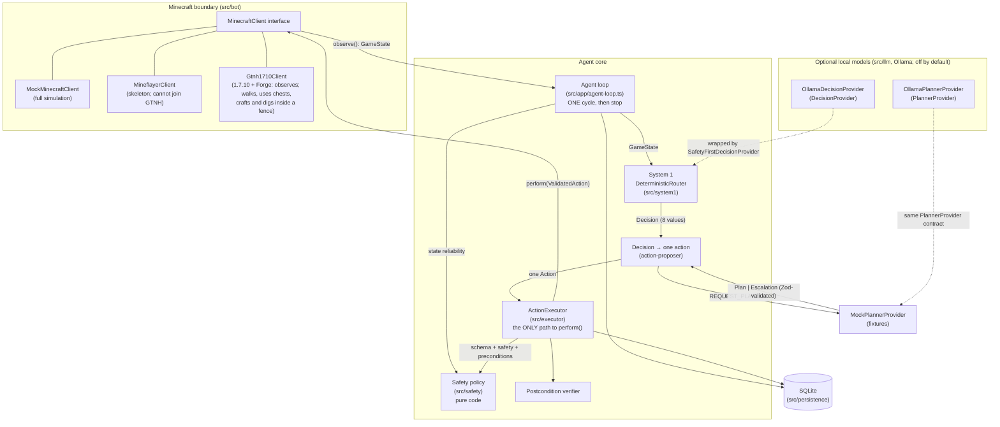

# Architecture

A typed, safety-first agent core that runs one observe → decide → validate → execute → verify
cycle against a mock Minecraft world or a private test server (and bounded runs of such cycles).
Local models (Ollama) can make the decisions and write plans, opt-in; they only ever propose
(see [local-llm-integration.md](local-llm-integration.md)).

## Components



## Roles

| Component                                                        | Role                                                                                                                                                                                 | Authority                                                                                                                                                   |
| ---------------------------------------------------------------- | ------------------------------------------------------------------------------------------------------------------------------------------------------------------------------------ | ----------------------------------------------------------------------------------------------------------------------------------------------------------- |
| **MinecraftClient** (`src/bot`)                                  | The only boundary to the game. `observe()` returns a normalized `GameState`; `perform()` takes a `ValidatedAction` token.                                                            | Performs actions, but only ones minted by the executor (runtime-checked).                                                                                   |
| **Safety policy** (`src/safety`)                                 | Pure functions: state reliability, dangers, per-action rules, protected items, boundaries, forbidden-modification denylist, repeated-failure cap.                                    | **Veto over everything.** No model can override it.                                                                                                         |
| **Deterministic router** (`src/system1/deterministic-router.ts`) | System 1: prioritized, transparent rules that map a state to one of 8 bounded decisions, with confidence, reason codes and facts.                                                    | Chooses _what kind_ of step; cannot execute.                                                                                                                |
| **System-1 model** (`src/llm/ollama-decision-provider.ts`)       | Opt-in (`decisions.provider: ollama`): a local model picks one of the 8 decisions from facts computed by code.                                                                       | Always wrapped in `SafetyFirstDecisionProvider`: the router's safety decisions and every pause win, invalid output becomes PAUSE.                           |
| **Action proposer** (`src/system1/action-proposer.ts`)           | Turns one decision into exactly one allowlisted action (approaching a target first if it is out of reach).                                                                           | Proposes only.                                                                                                                                              |
| **LLM planner** (`src/llm/ollama-planner-provider.ts`)           | Opt-in (`planner.provider: ollama`): returns a strict `Plan` or an `Escalation`. Called only for `REQUEST_PLANNER`, and only when the task has no open plan.                         | **None.** Plans are validated and stored; one step per cycle goes through the executor like any other action. Plans that ask for approval wait for a human. |
| **ActionExecutor** (`src/executor`)                              | The single controlled path: schema → safety → preconditions → persist → execute → observe → verify → persist.                                                                        | Sole minter of `ValidatedAction` (lint-enforced).                                                                                                           |
| **Persistence** (`src/persistence`)                              | SQLite (better-sqlite3): tasks, checkpoints, plans with their progress, state snapshots, action logs, an append-only event log, safety violations, named locations, protected items. | Audit trail; failure history feeds the repeated-failure rule.                                                                                               |

## One cycle

1. Observe (or receive) a `GameState`; reject it if it fails schema validation.
2. Overlay agent memory (a paused/blocked task stays halted; last action) and persist a snapshot.
3. Hard safety check of the _state_: unknown, stale or inconsistent → forced `PAUSE_AND_ASK_USER`,
   whatever any decision provider says.
4. Ask the `DecisionProvider` (the deterministic router, or a model inside
   `SafetyFirstDecisionProvider`) for one decision.
5. Convert it to exactly one proposed action. For `REQUEST_PLANNER`: run the next step of the
   task's active plan; or, if its plan still waits for approval, pause; or else ask the planner for
   a new plan (see [Plans across cycles](#plans-across-cycles)).
   If deciding or planning took so long (a model) that the observation is now stale, observe
   again: the action is validated against the new observation (a second snapshot, logged as a
   `STATE` event marked `reobserved`). The executor always checks freshness against the clock at
   execution time.
6. Validate the action (schema, safety policy, preconditions) and persist the result.
7. Execute through `MinecraftClient.perform()` only if validation passed.
8. Observe again and verify the action's postcondition.
9. Persist the outcome; pause or block the task if needed. **Stop.**

## Live tasks

The live server knows nothing about the agent's tasks, so they come from agent memory
(`src/persistence/memory-repository.ts`, migration 003):

- `cli task-add` stores a task and makes it the **current task** (`agent_state.current_task`).
  Only live observations (`source: gtnh1710`) get it filled in. Mock scenarios share the database
  and never see it. A completed or failed task is never filled in.
- A plan the human wrote (`--plan`) goes through `validatePlan` exactly like a planner's plan. It
  is stored with planner `operator`, and when it completes it completes the task.
- Machines the task depends on (`--machines`, table `task_machines`) become the live state's
  `knownRecipeState.requiredMachineIds`, so System 1's machine rules apply:
  - busy or **not seen** → `WAIT_FOR_MACHINE`;
  - switched off (`error`) → pause;
  - unpowered → the planner;
  - otherwise the plan goes on.
    An unseen machine is never assumed ready. Right after connecting, GregTech's machine packets
    may not have arrived yet.
- **Container memory:** the loop records every container whose contents it sees (before and after
  each action). A later cycle, in a new connection with the chest closed, gets those contents back
  for `memory.containerContentsMaxAgeMs`, but only for the executor's feasibility checks. The live
  client re-reads the real contents before it clicks anything, and verification compares the
  remembered "before" with the live "after", so a chest changed by someone else shows up as a
  verification failure.

### Bounded auto-run

`src/app/live-session.ts` (`cli run --live`) runs ordinary cycles back to back on one connection
for the current task. It adds no decision logic and no checks of its own. It only decides whether
to start another cycle, and it continues only while each cycle:

- succeeded;
- asked for no attention;
- decided `REQUEST_PLANNER`, `EXECUTE_KNOWN_SAFE_STEP` or `WAIT_FOR_MACHINE` (task progress).

Anything else stops it: a finished task, a safety retreat, eating, upkeep, a pause, a failure,
the cycle or time cap, the stop file, Ctrl+C or a lost connection. There is still no open-ended
loop: every run is started by a human and bounded.

## Quest goals and autonomous play

The agent's goals come from GTNH's own quest book, like a new player's. The benchmark is
"Finish Age 0": the 92 quests of the "Tier 0 Stone Age" chapter (37 of them main quests).

- `scripts/extract-quests.ts` reads the test server's Better Questing files into
  `src/goals/age0-quests.ts`: each quest's exact 64-bit id, name, prerequisites (AND/OR), main flag
  and tasks with their items (registry name and damage, the agent's inventory naming).
- `src/goals/quest-goals.ts` decides, purely from data:
  - **done:** a quest completes when its prerequisites are done and every required task is
    satisfied. A checkbox is satisfied at once, items when they are held, and a crafting task when
    the crafted items are held (the quest book counts crafts; the agent keeps what it crafts).
    Optional retrieval never blocks a quest. Prerequisites in other chapters count as met.
  - **doable:** the agent's abilities (items it can gather or craft) cover every required task.
    Hunting, locations, fluids and the like are not doable yet, so those quests are never picked.
  - **next:** the shallowest doable, unlocked quest (fewest prerequisites below it), main quests
    first, then quest-book order.
- The agent keeps its own completions in agent memory (`quests.age0.completed`). It never touches
  the server's quest book; claiming there is a GUI action for the player.

**Routes: the planner takes stock before it plans.** A task can name the items its goal
needs (quests do; `cli task-add --needs item=count,...` for any goal). For those,
`src/goals/route.ts` calculates in code, from the agent's recipes and gathering sources
(`src/goals/route-book.ts`) and the places it has seen, exactly what the goal still needs:
have vs need per item, the raw materials to gather in total, every gather and craft step in
order (ingredients before what they make), the best known place for each material (the
nearest with enough seen), where a player would look when no place is known, and a rough
time. The planner gets the route in its request and plans along it; the model still makes
every decision. The route is general: smelting, tools, mob drops and exported recipe data
are new book entries, not new planner logic. The book holds GTNH's real recipes, ore veins
and harvest levels (see [Knowledge base](#knowledge-base)).

**Storage in the stocktake.** Containers whose contents the agent knows (seen now, or
remembered) count as "stored": the route fetches from them, nearest first, before it
gathers or crafts (withdraw steps), and the planner sees what each container holds.

**Checkpoints and compaction.** Long work is done in chunks. The planner plans only the next
one or two route steps; when they are done the agent checkpoints and asks again with fresh
stock. Each task keeps a journal written by code at every checkpoint: a plan made, done or
failed (and why), the planner escalating, a quest completed, an interruption (a mob, the
night, a stuck session). Like a long conversation, it is compacted: past 16 lines the oldest
are folded into one "earlier" summary (counts and the latest failures). The planner reads the
journal instead of a raw log, continues where the task stopped and avoids repeating failures.
Interruptions (mobs, hunger, lava, night) are still handled first by System 1's reflexes;
a step that no longer fits the world is refused and replanned.

`src/app/play.ts` (`runPlay`) is the play loop. Each round it reads the inventory, records the
quests that are now satisfied, makes the next quest the current task (`quest-<id>`, its subgoal
saying what is still missing) and runs one bounded session on it (`runSession`). In the session
the configured decision maker and planner choose what to do, and every action is still
validated, executed and verified like any other. Play stops, and says why, when:

- no doable quest is left, or the inventory cannot be read;
- a session asks for a human (an approval, a safety stop), or the quest's task was paused,
  blocked or closed (play never resumes those);
- the same quest shows no fewer missing items for `maxStuckSessions` sessions in a row, measured
  from the inventory, not from what a session claims;
- the time or session limit, the stop file or Ctrl+C.

A failed action or a safe detour (retreating, eating) does not stop play by itself: that is part
of playing, and the planner sees it in its recent history. Play is still started by a human and
bounded in time (at most 8 hours).

## Knowledge base

Routes can only plan what the book knows. The book is built from a **generated GTNH 2.8.4
knowledge base**: `src/goals/knowledge/gtnh-2.8.4.json.gz` (about 700 KiB, 6.3 MiB of JSON),
loaded once on first use by `src/goals/knowledge.ts`. Item names follow the inventory's naming
(registry name, `@damage` when not 0). What it holds, and where each part comes from (details
and evidence in [GTNH compatibility: knowledge base](gtnh-compatibility.md#knowledge-base-2026-09-30)):

| Part                      | Count    | Source on the test server                                                                                                                                         |
| ------------------------- | -------- | ----------------------------------------------------------------------------------------------------------------------------------------------------------------- |
| Crafting recipes          | 53,821   | CraftTweaker's `/minetweaker recipes` dump: shaped and shapeless, ore-dictionary ingredients, 2x2 or 3x3, crafting tools marked                                   |
| Output counts             | 3,237    | Not in the dump: read from GTNewHorizonsCoreMod's recipe scripts (its jar) and matched to the dumped recipes. Other counts are unknown (`0`; the route assumes 1) |
| Furnace recipes           | 6,128    | `/minetweaker recipes furnace` (output counts not dumped: 1 assumed)                                                                                              |
| Ore dictionary            | 22,006   | `/minetweaker oredict` (`:*` wildcards expanded to every damage value seen)                                                                                       |
| Item names                | 27,050   | Every name is checked against `/minetweaker names` (the item registry) and the agent's `ItemName` format                                                          |
| GT ore veins / small ores | 79 / 55  | GregTech's jar (`OreMixes`, `SmallOres`): heights, weights, density, size, dimensions, the four ores of each vein                                                 |
| GT materials              | 801      | GregTech's jar (`MaterialsInit1`): id and tool quality, which set an ore's harvest level                                                                          |
| Ore drops                 |          | GT's code: a vein ore drops its raw ore (`FortuneItem` in `GregTech.cfg`); a small ore drops a weighted mix of gems, crushed ore and impure dust                  |
| Harvest levels, tools     | 60 / 199 | `config/IguanaTinkerTweaks` (block levels, tool levels, Tinkers' material levels, level names); GT ores use GT's own rule                                         |

**Regenerating it** (the server must be running; the dump commands are read-only lists):

```sh
node scripts/test-server-admin.ts rcon minetweaker oredict
node scripts/test-server-admin.ts rcon minetweaker recipes        # replies "timed out": it keeps running
node scripts/test-server-admin.ts rcon minetweaker recipes furnace
node scripts/test-server-admin.ts rcon minetweaker names
node scripts/test-server-admin.ts rcon minetweaker mods
node scripts/build-knowledge.ts            # needs TEST_SERVER_DIR (or --server, --log, --out)
```

Each dump appends to the server's `minetweaker.log`; the build reads the last of each. A full
recipe dump pauses the server for a few seconds. `scripts/build-knowledge.ts` reads only files in
the server folder: the log, `config/GregTech/*.cfg`, `config/IguanaTinkerTweaks/*.cfg` and two
jars, which it parses itself (`scripts/knowledge/jvm.ts`: a zip reader, a class-file parser and
a symbolic interpreter for the straight-line code of GT's data tables; the lint forbids
spawning `javap`). The data records each source file's size and SHA-256 (`sources`) and the
caveats (`notes`). `tests/goals/knowledge.test.ts` checks its integrity and known facts.

**How routes use it.** `src/goals/route-book.ts` builds the book once (`ROUTE_BOOK` is lazy;
`HAND_BOOK` is the hand-verified book alone):

- Recipes: the generated crafting recipes (station `2x2` or `crafting_table`; ore-dictionary
  ingredients as `anyOf` lists; `ore:craftingTool*` ingredients as tools, used but not consumed),
  furnace recipes (station `furnace`) and the hand-verified recipes of `src/domain/recipes.ts`.
  A hand-verified recipe replaces the generated recipe it matches (same output and ingredient
  sets), keeping its verified count and taking the wider ingredient lists.
- Sources: bare-hand digs (`DIG_YIELDS`), digs that need a tool (stone gives cobblestone, with
  the IguanaTweaks level), and GT ores that generate in the Overworld: a vein ore gives its raw
  ore (pickaxe level from GT's rule, where: the vein and its height range), a small ore gives
  its average drops.
- Tools (item, kind, level) and the item that provides each station.

`src/goals/route.ts` stays general (nothing in it is GTNH-specific):

- **Fast with thousands of recipes.** Recipes are indexed by output, and the book becomes an
  AND/OR graph once. Per route, a cost table estimates every item's cheapest way (seconds of
  digging, crafting and smelting) with Knuth's generalization of Dijkstra: items settle cheapest
  first, an option counts once each of its requirements is met, and cycles (ingot to plate to
  ingot) cannot make an item look impossible. A deep GTNH route takes well under a second.
- **Choosing.** For each item the route weighs every way to get it with what is held: a held
  ingredient is free, a missing crafting tool or dig tool is a one-time cost, a station nobody
  knows of costs a little, and a machine station (no item to make it) rules a recipe out. Ties go
  to hand-verified recipes. Output counts the data does not know are taken as 1 and shown as
  `>=N`.
- **Tools.** A gather leg whose blocks need a tool the inventory lacks gets the cheapest fitting
  tool first, expanding its recipe tree; its steps are marked `[for: tool: ...]`. If the tool
  needs the item it will dig (a pickaxe made of what it mines), the route gets those items
  another way first. Held tools match by kind and level (worn vanilla tools by base name);
  Tinkers' Construct tools take their level from NBT, so they count as fitting with a warning.
- **Stations.** `planRoute(..., stations)` takes the stations the agent can use; each needed one
  is listed as available, held (place it), missing (with how to make its item), or, when the
  caller does not say, as needed. The route never places anything.
- **What it cannot do.** Unresolved items carry a reason, e.g. "digging
  gregtech:gt.blockores@16500 (GT small ore Diamond: y 5-15) needs a pickaxe level >= 3: none
  held, none known to make". When nothing completes, the route still expands the recipe that
  gets closest, so the planner sees what it can already do and exactly what is missing.

Not in the knowledge base (open gaps): GT machine recipes (no read-only dump exists; recipes
whose station is a machine would simply be skipped), Tinkers' Construct tool building (Part
Builder and Tool Station are not crafting-table recipes, yet they make GTNH's early pickaxes),
the output counts of recipes not registered by the coremod scripts, mob drops, and where GT ores
are in the world (the agent's chunk scan sees `gregtech:gt.blockores` with the harvest level as
metadata; the ore's material lives in its tile entity).

## Plans across cycles

A validated plan is stored in the `plans` table with its progress, so a multi-step plan advances one
step per cycle instead of being re-planned (and restarted) every cycle. A task has at most one open
plan; a newer plan supersedes it.

| Status             | Meaning                                                             | Next                                                                                                                                                                                                                                                                                                                                                                                                                           |
| ------------------ | ------------------------------------------------------------------- | ------------------------------------------------------------------------------------------------------------------------------------------------------------------------------------------------------------------------------------------------------------------------------------------------------------------------------------------------------------------------------------------------------------------------------ |
| `pending_approval` | The plan set `requiresUserApproval`. Nothing has run.               | The cycle pauses the task and asks. `plan-approve --task <id> --plan <n>` makes it `active` and resumes the task; `plan-reject` rejects it. Resuming the task alone does not approve it.                                                                                                                                                                                                                                       |
| `active`           | Approved or not needing approval.                                   | Each cycle that reaches `REQUEST_PLANNER` proposes the next step; the executor validates it against the current state.                                                                                                                                                                                                                                                                                                         |
| `completed`        | Every step executed and verified.                                   | The next `REQUEST_PLANNER` asks the planner again.                                                                                                                                                                                                                                                                                                                                                                             |
| `failed`           | A step was rejected, or failed more than `maxRetriesPerStep` times. | Rejected step: the task is blocked, unless a planner's step failed only preconditions (stale: out of reach, too few items, block gone) with no safety violation; then the task goes on and the next cycle replans. Exhausted retries: `REPLAN` leaves the task active (the next cycle asks the planner, with the failure history); `PAUSE_AND_ASK_USER` and `RETREAT_HOME` pause the task (there is no retreat directive yet). |
| `rejected`         | A human rejected it.                                                | After `task-resume`, the planner is asked for a new plan.                                                                                                                                                                                                                                                                                                                                                                      |
| `superseded`       | Replaced by a newer plan for the same task.                         | Nothing.                                                                                                                                                                                                                                                                                                                                                                                                                       |

Safety does not depend on the stored plan: every step is validated again, against the state of the
cycle that runs it, and the repeated-failure rule still applies across plans (a `REPLAN` that proposes
the same failing action is refused with `REPEATED_FAILURE`). Dangers, vitals and upkeep are routed
before the planner, so a plan simply waits while System 1 handles them.

## Walking

Walking was the live client's first world-changing ability (`src/bot/gtnh1710/walking.ts` plans
and checks; `Gtnh1710Client` sends). It needs `MC_ENABLE_MOVEMENT=true` **and** a fence: whole
blocks at the player's feet level, all on one level. Defence in depth:

1. The executor validates `MOVE_TO` / `RETURN_TO_SAFE_LOCATION` as usual: the target is inside the
   safety boundary, the target's surroundings were scanned, it keeps clear of known hazards, and
   the state is reliable.
2. The walker plans on the blocks the server sent: A* inside the fence (no corner cutting), then
   straight stretches where clear. A position is walkable only if every block the player's body
   touches is air, every block under it is a known full block, and nothing dangerous (or unloaded,
   or unnamed) touches those blocks. Stretches are checked exactly: the swept body, not samples.
3. Every 0.2-block step is re-checked just before it is sent (the world may have changed). The walk
   stops on a server correction, a health drop, a hostile/unidentified entity within
   `threatRadius` (not for a retreat, which is how the agent escapes one), the stop file, `halt()`
   (Ctrl+C) or a lost connection. After the last step it waits 5 ticks for a server correction
   before reporting success, and the executor then verifies the position.

The `move` command runs one such action for a human (origin `user`). The repeated-failure rule does
not apply to it (it is the human's decision each time), and its failures do not count against the
agent's own attempts.

## Chests

`OPEN_CONTAINER`, `WITHDRAW_ITEM` and `DEPOSIT_ITEM` work on configured vanilla chests
(`src/bot/gtnh1710/container.ts` plans; `Gtnh1710Client` sends). Three 1.7.10 facts shape the design:

- The server confirms an accepted click (S32) without sending the resulting slots, so the client
  must predict every click exactly.
- On a mismatch the server rejects the click and re-sends the whole window.
- Closing a window, or disconnecting, with items on the cursor DROPS them into the world.

So, in layers:

1. The executor validates as usual. The chest must be known storage within `interactionReach`,
   the item must not be protected, and there must be enough of it. A withdrawal also needs the
   chest's contents to be known, which they are only while the agent has it open, so
   `OPEN_CONTAINER` comes first.
2. The client opens only a configured chest whose block is `minecraft:chest` (never a trapped
   chest), with an empty hand, and accepts only a chest window (27 or 54 slots).
3. `planTransfer` builds the whole move from predictable clicks: pick up a stack, put it into an
   EMPTY slot, or place one item at a time into a slot it filled itself. It never merges into
   other stacks, so item stack limits never matter, and it never touches stacks with NBT data.
   It refuses up front when the move cannot finish exactly.
4. Clicks go one at a time, each waiting for the server's verdict. On a rejection the client
   acknowledges it, takes the server's re-sync, puts whatever is on the cursor back into an empty
   slot, and reports failure.
5. The window stays open so the executor can verify both sides (player −/+ exactly, chest +/−
   exactly). It closes only with an empty cursor.

`halt()`, the stop file and an ongoing walk or dig also block chest use.

## Digging

`DIG_BLOCK` breaks ONE block from a fixed allowlist of vanilla natural blocks: `log`, `log2`,
`leaves`, `leaves2`, `dirt`, `grass`, `sand`, `gravel` and `clay` (`src/domain/blocks.ts`). A
bare hand harvests all of them, and none has a tile entity. It needs `MC_ENABLE_DIGGING=true`
**and** the movement fence. `src/bot/gtnh1710/digging.ts` holds the facts and checks;
`Gtnh1710Client` sends. The server-side rules it relies on are in
[GTNH compatibility: digging](gtnh-compatibility.md#digging). In layers:

1. **Observation.** The `GameState` lists `nearbyBlocks`, computed from the chunk data
   (`resource-scan.ts`):
   - `resources`: allowlisted blocks within 16 blocks, at or above the feet level, nearest
     first. At most 64; past that, the declared radius shrinks so the list stays complete
     within it. The ground the player stands on is never listed.
   - `removed`: positions where the client saw such a block turn into air, while they stay air.

   The planner gets the nearest 32 resources.

2. **The executor validates as usual.**
   - The whole block must be inside the safety boundary.
   - It must be listed in `nearbyBlocks.resources` (`NOT_DIGGABLE` otherwise, pause), so
     nothing off the allowlist can even be asked for.
   - It must clear known hazards by `hazardAvoidanceRadius`.
   - It must not be under the player or in its body's cells, must not be sand or gravel over
     the player's head, and must not have a listed sand or gravel block on top (`UNSAFE_DIG`).
   - Preconditions: within `interactionReach` of the eyes, and a free inventory slot for the
     drop.
   - Like any world action, it is refused during danger.
3. **The client re-checks it all on the blocks the server sent** (`checkDig`), fail closed:
   - inside the fence's columns, from the fence level up to `maxHeightAboveFence` (default 4),
     never the floor;
   - loaded, named and allowlisted;
   - within 4.5 of the eyes;
   - not in the player's own columns at or below its head, and not sand or gravel above it.
   - Everything touching the block's six faces must be air, an allowlisted block, or one of the
     walker's plain full blocks. Water, lava, torches, plants, chests, machines, modded and
     unnamed blocks all refuse: removing the block could flood the hole, drop something
     attached or change a build.
   - Nothing on top may fall into the hole, and nothing dangerous may be anywhere in the 3 x 3
     x 3 cube around it.
4. **The dig itself, always with an empty hand.** No tool can wear out, fell a tree or do
   anything special. With no empty hotbar slot, it refuses.
   - It selects an empty slot (C09), sends C07 start, and waits the vanilla dig time x 1.25 + 2
     ticks.
   - Every tick it re-checks everything above, plus: the stop file, `halt()`, the connection,
     a server correction, a health drop, a hostile or unidentified entity within
     `threatRadius`, and any update for the block (the server's refusal is a re-send).
   - On any problem it sends C07 cancel and fails.
5. **The finish and the verdict.** It sends C07 finish, then waits for the server's block
   changes and a quiet 250 ms. Forge sends "air" to the digging player before mods may cancel
   the break, so the first "air" alone is not proof. Only air, with no re-send, is success.
   Any re-send (too early, a cancelled break) fails the dig. If the server judged it too
   early, vanilla still breaks the block when its own timer reaches 100%; the next observation
   shows that.
6. **The drop.** It waits up to 2 s for the inventory to grow. The result reports
   `dropCollected` and which items arrived; a drop out of pickup range is reported, not
   fetched.
7. **Verification:** `BLOCK_REMOVED` passes only if the new observation lists the position in
   `nearbyBlocks.removed` (seen turning into air, still air) and not among the resources.

Walking, chests and digging never run at the same time. `halt()` and the stop file stop them all.

**Not covered yet:**

- Entities on or hanging from the block. A mob or player standing on it drops a block, and an
  item frame or painting hanging on it pops off. The client does not track paintings at all.
- Potion effects that slow digging (Mining Fatigue). They are not observed; the server would
  judge the dig too early, and the dig fails cleanly.
- Leaves decaying later once nearby logs are gone. That is the world's normal behaviour after
  chopping.

## Crafting

`CRAFT_ITEM` crafts with a recipe from the agent's table (`src/domain/recipes.ts`): 2x2 recipes in
the player's own grid (window 0), 3x3 at a configured crafting table. `src/bot/gtnh1710/crafting.ts`
plans; `Gtnh1710Client` sends. On top of the chest facts, 1.7.10 has three more
([evidence](gtnh-compatibility.md#crafting-2026-09-30)):

- The server never sends the crafting result slot as a slot update. Only a full window sync shows
  it, and the server sends one whenever it rejects a click.
- Taking the result puts the whole stack on the cursor and takes one item from every grid slot.
- Closing a window, closing the inventory itself, or leaving the server DROPS whatever is in the
  grid, like the cursor.

GTNH changes many vanilla recipes, so the table is never trusted blindly. In layers:

1. The executor validates as usual. Every ingredient kind the recipe may use must be unprotected,
   the inventory must hold enough, and a 3x3 recipe needs a known table within `interactionReach`.
   The postcondition is derived from the table: the result +count × times, each ingredient group
   −cells × times, and nothing else changed.
2. The client plans the whole action on its view of the inventory and refuses before anything is
   opened or clicked when it cannot finish exactly. Window 0 is clicked only with no other window
   open. A table opens only if it is configured and its block is a `minecraft:crafting_table`, with
   an empty hand.
3. Each craft:
   - **Fill:** one item into every pattern cell, with predictable clicks (pick up a stack, place one
     item per empty cell, put the rest back).
   - **Sync:** a left-click on an empty slot with an empty cursor, claiming a stack that slot cannot
     hold. The server rejects it and re-sends the window. Every slot must match the client's
     prediction.
   - **Check:** the result slot must show exactly the expected item and count, without NBT data.
     Otherwise nothing is taken and the action fails with what the server showed, so the operator
     learns the real recipe.
   - **Take** the result with one click (cursor gets it; every grid slot −1), then **store** it in an
     EMPTY slot. Results are never merged into other stacks, because their stack limits are unknown.
4. Any failure first returns the grid and the cursor to the inventory: onto the stack an item came
   from while that stays within a size the stack has already had, otherwise into an empty slot.
   Then a sync confirms. A final sync confirms success too.
5. The grid only ever holds one craft's worth of items. A table is closed afterwards, and never with
   items in its grid or on the cursor. `outbound.closeWindow(0)` is refused outright: it would drop
   the 2x2 grid.
6. `disconnect()` first returns anything a crafting grid or the cursor still holds.

`halt()` and the stop file stop crafting between crafts. Walking, chests and crafting exclude each
other, and walking is refused while items are on the cursor or in a crafting grid: walking away
closes a window server-side.

## Why code, not AI, enforces safety

- **Determinism and auditability.** A rule like "never deposit a protected item" must hold every
  time. Code does that; a model may not, especially under unusual state or adversarial text
  (item names, sign text or chat can all reach a model's context).
- **Fail-closed by construction.** The executor accepts `unknown` input and rejects anything that is
  not a schema-valid, allowlisted action. There is no path where a model output is "trusted".
- **Testability.** Every safety rule has unit tests (`tests/safety`). A model's behaviour
  cannot be exhaustively tested.
- **Separation of powers.** Models only _propose_ (a decision enum or a plan). The executor
  alone acts, and only through a token it mints after validation.

## Enforced boundaries

| Boundary                           | Enforcement                                                                                                                                                                                                                                                                                                                                                                                                                                                                                                                                                                                                                                                                                                                                                     |
| ---------------------------------- | --------------------------------------------------------------------------------------------------------------------------------------------------------------------------------------------------------------------------------------------------------------------------------------------------------------------------------------------------------------------------------------------------------------------------------------------------------------------------------------------------------------------------------------------------------------------------------------------------------------------------------------------------------------------------------------------------------------------------------------------------------------- |
| No shell / process spawning        | ESLint `no-restricted-imports` bans `child_process` everywhere.                                                                                                                                                                                                                                                                                                                                                                                                                                                                                                                                                                                                                                                                                                 |
| Only adapters touch the network    | ESLint bans socket/HTTP imports (`node:net` connect/servers, `tls`, `dgram`, `http(s)`) and the global `fetch`/`WebSocket`/`EventSource` outside `src/bot/` (Minecraft) and `src/llm/` (the local-model client).                                                                                                                                                                                                                                                                                                                                                                                                                                                                                                                                                |
| Live client                        | `Gtnh1710Client` can only emit the packet builders in `src/bot/gtnh1710/packets.ts` (handshake, login, keep-alive, FML handshake, idle ticks, echoes of server positions, walking steps, the chest and crafting packets: empty-hand block activation, hotbar selection, window clicks, confirmations, closing; digging: C07 start, cancel and finish only, never the item-dropping statuses; and two cosmetic ones: head look and arm swing). Walking needs `MC_ENABLE_MOVEMENT=true` and a fence; chests need `MC_ENABLE_CONTAINERS=true` and a configured chest; crafting needs `MC_ENABLE_CRAFTING=true` (3x3 only at configured tables); digging needs `MC_ENABLE_DIGGING=true` and the fence; every other world-changing action returns `NOT_IMPLEMENTED`. |
| Operator tools stay outside        | `scripts/test-server-admin.ts` (RCON, operator rights on the test server) is the only script allowed sockets, and nothing in `src/` may import from `scripts/` (lint).                                                                                                                                                                                                                                                                                                                                                                                                                                                                                                                                                                                          |
| Mineflayer isolated to the adapter | ESLint bans importing `mineflayer` outside `src/bot/mineflayer-client.ts`; the adapter imports it lazily.                                                                                                                                                                                                                                                                                                                                                                                                                                                                                                                                                                                                                                                       |
| Only the executor performs actions | `mintValidatedAction` is lint-restricted to `src/executor/action-executor.ts`; clients call `assertValidatedAction()`, which rejects any object not minted (a `WeakSet` check), and tokens are deep-frozen copies.                                                                                                                                                                                                                                                                                                                                                                                                                                                                                                                                              |
| Private servers only               | Config rejects public IPs and non-allowlisted hostnames; the adapter re-checks DNS resolution before connecting and refuses unless `enableLiveConnection` is true. The model client applies the same guard to `llm.baseUrl` before every request and refuses redirects.                                                                                                                                                                                                                                                                                                                                                                                                                                                                                         |
| One action per cycle               | `runSingleCycle` has no loop.                                                                                                                                                                                                                                                                                                                                                                                                                                                                                                                                                                                                                                                                                                                                   |

## Directory map

```
src/config       env + JSON config loading (Zod), private-network guard
src/domain       schemas/types: GameState, actions, tasks, safety, decisions, Known<T>
src/safety       safety policy, boundaries, protected items, forbidden-action classifier
src/system1      router, decision providers (incl. SafetyFirstDecisionProvider), action proposer
src/planner      plan schema, validator, planner interface, mock planner
src/llm          Ollama client, model decision provider, model planner (opt-in)
src/bot          MinecraftClient interface, mock client, gtnh1710/ live client (observe; walk, chests, crafting, dig in a fence), Mineflayer skeleton
src/executor     executor, preconditions, verifier, action log
src/persistence  SQLite open/migrate, repositories, migrations
src/goals        the Age 0 quest book (generated) and goal selection; routes and the GTNH knowledge base (generated)
src/app          agent loop, sessions, play loop, quest book, provider factory, mock scenarios, CLI
```
