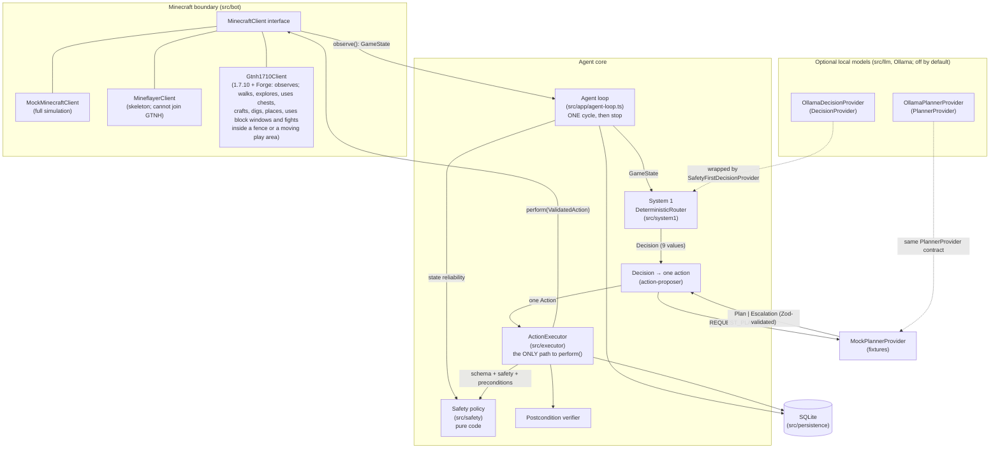

# Architecture

A typed, safety-first agent core that runs one observe → decide → validate → execute → verify
cycle against a mock Minecraft world or a private test server (and bounded runs of such cycles).
Local models (Ollama) can make the decisions and write plans, opt-in; they only ever propose
(see [local-llm-integration.md](local-llm-integration.md)).

## Components



## Roles

| Component                                                        | Role                                                                                                                                                                                                                                    | Authority                                                                                                                                                   |
| ---------------------------------------------------------------- | --------------------------------------------------------------------------------------------------------------------------------------------------------------------------------------------------------------------------------------- | ----------------------------------------------------------------------------------------------------------------------------------------------------------- |
| **MinecraftClient** (`src/bot`)                                  | The only boundary to the game. `observe()` returns a normalized `GameState`; `perform()` takes a `ValidatedAction` token.                                                                                                               | Performs actions, but only ones minted by the executor (runtime-checked).                                                                                   |
| **Safety policy** (`src/safety`)                                 | Pure functions: state reliability, dangers, per-action rules, protected items, boundaries, forbidden-modification denylist, repeated-failure cap.                                                                                       | **Veto over everything.** No model can override it.                                                                                                         |
| **Deterministic router** (`src/system1/deterministic-router.ts`) | System 1: prioritized, transparent rules that map a state to one of 9 bounded decisions, with confidence, reason codes and facts.                                                                                                       | Chooses _what kind_ of step; cannot execute.                                                                                                                |
| **System-1 model** (`src/llm/ollama-decision-provider.ts`)       | Opt-in (`decisions.provider: ollama`): a local model picks one of the 9 decisions from facts computed by code.                                                                                                                          | Always wrapped in `SafetyFirstDecisionProvider`: the router's safety decisions and every pause win, invalid output becomes PAUSE.                           |
| **Action proposer** (`src/system1/action-proposer.ts`)           | Turns one decision into exactly one allowlisted action (approaching a target first if it is out of reach).                                                                                                                              | Proposes only.                                                                                                                                              |
| **LLM planner** (`src/llm/ollama-planner-provider.ts`)           | Opt-in (`planner.provider: ollama`): returns a strict `Plan` or an `Escalation`. Called only for `REQUEST_PLANNER`, and only when the task has no open plan.                                                                            | **None.** Plans are validated and stored; one step per cycle goes through the executor like any other action. Plans that ask for approval wait for a human. |
| **ActionExecutor** (`src/executor`)                              | The single controlled path: schema → safety → preconditions → persist → execute → observe → verify → persist.                                                                                                                           | Sole minter of `ValidatedAction` (lint-enforced).                                                                                                           |
| **Persistence** (`src/persistence`)                              | SQLite (better-sqlite3): tasks, checkpoints, plans with their progress, state snapshots, action logs, an append-only event log, safety violations, named locations, protected items, world memory (what the agent has seen, per chunk). | Audit trail; failure history feeds the repeated-failure rule.                                                                                               |

## One cycle

1. Observe (or receive) a `GameState`; reject it if it fails schema validation.
2. Overlay agent memory (a paused/blocked task stays halted; last action) and persist a snapshot.
3. Hard safety check of the _state_: unknown, stale or inconsistent → forced `PAUSE_AND_ASK_USER`,
   whatever any decision provider says.
4. Ask the `DecisionProvider` (the deterministic router, or a model inside
   `SafetyFirstDecisionProvider`) for one decision.
5. Convert it to exactly one proposed action. For `REQUEST_PLANNER`: run the next step of the
   task's active plan; or, if its plan still waits for approval, pause; or else ask the planner for
   a new plan (see [Plans across cycles](#plans-across-cycles)).
   If deciding or planning took so long (a model) that the observation is now stale, observe
   again: the action is validated against the new observation (a second snapshot, logged as a
   `STATE` event marked `reobserved`). The executor always checks freshness against the clock at
   execution time.
6. Validate the action (schema, safety policy, preconditions) and persist the result.
7. Execute through `MinecraftClient.perform()` only if validation passed.
8. Observe again and verify the action's postcondition.
9. Persist the outcome; pause or block the task if needed. **Stop.**

## Live tasks

The live server knows nothing about the agent's tasks, so they come from agent memory
(`src/persistence/memory-repository.ts`, migration 003):

- `cli task-add` stores a task and makes it the **current task** (`agent_state.current_task`).
  Only live observations (`source: gtnh1710`) get it filled in. Mock scenarios share the database
  and never see it. A completed or failed task is never filled in.
- A plan the human wrote (`--plan`) goes through `validatePlan` exactly like a planner's plan. It
  is stored with planner `operator`, and when it completes it completes the task.
- Machines the task depends on (`--machines`, table `task_machines`) become the live state's
  `knownRecipeState.requiredMachineIds`, so System 1's machine rules apply:
  - busy or **not seen** → `WAIT_FOR_MACHINE`;
  - switched off (`error`) → pause;
  - unpowered → the planner;
  - otherwise the plan goes on.
    An unseen machine is never assumed ready. Right after connecting, GregTech's machine packets
    may not have arrived yet.
- **Container memory:** the loop records every container whose contents it sees (before and after
  each action). A later cycle, in a new connection with the chest closed, gets those contents back
  for `memory.containerContentsMaxAgeMs`, but only for the executor's feasibility checks. The live
  client re-reads the real contents before it clicks anything, and verification compares the
  remembered "before" with the live "after", so a chest changed by someone else shows up as a
  verification failure.

### Bounded auto-run

`src/app/live-session.ts` (`cli run --live`) runs ordinary cycles back to back on one connection
for the current task. It adds no decision logic and no checks of its own. It only decides whether
to start another cycle, and it continues only while each cycle:

- succeeded;
- asked for no attention;
- decided `REQUEST_PLANNER`, `EXECUTE_KNOWN_SAFE_STEP` or `WAIT_FOR_MACHINE` (task progress).

Anything else stops it: a finished task, a safety retreat, eating, upkeep, a pause, a failure,
the cycle or time cap, the stop file, Ctrl+C or a lost connection. There is still no open-ended
loop: every run is started by a human and bounded.

## Quest goals and autonomous play

The agent's goals come from GTNH's own quest book, like a new player's. The benchmark is
"Finish Age 0": the 92 quests of the "Tier 0 Stone Age" chapter (37 of them main quests).

- `scripts/extract-quests.ts` reads the test server's Better Questing files into
  `src/goals/age0-quests.ts`: each quest's exact 64-bit id, name, prerequisites (AND/OR), main flag
  and tasks with their items (registry name and damage, the agent's inventory naming).
- `src/goals/quest-goals.ts` decides, purely from data:
  - **done:** a quest completes when its prerequisites are done and every required task is
    satisfied. A checkbox is satisfied at once, items when they are held, and a crafting task when
    the crafted items are held (the quest book counts crafts; the agent keeps what it crafts).
    Optional retrieval never blocks a quest. Prerequisites in other chapters count as met.
  - **doable:** the agent's abilities (items it can gather or craft) cover every required task.
    Hunting, locations, fluids and the like are not doable yet, so those quests are never picked.
  - **next:** the shallowest doable, unlocked quest (fewest prerequisites below it), main quests
    first, then quest-book order.
- The agent keeps its own completions in agent memory (`quests.age0.completed`). It never touches
  the server's quest book; claiming there is a GUI action for the player.

**Routes: the planner takes stock before it plans.** A task can name the items its goal
needs (quests do; `cli task-add --needs item=count,...` for any goal). For those,
`src/goals/route.ts` calculates in code, from the agent's recipes and gathering sources
(`src/goals/route-book.ts`) and the places it has seen, exactly what the goal still needs:
have vs need per item, the raw materials to gather in total, every gather and craft step in
order (ingredients before what they make), the best known place for each material (the
nearest with enough seen), where a player would look when no place is known, and a rough
time. The planner gets the route in its request and plans along it; the model still makes
every decision. The route is general: smelting, tools, mob drops and exported recipe data
are new book entries, not new planner logic.

**Any goal, not only quests.** `cli play --live --needs item=count,...` makes play pursue a
goal of the player's own (task `goal-...`) exactly like a quest: the planner gets its route,
sessions and the journal work the same way, and play ends when the items are held. How
far a goal can be routed depends on the route book: items it cannot make or find yet are
listed as such, and the planner escalates rather than guessing.

**Storage in the stocktake.** Containers whose contents the agent knows (seen now, or
remembered) count as "stored": the route fetches from them, nearest first, before it
gathers or crafts (withdraw steps), and the planner sees what each container holds.

**Nights.** Two real minutes before night (and at night), play turns to a shelter
(`src/goals/shelter.ts`): a 1 x 1 box around the player, four walls at feet level and four at
head level from blocks a bare hand digs again (sand first), and a roof that does not fall
(cobblestone, dirt, planks...). Code works out what is still open and what to place there;
that blueprint is the planner's route, and the planner places the blocks (PLACE_BLOCK is
refused once mobs are near, hence the lead time). Enclosed, the agent waits for sunrise, then
the next goal's journal tells the planner how to get out (dig a wall, head level first).
If no shelter is possible (no blocks to build it), play stops before dark and `cli play`
waits offline until sunrise.

**A mob near home.** When System 1 pauses only because a mob is near (`HOSTILES_NEARBY` or
`UNCLASSIFIED_ENTITY_NEARBY`) and the agent is already home or has no home, play does not hand
the pause to a person: it sets the task active again, notes it in the journal, and `cli play`
waits offline for 30 s (an offline player cannot be hurt) and plays on, at most 6 times in a
row (`MOB_WAIT_MS`, `MAX_MOB_WAITS` in `src/app/play.ts`). Every new session re-checks the
state from scratch, so a mob that is still there pauses it again.

**Checkpoints and compaction.** Long work is done in chunks. The planner plans only the next
one or two route steps; when they are done the agent checkpoints and asks again with fresh
stock. Each task keeps a journal written by code at every checkpoint: a plan made, done or
failed (and why), the planner escalating, a quest completed, an interruption (a mob, the
night, a stuck session). Like a long conversation, it is compacted: past 16 lines the oldest
are folded into one "earlier" summary (counts and the latest failures). The planner reads the
journal instead of a raw log, continues where the task stopped and avoids repeating failures.
Interruptions (mobs, hunger, lava, night) are still handled first by System 1's reflexes;
a step that no longer fits the world is refused and replanned.

`src/app/play.ts` (`runPlay`) is the play loop. Each round it reads the inventory, records the
quests that are now satisfied, makes the next quest the current task (`quest-<id>`, its subgoal
saying what is still missing) and runs one bounded session on it (`runSession`). In the session
the configured decision maker and planner choose what to do, and every action is still
validated, executed and verified like any other. Play stops, and says why, when:

- no doable quest is left, or the inventory cannot be read;
- a session asks for a human (an approval, a safety stop), or the quest's task was paused,
  blocked or closed (play never resumes those);
- the same quest shows no fewer missing items for `maxStuckSessions` sessions in a row, measured
  from the inventory, not from what a session claims;
- the time or session limit, the stop file or Ctrl+C.

A failed action or a safe detour (retreating, eating) does not stop play by itself: that is part
of playing, and the planner sees it in its recent history. Play is still started by a human and
bounded in time (at most 8 hours).

## Plans across cycles

A validated plan is stored in the `plans` table with its progress, so a multi-step plan advances one
step per cycle instead of being re-planned (and restarted) every cycle. A task has at most one open
plan; a newer plan supersedes it.

| Status             | Meaning                                                             | Next                                                                                                                                                                                                                                                                                                                                                                                                                           |
| ------------------ | ------------------------------------------------------------------- | ------------------------------------------------------------------------------------------------------------------------------------------------------------------------------------------------------------------------------------------------------------------------------------------------------------------------------------------------------------------------------------------------------------------------------ |
| `pending_approval` | The plan set `requiresUserApproval`. Nothing has run.               | The cycle pauses the task and asks. `plan-approve --task <id> --plan <n>` makes it `active` and resumes the task; `plan-reject` rejects it. Resuming the task alone does not approve it.                                                                                                                                                                                                                                       |
| `active`           | Approved or not needing approval.                                   | Each cycle that reaches `REQUEST_PLANNER` proposes the next step; the executor validates it against the current state.                                                                                                                                                                                                                                                                                                         |
| `completed`        | Every step executed and verified.                                   | The next `REQUEST_PLANNER` asks the planner again.                                                                                                                                                                                                                                                                                                                                                                             |
| `failed`           | A step was rejected, or failed more than `maxRetriesPerStep` times. | Rejected step: the task is blocked, unless a planner's step failed only preconditions (stale: out of reach, too few items, block gone) with no safety violation; then the task goes on and the next cycle replans. Exhausted retries: `REPLAN` leaves the task active (the next cycle asks the planner, with the failure history); `PAUSE_AND_ASK_USER` and `RETREAT_HOME` pause the task (there is no retreat directive yet). |
| `rejected`         | A human rejected it.                                                | After `task-resume`, the planner is asked for a new plan.                                                                                                                                                                                                                                                                                                                                                                      |
| `superseded`       | Replaced by a newer plan for the same task.                         | Nothing.                                                                                                                                                                                                                                                                                                                                                                                                                       |

Safety does not depend on the stored plan: every step is validated again, against the state of the
cycle that runs it, and the repeated-failure rule still applies across plans (a `REPLAN` that proposes
the same failing action is refused with `REPEATED_FAILURE`). Dangers, vitals and upkeep are routed
before the planner, so a plan simply waits while System 1 handles them.

## Walking

Walking was the live client's first world-changing ability (`src/bot/gtnh1710/walking.ts` plans
and checks; `Gtnh1710Client` sends). It needs `MC_ENABLE_MOVEMENT=true` **and** a fence: whole
blocks at the player's feet level, all on one level (a fence with a height range walks terrain:
`terrain.ts`; in movement mode `follow` the fence is a play area that moves with the player, see
[Exploring and world memory](#exploring-and-world-memory)). Defence in depth:

1. The executor validates `MOVE_TO` / `RETURN_TO_SAFE_LOCATION` as usual: the target is inside the
   safety boundary, the target's surroundings were scanned, it keeps clear of known hazards, and
   the state is reliable.
2. The walker plans on the blocks the server sent: A* inside the fence (no corner cutting), then
   straight stretches where clear. A position is walkable only if every block the player's body
   touches is air, every block under it is a known full block, and nothing dangerous (or unloaded,
   or unnamed) touches those blocks. Stretches are checked exactly: the swept body, not samples.
3. Every 0.2-block step is re-checked just before it is sent (the world may have changed). The walk
   stops on a server correction, a health drop, a hostile/unidentified entity within
   `threatRadius` (not for a retreat, which is how the agent escapes one), the stop file, `halt()`
   (Ctrl+C) or a lost connection. After the last step it waits 5 ticks for a server correction
   before reporting success, and the executor then verifies the position.

The `move` command runs one such action for a human (origin `user`). The repeated-failure rule does
not apply to it (it is the human's decision each time), and its failures do not count against the
agent's own attempts.

## Chests

`OPEN_CONTAINER`, `WITHDRAW_ITEM` and `DEPOSIT_ITEM` work on configured vanilla chests
(`src/bot/gtnh1710/container.ts` plans; `Gtnh1710Client` sends). Three 1.7.10 facts shape the design:

- The server confirms an accepted click (S32) without sending the resulting slots, so the client
  must predict every click exactly.
- On a mismatch the server rejects the click and re-sends the whole window.
- Closing a window, or disconnecting, with items on the cursor DROPS them into the world.

So, in layers:

1. The executor validates as usual. The chest must be known storage within `interactionReach`,
   the item must not be protected, and there must be enough of it. A withdrawal also needs the
   chest's contents to be known, which they are only while the agent has it open, so
   `OPEN_CONTAINER` comes first.
2. The client opens only a configured chest whose block is `minecraft:chest` (never a trapped
   chest), with an empty hand, and accepts only a chest window (27 or 54 slots).
3. `planTransfer` builds the whole move from predictable clicks: pick up a stack, put it into an
   EMPTY slot, or place one item at a time into a slot it filled itself. It never merges into
   other stacks, so item stack limits never matter, and it never touches stacks with NBT data.
   It refuses up front when the move cannot finish exactly.
4. Clicks go one at a time, each waiting for the server's verdict. On a rejection the client
   acknowledges it, takes the server's re-sync, puts whatever is on the cursor back into an empty
   slot, and reports failure.
5. The window stays open so the executor can verify both sides (player −/+ exactly, chest +/−
   exactly). It closes only with an empty cursor.

`halt()`, the stop file and an ongoing walk, dig or placement also block chest use.

## Interacting with blocks

GTNH has thousands of blocks that open a window, each one different. What the agent knows about
them is data, not code: one interaction profile per kind of block, in
`src/domain/interactions.ts`. The live client does the same generic window work for every profile
(`src/bot/gtnh1710/interact.ts` plans; `Gtnh1710Client` sends). `INTERACT_BLOCK`, `SMELT` and
`TAKE_OUTPUT` need `MC_ENABLE_INTERACT=true`. The facts and their evidence are in
[GTNH compatibility](gtnh-compatibility.md#interacting-with-blocks-2026-09-30).

**A profile says:**

- `blocks`: the registry names it covers. The block at the position decides.
- `open`: an empty-hand right-click, or `never` with the reason (a trapped chest emits redstone).
- `window.variants`: each way its window can look. A variant has:
  - the opener: an S2D type and announced slot count, or an FML mod id and GUI id;
  - the layout: the container slots before the player's 36, in groups with a role (`input`,
    `fuel`, `output`, `grid`, `result`, `storage`...) and whether the agent may put items in or
    take them out;
  - `trailingSlots`, for windows that show more slots after the player's.
- `itemsOnClose`: `kept`, or `dropped` (a crafting grid).
- `result`: none, an output slot, or a crafting result that only a full sync shows.
- `properties`: what its S31 window properties mean.
- `usedBy`: the actions that may use it.
- `storage`: every slot is plain storage. The block is then listed in `GameState.storage`, and the
  container actions may use it.
- `evidence`: where each fact was checked.
- `stateSource` and `modPayloads`: room for later (state from tile-entity data; mod packets such as
  Tinkers' stencil table's).

Profiles today:

| Profile            | Blocks                                       | Used by                                  |
| ------------------ | -------------------------------------------- | ---------------------------------------- |
| `crafting_table`   | `minecraft:crafting_table`                   | `INTERACT_BLOCK`, `CRAFT_ITEM`           |
| `furnace`          | `minecraft:furnace`, `minecraft:lit_furnace` | `INTERACT_BLOCK`, `SMELT`, `TAKE_OUTPUT` |
| `chest`            | `minecraft:chest`                            | `INTERACT_BLOCK`, container actions      |
| `trapped_chest`    | `minecraft:trapped_chest`                    | nothing: never opened                    |
| `iron_chest`       | `IronChest:BlockIronChest` (11 chest types)  | `INTERACT_BLOCK`, container actions      |
| `hungry_chest`     | `Thaumcraft:blockChestHungry`                | `INTERACT_BLOCK`, container actions      |
| `crafting_station` | `TConstruct:CraftingStation`                 | `INTERACT_BLOCK` (looked at only)        |

**In layers:**

1. **Observation.** `interactables` lists blocks near the player, nearest first (32 at most), from
   the chunk data: blocks with a profile or on the observe-only list, with a face open to air. With
   a fence, only blocks inside it are listed, each with where to stand to use it (inside the fence,
   within reach). A furnace also has `burning` (the block is `lit_furnace`, so this is always
   current) and its contents and timers as last seen. `blockWindow` is the last block window
   opened.
   - Found crafting tables are also listed in `craftingTables` as `crafting_table:<x>.<y>.<z>`.
   - Found storage blocks are listed in `storage` as `<profile>:<x>.<y>.<z>`, with their contents
     while open.
2. **Safety policy.**
   - The block must be listed in the observation, with a profile that allows the action
     (`NOT_INTERACTABLE` otherwise, which counts as stale: the agent replans).
   - The whole block must be inside the boundary.
   - `SMELT`: approved fuels only, never lava.
   - No protected input, fuel or output.
   - Nothing is opened in danger.
3. **Preconditions:** reach from the eyes (4.5), enough input and fuel together, and an empty slot
   for an output.
4. **The client** re-checks the block itself: loaded, its name, its profile or the observe-only
   list, the never-opened lists, reach and the fence.
   - It opens the block with an empty hand, and accepts only a window the profile knows (opener
     and exact slot count).
   - Clicks are the chests' clicks: predictable, all planned before the first one, never onto
     stacks with NBT data, one at a time with the server's verdict. A rejection is followed by the
     re-sync, and the cursor goes back to the inventory.
   - The window stays open for verification. The next dig, chest, crafting or window action
     closes it, never with a full cursor.
5. **The verifier** checks exact inventory deltas with every other item unchanged. For `SMELT`,
   the furnace must be open and hold the input. For `TAKE_OUTPUT`, the count the client reports
   must have reached the inventory.

**Smelting.** A furnace smelts on its own, 10 s per item, and keeps its items when the agent
leaves. So the planner puts the items and enough fuel in with one `SMELT`, does something else or
`WAIT`s (`furnace.secondsLeft` in its state), then `TAKE_OUTPUT`s. What comes out is the server's
business: GTNH changes smelting (no charcoal from logs), so the agent never assumes a result. It
takes only what the output slot shows.

**Observe-only fallback.** A block without a profile can only be looked at, and only if the
operator lists it in `MC_INTERACT_OBSERVE_ONLY`. Entries are exact names
(`BiblioCraft:BiblioShelf`) or whole mods (`appliedenergistics2:*`).

- `INTERACT_BLOCK` opens the block, records its window and closes it again at once. Nothing
  inside is ever clicked.
- The record goes to the `window_layouts` table: block, opener, slot count, where the player's
  inventory appeared, and a sample of the slots. `cli layouts` lists them: the material for a
  new profile.
- Some blocks are never opened, even when listed (`NEVER_OPEN_BLOCKS`, `NEVER_OPEN_MODS`):
  - vanilla blocks whose right-click changes the world: levers, buttons, doors, beds, TNT...;
  - mods whose right-click moves the player's items (Storage Drawers, JABBA);
  - mods whose windows the client cannot recognise (EnderStorage).

**Adding a profile** is a data change:

1. Find the block's registry name and look at it. Add it to `MC_INTERACT_OBSERVE_ONLY`, then run
   `cli interact --live --at x,y,z` and `cli layouts`. That shows how it opens and its slot count.
2. Check its code in the server's jars (`javap`):
   - What an empty-hand right-click does. Nothing else may happen: no redstone, no items moved, no
     sneaking needed.
   - Its container class: the order of the slots, and what each accepts (`Slot.isItemValid`).
   - What `onContainerClosed` does with items left inside: kept or dropped.
   - Its window properties, and every variant (types, sizes).
   - Mixins and transformers in other mods that touch those classes.
3. Add an entry to `INTERACTION_PROFILES` (and its id to `PROFILE_IDS`), with the evidence, and
   a row in the compatibility doc. `tests/domain/interactions.test.ts` checks that every layout
   covers each of its slots exactly once.
4. Add its window to the fake server (`tests/bot/gtnh1710/fake-chests.ts`), with a test that
   opens it.
5. Try it live in the pen before relying on it.

Some blocks need a new kind of profile first: ones that need more than clicks (a mod packet),
ones whose state comes from tile-entity data, and block names that cover different machines
(GregTech's `gt.blockmachines`, Railcraft's `machine.*`). The
[storage survey](gtnh-compatibility.md#storage-blocks-in-gtnh-284) lists which GTNH storage
blocks those are.

**Storage index.** Storage blocks with a profile are listed in `GameState.storage` as
`<profile>:<x>.<y>.<z>`: position ids, so nothing needs configuring. Their contents are known while
the agent has the block open. Each cycle remembers every container whose contents it saw, with the
time, so the agent's container memory works for them across connections like for configured
chests. `OPEN_CONTAINER`, `DEPOSIT_ITEM` and `WITHDRAW_ITEM` work on them when both
`MC_ENABLE_CONTAINERS` and `MC_ENABLE_INTERACT` are on. A move must be allowed for every slot of
the window: nothing is ever put into an Iron Chests dirt chest.

**Crafting at found tables.** `CRAFT_ITEM`'s `craftingTableId` may name a configured table, or
`crafting_table:<x>.<y>.<z>` from the observation, inside the fence. Everything else about
crafting stays the same.

The window model (the block's slots, then the player's inventory, plus a result slot) follows
the ideas of prismarine-windows and Mineflayer's furnace and crafting plugins (MIT). No code was
copied, and every number was checked in the 1.7.10 and GTNH jars.

## Digging

`DIG_BLOCK` breaks ONE block from a fixed allowlist of vanilla natural blocks: `log`, `log2`,
`leaves`, `leaves2`, `dirt`, `grass`, `sand`, `gravel` and `clay` (`src/domain/blocks.ts`). A
bare hand harvests all of them, and none has a tile entity. It needs `MC_ENABLE_DIGGING=true`
**and** the movement fence. The block facts and dig times are in `src/domain/dig-time.ts`, the
tools it may hold in `src/domain/tools.ts`, the checks in `src/bot/gtnh1710/digging.ts`;
`Gtnh1710Client` sends. The server-side rules it relies on are in
[GTNH compatibility: digging](gtnh-compatibility.md#digging) and
[tools](gtnh-compatibility.md#tools-2026-09-30). In layers:

1. **Observation.** The `GameState` lists `nearbyBlocks`, computed from the chunk data
   (`resource-scan.ts`):
   - `resources`: allowlisted blocks within 16 blocks, at or above the feet level, nearest
     first. At most 64; past that, the declared radius shrinks so the list stays complete
     within it. The ground the player stands on is never listed.
   - `removed`: positions where the client saw such a block turn into air, while they stay air.

   The planner gets the nearest 32 resources, and `tools`: the allowlisted tools the player
   carries (from the inventory names, where a worn tool shows its damage), with the digs each
   has left and the blocks it digs faster. Protected tools are left out.

2. **The executor validates as usual.**
   - The whole block must be inside the safety boundary.
   - It must be listed in `nearbyBlocks.resources` (`NOT_DIGGABLE` otherwise, pause), so
     nothing off the allowlist can even be asked for.
   - It must clear known hazards by `hazardAvoidanceRadius`.
   - It must not be under the player or in its body's cells, must not be sand or gravel over
     the player's head, and must not have a listed sand or gravel block on top (`UNSAFE_DIG`).
   - Preconditions: within `interactionReach` of the eyes, and a free inventory slot for the
     drop.
   - Like any world action, it is refused during danger.
3. **The client re-checks it all on the blocks the server sent** (`checkDig`), fail closed:
   - inside the fence's columns, from the fence level up to `maxHeightAboveFence` (default 4),
     never the floor;
   - loaded, named and allowlisted;
   - within 4.5 of the eyes;
   - not in the player's own columns at or below its head, and not sand or gravel above it.
   - Everything touching the block's six faces must be air, an allowlisted block, or one of the
     walker's plain full blocks. Water, lava, torches, plants, chests, machines, modded and
     unnamed blocks all refuse: removing the block could flood the hole, drop something
     attached or change a build.
   - Nothing on top may fall into the hole, and nothing dangerous may be anywhere in the 3 x 3
     x 3 cube around it.
4. **The dig itself, with the best allowed tool or an empty hand.**
   - Only the wooden shovel (on dirt, grass, sand, gravel and clay) and the vanilla axes (on
     logs) may be held. On this server each breaks one block, and its speed and wear are known.
     The other vanilla shovels dig nothing here (IguanaTweaks), and GregTech and TConstruct tools
     keep their wear in NBT data the client does not read.
   - The client picks the fastest such tool in the inventory that has no NBT data, is not
     protected, and that one more use cannot break. The executor hands the protected items over
     with the validated action. For wooden tools "cannot break" means damage + 1 ≤ 59, the lower
     of vanilla's and GregTech's maxima.
   - At equal speed it prefers the tool in hand, then the hotbar, then the main inventory. A tool
     in the main inventory is first moved into an empty hotbar slot with two confirmed clicks in
     window 0. A click that is not accepted puts the cursor back and fails the dig.
   - With no usable tool it holds an empty hotbar slot (an empty hand). With neither, it
     refuses.
   - It selects the slot (C09), sends C07 start, and waits the vanilla dig time at the tool's
     speed x 1.25 + 2 ticks: sand takes 21 ticks by hand, 12 with a wooden shovel.
   - Every tick it re-checks everything above, plus: the stop file, `halt()`, the connection,
     a server correction, a health drop, a hostile or unidentified entity within
     `threatRadius`, any update for the block (the server's refusal is a re-send), and that the
     tool in hand has not changed.
   - On any problem it sends C07 cancel and fails.
5. **The finish and the verdict.** It sends C07 finish, then waits for the server's block
   changes and a quiet 250 ms. Forge sends "air" to the digging player before mods may cancel
   the break, so the first "air" alone is not proof. Only air, with no re-send, is success.
   Any re-send (too early, a cancelled break) fails the dig. If the server judged it too
   early, vanilla still breaks the block when its own timer reaches 100%; the next observation
   shows that.
6. **The tool and the drop.** It waits up to 1 s for the server to re-send the tool's slot
   (one more damage) and up to 2 s for the inventory to grow. The result reports the tool
   (`tool`, null for an empty hand), its uses left (`toolUsesLeft`), why other tools for the
   block were passed over (`toolNote`), `dropCollected` and which items arrived. The tool's
   new name (`minecraft:wooden_shovel@1`) is not counted as a drop. A drop out of pickup range
   is fetched by walking onto it when the fence is terrain and the spot is standable;
   otherwise it is reported.
7. **Verification:** `BLOCK_REMOVED` passes only if the new observation lists the position in
   `nearbyBlocks.removed` (seen turning into air, still air) and not among the resources.

Walking, chests and digging never run at the same time. `halt()` and the stop file stop them all.

**Not covered yet:**

- Entities on or hanging from the block. A mob or player standing on it drops a block, and an
  item frame or painting hanging on it pops off. The client does not track paintings at all.
- Potion effects that slow digging (Mining Fatigue). They are not observed; the server would
  judge the dig too early, and the dig fails cleanly.
- Leaves decaying later once nearby logs are gone. That is the world's normal behaviour after
  chopping.
- Enchanted or renamed tools (NBT data), GregTech tools and TConstruct tools: never held. Their
  data would have to be decoded first.

## Placing

`PLACE_BLOCK` places ONE block the player carries, from a fixed allowlist of plain vanilla
blocks: `dirt`, `cobblestone`, `sand`, `gravel`, `sandstone`, `planks` (every wood type) and
`log`/`log2` (`src/domain/blocks.ts`). It needs `MC_ENABLE_PLACING=true` **and** the movement
fence. `src/bot/gtnh1710/placing.ts` holds the checks; `Gtnh1710Client` sends. The server-side
rules it relies on are in [GTNH compatibility: placing](gtnh-compatibility.md#placing-2026-09-30).
In layers:

1. **Observation.** `nearbyBlocks.placeable` lists the cells a block could go into, nearest to
   the eyes first (at most 32; the planner gets 16): air, tall grass or a dead bush within 4.5
   of the eyes, clear of the player's body and of every entity, touching a plain full block
   that faces the eyes to place it against, with only air, plants and plain blocks around it
   and no hazard within one block. Each says whether sand and gravel may go there
   (`takesFalling`: a plain full block under it, and not in the player's own columns). With
   placing enabled only cells inside the fence and its place heights are listed.
   `nearbyBlocks.placed` lists cells the client saw turn from empty into a placeable block,
   while they still hold it.
2. **The executor validates as usual.**
   - The whole cell must be inside the safety boundary, and the item must not be protected.
   - It must be listed as placeable (`NOT_PLACEABLE` otherwise, pause), so no cell can be
     invented.
   - Never a cell the player's body is in; never sand or gravel in a column the player stands
     in, or where `takesFalling` is false (`UNSAFE_PLACE`, pause).
   - It must clear known hazards by `hazardAvoidanceRadius`.
   - Preconditions: within `interactionReach` of the eyes, and the item in the inventory.
   - Like any world action it is refused during danger. Placing is deliberately not an escape:
     one block does not make a shelter, sealing one with a mob within reach can wall the agent
     in with it, and a creeper's blast opens it again. Shelters are built before dark, while
     the state is safe.
3. **The client re-checks it all on the blocks the server sent** (`checkPlace`), fail closed:
   - inside the fence's columns, from its level up to `maxHeightAboveFence` (default 4); on a
     terrain fence from one below the feet;
   - the cell holds air, tall grass or a dead bush: never water, lava, a flower or a block;
   - only air, plants, allowlisted blocks and the walker's plain full blocks touch it, and
     nothing dangerous is in the 3 x 3 x 3 cube around it;
   - no tracked entity may be in the cell. Sizes are not observed, so each counts as a box 2
     wide and 3 tall around its position;
   - the block it clicks: the first plain full neighbour, in the order below, north, south,
     west, east, above, whose face towards the cell faces the eyes and whose centre is within
     5.5 of the feet and of the point 2 above them. Never a chest, crafting table, machine or
     modded block: the server activates the clicked block first, and those would open;
   - no hostile or unidentified entity within `threatRadius`, no health drop or server
     correction since it started, and neither `halt()` nor the stop file.
4. **The hand.** The selected hotbar slot if it holds the item, else the first hotbar slot
   that does, else a stack from the main inventory goes into the first empty hotbar slot with
   two confirmed window-0 clicks (a failed click puts the stack back). With neither, or only
   stacks with NBT data, it refuses. An open chest window is closed first.
5. **The click.** Everything is checked again just before it. Then C05 to face the centre of
   the clicked face, C08 with the held stack exactly as held and the cursor on that centre,
   and C0A to swing the arm, as a vanilla client does after a use.
6. **The verdict.** The server answers every C08 with S23 for the clicked block, then for the
   cell. The first is the acknowledgement: cell updates before it are stale. Success needs
   every cell update after it to be the placed block, over a quiet 250 ms (a mod that cancels
   the placement restores the cell, and sand with nothing under it would fall within that
   time). A window that opens instead is closed again, and the placement fails. Then the held
   slot's S2F with one item fewer is awaited (1 s) and reported as `stackUsed`.
7. **Verification:** `BLOCK_PLACED` passes only if the new observation lists the cell in
   `nearbyBlocks.placed` with the expected block, and the inventory holds exactly one of the
   item fewer.

Walking, chests, crafting, digging and placing never run at the same time. `halt()` and the
stop file stop them all.

**Not covered yet:**

- Metadata: only block ids are compared, so a plank's wood type and a log's axis are not checked.
- Paintings are not tracked, so one hanging where the block goes pops off. Item frames are
  tracked entities and refuse the cell.
- Blocks with a GUI or that need support (torches, crafting tables, furnaces, the coke oven)
  are not on the allowlist; each will need its own checks.

## Crafting

`CRAFT_ITEM` crafts with a recipe from the agent's table (`src/domain/recipes.ts`): 2x2 recipes in
the player's own grid (window 0), 3x3 at a configured crafting table. `src/bot/gtnh1710/crafting.ts`
plans; `Gtnh1710Client` sends. On top of the chest facts, 1.7.10 has three more
([evidence](gtnh-compatibility.md#crafting-2026-09-30)):

- The server never sends the crafting result slot as a slot update. Only a full window sync shows
  it, and the server sends one whenever it rejects a click.
- Taking the result puts the whole stack on the cursor and takes one item from every grid slot.
- Closing a window, closing the inventory itself, or leaving the server DROPS whatever is in the
  grid, like the cursor.

GTNH changes many vanilla recipes, so the table is never trusted blindly. In layers:

1. The executor validates as usual. Every ingredient kind the recipe may use must be unprotected,
   the inventory must hold enough, and a 3x3 recipe needs a known table within `interactionReach`.
   The postcondition is derived from the table: the result +count × times, each ingredient group
   −cells × times, and nothing else changed.
2. The client plans the whole action on its view of the inventory and refuses before anything is
   opened or clicked when it cannot finish exactly. Window 0 is clicked only with no other window
   open. A table opens only if it is configured and its block is a `minecraft:crafting_table`, with
   an empty hand.
3. Each craft:
   - **Fill:** one item into every pattern cell, with predictable clicks (pick up a stack, place one
     item per empty cell, put the rest back).
   - **Sync:** a left-click on an empty slot with an empty cursor, claiming a stack that slot cannot
     hold. The server rejects it and re-sends the window. Every slot must match the client's
     prediction.
   - **Check:** the result slot must show exactly the expected item and count, without NBT data.
     Otherwise nothing is taken and the action fails with what the server showed, so the operator
     learns the real recipe.
   - **Take** the result with one click (cursor gets it; every grid slot −1), then **store** it in an
     EMPTY slot. Results are never merged into other stacks, because their stack limits are unknown.
4. Any failure first returns the grid and the cursor to the inventory: onto the stack an item came
   from while that stays within a size the stack has already had, otherwise into an empty slot.
   Then a sync confirms. A final sync confirms success too.
5. The grid only ever holds one craft's worth of items. A table is closed afterwards, and never with
   items in its grid or on the cursor. `outbound.closeWindow(0)` is refused outright: it would drop
   the 2x2 grid.
6. `disconnect()` first returns anything a crafting grid or the cursor still holds.

`halt()` and the stop file stop crafting between crafts. Walking, chests and crafting exclude each
other, and walking is refused while items are on the cursor or in a crafting grid: walking away
closes a window server-side.

## Exploring and world memory

GTNH rewards a good starting spot: the quest book sends the player for gravel "near water",
clay on "the riverbanks", and warns "You will have to travel far in this tier". The test world
spawns the agent in a desert (Hot Desert, biome 230). So the agent can leave its first spot:
a play area that moves with it, an `EXPLORE` action, a memory of what it has seen, and a
planner that knows both.

### The play area (`src/bot/gtnh1710/play-area.ts`)

`minecraft.movement.mode` (`MC_MOVEMENT_MODE`) chooses where walks and digs may happen:

- **`fixed`** (the default): the configured fence, exactly as before (the test pen).
- **`follow`**: a terrain fence around the player's feet block, `movement.area.side` columns
  square (at most 64) and `area.height` levels tall (at most 32), clipped so every block of it
  lies inside the **exploration boundary**, which is the safety boundary (`SAFETY_BOUNDARY_MIN/MAX`,
  at most 2048 blocks per side in this mode). Without the boundary, or with the player outside
  it, nothing walks or digs.

Every use of the fence in the client goes through one function, `Gtnh1710Client#fence()`. A walk
or dig takes its fence once, when it starts, and every step or tick is checked against that same
fence, so the moving area never changes the per-step rules: walking, its 0.2-block steps, every
step re-checked, threats stopping `MOVE_TO`, digging's checks, all as above.

### EXPLORE (`src/bot/gtnh1710/explore.ts`)

`EXPLORE { toward: <direction> | {x, z}, maxDistance: 8..96 }` walks over land, in hops:

1. The goal is the point, or `maxDistance` blocks in the compass direction (north is -z), pulled
   in to stay 1.5 blocks inside the boundary.
2. Each hop: the client waits until the chunks and entities around its spot have arrived, then
   a search over the play area with the walker's own move rules (level moves without cutting
   corners, one block up with headroom, drops of at most 2, never into water, lava, unloaded
   chunks or next to a hazard) finds the reachable spots closest to the goal, within
   `maxPathLength` and the distance left. The best one becomes an ordinary checked walk
   (`#walkTo`, MOVE_TO's rules: threats stop it). If the walker will not plan it, the next
   candidate is tried.
3. It stops, OK, at the goal, after `maxDistance` blocks walked, at the boundary, when no spot
   gets closer (water, a cliff, a wall), when two hops in a row gain less than a block (stuck),
   when it gets dark, or at 12 hops / 3 minutes; it fails on anything that stops a walk (a threat,
   a correction, health, the stop file, `halt()`, the connection). The result says how far it got
   and what it saw.

The same hops bring the agent back: in mode `follow`, a `RETURN_TO_SAFE_LOCATION` whose location
lies outside the current play area travels in hops to within 6 blocks of it (at most 768 blocks
walked, 48 hops, 6 minutes), then walks onto it. Threats do not stop a retreat (it is how the
agent gets away from them) and it is not limited to daylight: it is the escape. Every step is
still checked for terrain and hazards, and a health drop still stops it.

This is the long-distance idea of Baritone (path to the best reachable node toward a goal beyond
the loaded area, then re-plan as chunks arrive) and of mineflayer-pathfinder's `GoalXZ`
(an x/z goal at any height), written anew for this walker: no code was taken from either.

The executor checks it like any action: a point must lie inside the boundary (`OUT_OF_BOUNDS`,
also for plan steps), only in daylight (`NOT_DAYTIME` in the evening or at night; an unknown
time is refused too), never during danger, and the postcondition `EXPLORED` needs the player at
least a block farther along the heading and no farther than `maxDistance` from where it started.
Unlike `MOVE_TO`, the target's surroundings need not be scanned already: reaching unscanned
ground is the point, and every step is checked on the blocks the server sends.

### World memory (`src/bot/gtnh1710/world-survey.ts`, `src/domain/world-memory.ts`)

The client has every block of every loaded chunk, which is x-ray. A player does not, so a block
counts as seen only when:

- it lies near the surface (within 24 blocks below its column's top block: trees, the ground,
  cliff faces; not caves);
- a face of it touches air (water: its top), so a player could see that face (a lake bed seen
  only through water is left out: the agent cannot dig it);
- a straight line from the eyes to that face passes only through air, water, glass, plants and
  at most 2 leaf blocks, within 40 blocks (unloaded and unknown blocks block it);
- it is day: nothing is surveyed in the evening or at night.

A survey covers the 5 x 5 chunks around the player, when it enters another chunk, every 30 s, and
after every EXPLORE hop (17-52 ms on real chunks). Per chunk it keeps the dominant biome (decoded
from the chunk data, named from `biomes.ts`), counts of logs, leaves, sand, gravel, clay, water,
lava, stone (and cobblestone) and ores (by block name; the material is never guessed), and up to
3 seen positions of each. The agent loop stores the sightings at every observation and after
every action (`world_chunks`, migration 005). A new sighting is merged with the stored one (the
most seen of each kind), so a poor view never erases a good one. Chunk coordinates are plain
integers, so chunk-grid rules (GregTech's ore-vein grid) can be applied later.

### The planner and play

- In mode `follow` (with movement on) the planner request gets `exploration`: per resource the
  nearest place seen with enough of it (and a much richer one), the biomes seen, and per direction
  how far it has been seen and the room left to the boundary. `EXPLORE` is in `allowedActions`
  only then. Rule 11 of the planner prompt: a good start has wood, gravel and sand near water,
  clay on riverbanks and stone; when the task needs a block that is not listed nearby, EXPLORE
  toward a known place, or toward the least-seen direction with room; EXPLORE last in a plan;
  never in the evening or at night. (`pnpm cli places` prints the same summary.)
- Play (`src/app/scouting.ts`): when the agent can explore and world memory holds fewer than 50
  chunks, play begins with ONE bounded session on a `scout-area` task ("explore two or three
  directions..."), before the quests. It ends once 100 chunks are seen, at the session's limits,
  or when anything needs a human, and it is done once: a completed scouting task is never redone.

## Combat

`ATTACK_ENTITY` (one bounded burst against one entity) and System 1's `DEFEND` decision, both
off unless `MC_ENABLE_COMBAT=true`. The knowledge (whom, with what, how far, how often) is in
`src/domain/combat.ts`; the rules about the moment (`fightProblems`) and the target
(`attackChecks`) are in `src/safety/combat-checks.ts`, shared by the safety policy and System 1
(`src/system1/defend.ts`), so both refuse alike. `src/bot/gtnh1710/combat.ts` holds the live
client's helpers (entity metadata, line of sight, aim, weapon choice). The server rules it relies
on are in [GTNH compatibility: combat](gtnh-compatibility.md#combat-2026-09-30). In layers:

1. **Observation.** `nearbyEntities` lists every entity within the entity scan (16 blocks),
   nearest first, at most 32: id, type, category (hostile, passive, unclassified, player), kind
   (mob, player, object), distance, health (the server's DataWatcher), whether it is owned (a
   name tag, a saddle) or a baby, and when the server last showed it hurt. It also lists the
   deaths seen since joining. It is unknown in older snapshots and whenever the threats are, and
   the safety policy checks it against `nearbyThreats` (same radius, same counts).
   `player.weapon` is the best allowlisted weapon in the hotbar, or a bare hand (unknown when
   the hotbar is, or holds neither). The planner sees the creatures with `attackable`, the
   weapon and the current `fightProblems`.
2. **System 1** considers fighting only when hostiles are the only danger. `assessDefense`
   decides:
   - **flee** (retreat or pause, adding `CREEPER_NEARBY` or `TOO_MANY_HOSTILES` to the reasons)
     when anything that explodes, or might (an unidentified entity), is within
     `creeperFleeRadius`, or more than `maxHostilesToFight` hostiles are near;
   - **nothing** (retreat or pause, as without combat) when the moment is otherwise unsafe
     (low health or food, an unidentified entity near, entities unknown) or no hostile near may
     be attacked;
   - **DEFEND** the nearest hostile that may be attacked when retreating is impossible or worse:
     with a home to go to, only when it is within striking distance (2.9 blocks) and dies in at
     most 3 full hits (its health is known), since turning away would only take its blows; with
     no home, or already home, when it is within striking distance or a melee mob is within 8
     blocks. A skeleton at range is not chased.

   DEFEND carries `HOSTILES_NEARBY`, so `SafetyFirstDecisionProvider` keeps it over a model's
   choice. A model's prompt says to pick DEFEND only when the summary's `defend` fact (the same
   function) is true. The proposer turns DEFEND into `ATTACK_ENTITY` on the target, or into a
   pause when there is no hostile it may fight.

3. **The executor validates as usual** (`attackChecks`): the target is listed (`TARGET_GONE` is
   stale, so a planner's plan is re-made), may be attacked at all (`NOT_ATTACKABLE`), is inside
   the boundary, the moment is safe (`UNSAFE_ATTACK`), farm animals only for a task and never
   with hostiles near, no protected weapon is carried; preconditions: within 8 blocks. The
   danger gate allows `ATTACK_ENTITY` only when hostiles are the only danger.
4. **The client re-checks it all** on its own entity picture: combat enabled, a fence, presence
   ticks, no walk, chest, crafting, dig or other fight; the target tracked, attackable, inside
   the fence and within 8 blocks; nothing that may explode within 16 blocks and nothing
   unidentified within `threatRadius`.
5. **The burst.** It selects the best allowlisted weapon in the hotbar (vanilla axes, never a
   stack with NBT data) or an empty slot, never anything else: a held item's own left-click
   code could do anything. Then, every tick, while the target is within reach (a bare hand
   2.2 blocks, a weapon 2.9, or 4.5 with a clear line of sight), it strikes as a player does:
   C05 look, C0A swing, C02 attack, one full hit per 12 ticks, at most 8 swings or 5 s. The
   player never moves. A blow that may kill waits while GTNH's kill explosion would leave the
   player under 4 health. Every tick it stops for the stop file, `halt()`, a server correction
   or a lost connection (failure), and for the target dying or leaving, any damage taken (so
   System 1 decides again), or something dangerous appearing.
6. **Verification:** `ENTITY_ATTACKED` passes when the target is seen dying (a death status
   after the action started), its health fell, or (health unknown) the server showed it hurt.
   A target that vanished without a death status fails.

`cli attack --live --entity <id>` runs one burst for a person (origin `user`); `observe` and
`watch` print the entity ids. Walking, chests, crafting, digging and fighting exclude each
other. The decision rules' ordering follows the priority chains of open-source bots such as
AltoClef's `MobDefenseChain` and mineflayer-pvp (both MIT): ideas only, no code was copied.

**Not covered yet:** blocking with a sword (GTNH's swords deal no damage), bows, armour,
potions, Infernal Mobs elites (indistinguishable without the mod's own channel; see the
compatibility notes), and moving while fighting (chasing, side-stepping, backing off from a
creeper: System 1 retreats home instead).

## Why code, not AI, enforces safety

- **Determinism and auditability.** A rule like "never deposit a protected item" must hold every
  time. Code does that; a model may not, especially under unusual state or adversarial text
  (item names, sign text or chat can all reach a model's context).
- **Fail-closed by construction.** The executor accepts `unknown` input and rejects anything that is
  not a schema-valid, allowlisted action. There is no path where a model output is "trusted".
- **Testability.** Every safety rule has unit tests (`tests/safety`). A model's behaviour
  cannot be exhaustively tested.
- **Separation of powers.** Models only _propose_ (a decision enum or a plan). The executor
  alone acts, and only through a token it mints after validation.

## Enforced boundaries

| Boundary                           | Enforcement                                                                                                                                                                                                                                                                                                                                                                                                                                                                                                                                                                                                                                                                                                                                                                                                                                                                                                                                                                                                                                                                                                                                                                                                                                   |
| ---------------------------------- | --------------------------------------------------------------------------------------------------------------------------------------------------------------------------------------------------------------------------------------------------------------------------------------------------------------------------------------------------------------------------------------------------------------------------------------------------------------------------------------------------------------------------------------------------------------------------------------------------------------------------------------------------------------------------------------------------------------------------------------------------------------------------------------------------------------------------------------------------------------------------------------------------------------------------------------------------------------------------------------------------------------------------------------------------------------------------------------------------------------------------------------------------------------------------------------------------------------------------------------------- |
| No shell / process spawning        | ESLint `no-restricted-imports` bans `child_process` everywhere.                                                                                                                                                                                                                                                                                                                                                                                                                                                                                                                                                                                                                                                                                                                                                                                                                                                                                                                                                                                                                                                                                                                                                                               |
| Only adapters touch the network    | ESLint bans socket/HTTP imports (`node:net` connect/servers, `tls`, `dgram`, `http(s)`) and the global `fetch`/`WebSocket`/`EventSource` outside `src/bot/` (Minecraft) and `src/llm/` (the local-model client).                                                                                                                                                                                                                                                                                                                                                                                                                                                                                                                                                                                                                                                                                                                                                                                                                                                                                                                                                                                                                              |
| Live client                        | `Gtnh1710Client` can only emit the packet builders in `src/bot/gtnh1710/packets.ts` (handshake, login, keep-alive, FML handshake, idle ticks, echoes of server positions, walking steps, the chest and crafting packets: empty-hand block activation, hotbar selection, window clicks, confirmations, closing; digging: C07 start, cancel and finish only, never the item-dropping statuses; placing: C08 with the held block item, faces 0-5 only (never "use the item in the air"), an NBT-free stack, clicking only a block `placing.ts` checked; and two cosmetic ones: head look and arm swing). Walking needs `MC_ENABLE_MOVEMENT=true` and a fence; chests need `MC_ENABLE_CONTAINERS=true` and a configured chest; crafting needs `MC_ENABLE_CRAFTING=true` (3x3 only at configured or found crafting tables); digging needs `MC_ENABLE_DIGGING=true` and the fence; placing needs `MC_ENABLE_PLACING=true` and the fence; block windows (`INTERACT_BLOCK`, `SMELT`, `TAKE_OUTPUT`) need `MC_ENABLE_INTERACT=true` and a block with an interaction profile, or one on the observe-only list, which is only looked at; every other world-changing action returns `NOT_IMPLEMENTED`. EXPLORE walks in hops with the same walking steps. |
| Operator tools stay outside        | `scripts/test-server-admin.ts` (RCON, operator rights on the test server) is the only script allowed sockets, and nothing in `src/` may import from `scripts/` (lint).                                                                                                                                                                                                                                                                                                                                                                                                                                                                                                                                                                                                                                                                                                                                                                                                                                                                                                                                                                                                                                                                        |
| Mineflayer isolated to the adapter | ESLint bans importing `mineflayer` outside `src/bot/mineflayer-client.ts`; the adapter imports it lazily.                                                                                                                                                                                                                                                                                                                                                                                                                                                                                                                                                                                                                                                                                                                                                                                                                                                                                                                                                                                                                                                                                                                                     |
| Only the executor performs actions | `mintValidatedAction` is lint-restricted to `src/executor/action-executor.ts`; clients call `assertValidatedAction()`, which rejects any object not minted (a `WeakSet` check), and tokens are deep-frozen copies.                                                                                                                                                                                                                                                                                                                                                                                                                                                                                                                                                                                                                                                                                                                                                                                                                                                                                                                                                                                                                            |
| Private servers only               | Config rejects public IPs and non-allowlisted hostnames; the adapter re-checks DNS resolution before connecting and refuses unless `enableLiveConnection` is true. The model client applies the same guard to `llm.baseUrl` before every request and refuses redirects.                                                                                                                                                                                                                                                                                                                                                                                                                                                                                                                                                                                                                                                                                                                                                                                                                                                                                                                                                                       |
| One action per cycle               | `runSingleCycle` has no loop.                                                                                                                                                                                                                                                                                                                                                                                                                                                                                                                                                                                                                                                                                                                                                                                                                                                                                                                                                                                                                                                                                                                                                                                                                 |

Fighting adds one packet to the live client's list: C02 Use Entity with the "attack" action
(never "interact"), only with `MC_ENABLE_COMBAT=true` and the fence.

## Directory map

```
src/config       env + JSON config loading (Zod), private-network guard
src/domain       schemas/types: GameState, actions, tasks, safety, decisions, Known<T>, interaction profiles
src/safety       safety policy, boundaries, protected items, forbidden-action classifier
src/system1      router, decision providers (incl. SafetyFirstDecisionProvider), action proposer
src/planner      plan schema, validator, planner interface, mock planner
src/llm          Ollama client, model decision provider, model planner (opt-in)
src/bot          MinecraftClient interface, mock client, gtnh1710/ live client (observe; walk, explore, chests, crafting, dig and place in a fence or a moving play area; block windows; fighting; world surveys), Mineflayer skeleton
src/executor     executor, preconditions, verifier, action log
src/persistence  SQLite open/migrate, repositories, migrations
src/goals        the Age 0 quest book (generated) and goal selection
src/app          agent loop, sessions, play loop (with scouting), quest book, provider factory, mock scenarios, CLI
```
