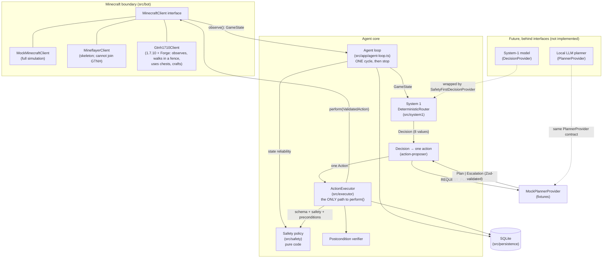

# Architecture

Milestone 1 is a **non-GPU foundation**: a typed, safety-first agent core that runs one
observe → decide → validate → execute → verify cycle against a mock Minecraft world.
There is no autonomous loop, no model, and no real server connection.

## Components



## Roles

| Component                                                        | Role                                                                                                                                                                                 | Authority                                                                                                                                                   |
| ---------------------------------------------------------------- | ------------------------------------------------------------------------------------------------------------------------------------------------------------------------------------ | ----------------------------------------------------------------------------------------------------------------------------------------------------------- |
| **MinecraftClient** (`src/bot`)                                  | The only boundary to the game. `observe()` returns a normalized `GameState`; `perform()` takes a `ValidatedAction` token.                                                            | Performs actions, but only ones minted by the executor (runtime-checked).                                                                                   |
| **Safety policy** (`src/safety`)                                 | Pure functions: state reliability, dangers, per-action rules, protected items, boundaries, forbidden-modification denylist, repeated-failure cap.                                    | **Veto over everything.** No model can override it.                                                                                                         |
| **Deterministic router** (`src/system1/deterministic-router.ts`) | System 1: prioritized, transparent rules that map a state to one of 8 bounded decisions, with confidence, reason codes and facts.                                                    | Chooses _what kind_ of step; cannot execute.                                                                                                                |
| **Future System-1 model**                                        | Optional small local classifier implementing `DecisionProvider`.                                                                                                                     | Must be wrapped in `SafetyFirstDecisionProvider`: safety-driven router decisions always win, invalid output becomes PAUSE.                                  |
| **Action proposer** (`src/system1/action-proposer.ts`)           | Turns one decision into exactly one allowlisted action (approaching a target first if it is out of reach).                                                                           | Proposes only.                                                                                                                                              |
| **Future LLM planner**                                           | Implements `PlannerProvider`: returns a strict `Plan` or an `Escalation`. Called only for `REQUEST_PLANNER`, and only when the task has no open plan.                                | **None.** Plans are validated and stored; one step per cycle goes through the executor like any other action. Plans that ask for approval wait for a human. |
| **ActionExecutor** (`src/executor`)                              | The single controlled path: schema → safety → preconditions → persist → execute → observe → verify → persist.                                                                        | Sole minter of `ValidatedAction` (lint-enforced).                                                                                                           |
| **Persistence** (`src/persistence`)                              | SQLite (better-sqlite3): tasks, checkpoints, plans with their progress, state snapshots, action logs, an append-only event log, safety violations, named locations, protected items. | Audit trail; failure history feeds the repeated-failure rule.                                                                                               |

## One cycle

1. Observe (or receive) a `GameState`; reject it if it fails schema validation.
2. Overlay agent memory (a paused/blocked task stays halted; last action) and persist a snapshot.
3. Hard safety check of the _state_: unknown, stale or inconsistent → forced `PAUSE_AND_ASK_USER`,
   whatever any decision provider says.
4. Ask the `DecisionProvider` (the deterministic router) for one decision.
5. Convert it to exactly one proposed action. For `REQUEST_PLANNER`: run the next step of the
   task's active plan; or, if its plan still waits for approval, pause; or else ask the planner for
   a new plan (see [Plans across cycles](#plans-across-cycles)).
6. Validate the action (schema, safety policy, preconditions) and persist the result.
7. Execute through `MinecraftClient.perform()` only if validation passed.
8. Observe again and verify the action's postcondition.
9. Persist the outcome; pause or block the task if needed. **Stop.**

## Live tasks

The live server knows nothing about the agent's tasks, so they come from agent memory
(`src/persistence/memory-repository.ts`, migration 003):

- `cli task-add` stores a task and makes it the **current task** (`agent_state.current_task`).
  Only live observations (`source: gtnh1710`) get it filled in. Mock scenarios share the database
  and never see it. A completed or failed task is never filled in.
- A plan the human wrote (`--plan`) goes through `validatePlan` exactly like a planner's plan. It
  is stored with planner `operator`, and when it completes it completes the task.
- Machines the task depends on (`--machines`, table `task_machines`) become the live state's
  `knownRecipeState.requiredMachineIds`, so System 1's machine rules apply:
  - busy or **not seen** → `WAIT_FOR_MACHINE`;
  - switched off (`error`) → pause;
  - unpowered → the planner;
  - otherwise the plan goes on.
    An unseen machine is never assumed ready. Right after connecting, GregTech's machine packets
    may not have arrived yet.
- **Container memory:** the loop records every container whose contents it sees (before and after
  each action). A later cycle, in a new connection with the chest closed, gets those contents back
  for `memory.containerContentsMaxAgeMs`, but only for the executor's feasibility checks. The live
  client re-reads the real contents before it clicks anything, and verification compares the
  remembered "before" with the live "after", so a chest changed by someone else shows up as a
  verification failure.

### Bounded auto-run

`src/app/live-session.ts` (`cli run --live`) runs ordinary cycles back to back on one connection
for the current task. It adds no decision logic and no checks of its own. It only decides whether
to start another cycle, and it continues only while each cycle:

- succeeded;
- asked for no attention;
- decided `REQUEST_PLANNER`, `EXECUTE_KNOWN_SAFE_STEP` or `WAIT_FOR_MACHINE` (task progress).

Anything else stops it: a finished task, a safety retreat, eating, upkeep, a pause, a failure,
the cycle or time cap, the stop file, Ctrl+C or a lost connection. There is still no open-ended
loop: every run is started by a human and bounded.

## Plans across cycles

A validated plan is stored in the `plans` table with its progress, so a multi-step plan advances one
step per cycle instead of being re-planned (and restarted) every cycle. A task has at most one open
plan; a newer plan supersedes it.

| Status             | Meaning                                                             | Next                                                                                                                                                                                                                                            |
| ------------------ | ------------------------------------------------------------------- | ----------------------------------------------------------------------------------------------------------------------------------------------------------------------------------------------------------------------------------------------- |
| `pending_approval` | The plan set `requiresUserApproval`. Nothing has run.               | The cycle pauses the task and asks. `plan-approve --task <id> --plan <n>` makes it `active` and resumes the task; `plan-reject` rejects it. Resuming the task alone does not approve it.                                                        |
| `active`           | Approved or not needing approval.                                   | Each cycle that reaches `REQUEST_PLANNER` proposes the next step; the executor validates it against the current state.                                                                                                                          |
| `completed`        | Every step executed and verified.                                   | The next `REQUEST_PLANNER` asks the planner again.                                                                                                                                                                                              |
| `failed`           | A step was rejected, or failed more than `maxRetriesPerStep` times. | Rejected step: the task is blocked. Exhausted retries: `REPLAN` leaves the task active (the next cycle asks the planner, with the failure history); `PAUSE_AND_ASK_USER` and `RETREAT_HOME` pause the task (there is no retreat directive yet). |
| `rejected`         | A human rejected it.                                                | After `task-resume`, the planner is asked for a new plan.                                                                                                                                                                                       |
| `superseded`       | Replaced by a newer plan for the same task.                         | Nothing.                                                                                                                                                                                                                                        |

Safety does not depend on the stored plan: every step is validated again, against the state of the
cycle that runs it, and the repeated-failure rule still applies across plans (a `REPLAN` that proposes
the same failing action is refused with `REPEATED_FAILURE`). Dangers, vitals and upkeep are routed
before the planner, so a plan simply waits while System 1 handles them.

## Walking

Walking is the live client's only world-changing ability (`src/bot/gtnh1710/walking.ts` plans and
checks; `Gtnh1710Client` sends). It needs `MC_ENABLE_MOVEMENT=true` **and** a fence: whole blocks
at the player's feet level, all on one level. Defence in depth:

1. The executor validates `MOVE_TO` / `RETURN_TO_SAFE_LOCATION` as usual: the target is inside the
   safety boundary, the target's surroundings were scanned, it keeps clear of known hazards, and
   the state is reliable.
2. The walker plans on the blocks the server sent: A* inside the fence (no corner cutting), then
   straight stretches where clear. A position is walkable only if every block the player's body
   touches is air, every block under it is a known full block, and nothing dangerous (or unloaded,
   or unnamed) touches those blocks. Stretches are checked exactly: the swept body, not samples.
3. Every 0.2-block step is re-checked just before it is sent (the world may have changed). The walk
   stops on a server correction, a health drop, a hostile/unidentified entity within
   `threatRadius` (not for a retreat, which is how the agent escapes one), the stop file, `halt()`
   (Ctrl+C) or a lost connection. After the last step it waits 5 ticks for a server correction
   before reporting success, and the executor then verifies the position.

The `move` command runs one such action for a human (origin `user`). The repeated-failure rule does
not apply to it (it is the human's decision each time), and its failures do not count against the
agent's own attempts.

## Chests

`OPEN_CONTAINER`, `WITHDRAW_ITEM` and `DEPOSIT_ITEM` work on configured vanilla chests
(`src/bot/gtnh1710/container.ts` plans; `Gtnh1710Client` sends). Three 1.7.10 facts shape the design:

- The server confirms an accepted click (S32) without sending the resulting slots, so the client
  must predict every click exactly.
- On a mismatch the server rejects the click and re-sends the whole window.
- Closing a window, or disconnecting, with items on the cursor DROPS them into the world.

So, in layers:

1. The executor validates as usual. The chest must be known storage within `interactionReach`,
   the item must not be protected, and there must be enough of it. A withdrawal also needs the
   chest's contents to be known, which they are only while the agent has it open, so
   `OPEN_CONTAINER` comes first.
2. The client opens only a configured chest whose block is `minecraft:chest` (never a trapped
   chest), with an empty hand, and accepts only a chest window (27 or 54 slots).
3. `planTransfer` builds the whole move from predictable clicks: pick up a stack, put it into an
   EMPTY slot, or place one item at a time into a slot it filled itself. It never merges into
   other stacks, so item stack limits never matter, and it never touches stacks with NBT data.
   It refuses up front when the move cannot finish exactly.
4. Clicks go one at a time, each waiting for the server's verdict. On a rejection the client
   acknowledges it, takes the server's re-sync, puts whatever is on the cursor back into an empty
   slot, and reports failure.
5. The window stays open so the executor can verify both sides (player −/+ exactly, chest +/−
   exactly). It closes only with an empty cursor.

`halt()`, the stop file and an ongoing walk also block chest use.

## Crafting

`CRAFT_ITEM` crafts with a recipe from the agent's table (`src/domain/recipes.ts`): 2x2 recipes in
the player's own grid (window 0), 3x3 at a configured crafting table. `src/bot/gtnh1710/crafting.ts`
plans; `Gtnh1710Client` sends. On top of the chest facts, 1.7.10 has three more
([evidence](gtnh-compatibility.md#crafting-2026-09-30)):

- The server never sends the crafting result slot as a slot update. Only a full window sync shows
  it, and the server sends one whenever it rejects a click.
- Taking the result puts the whole stack on the cursor and takes one item from every grid slot.
- Closing a window, closing the inventory itself, or leaving the server DROPS whatever is in the
  grid, like the cursor.

GTNH changes many vanilla recipes, so the table is never trusted blindly. In layers:

1. The executor validates as usual. Every ingredient kind the recipe may use must be unprotected,
   the inventory must hold enough, and a 3x3 recipe needs a known table within `interactionReach`.
   The postcondition is derived from the table: the result +count × times, each ingredient group
   −cells × times, and nothing else changed.
2. The client plans the whole action on its view of the inventory and refuses before anything is
   opened or clicked when it cannot finish exactly. Window 0 is clicked only with no other window
   open. A table opens only if it is configured and its block is a `minecraft:crafting_table`, with
   an empty hand.
3. Each craft:
   - **Fill:** one item into every pattern cell, with predictable clicks (pick up a stack, place one
     item per empty cell, put the rest back).
   - **Sync:** a left-click on an empty slot with an empty cursor, claiming a stack that slot cannot
     hold. The server rejects it and re-sends the window. Every slot must match the client's
     prediction.
   - **Check:** the result slot must show exactly the expected item and count, without NBT data.
     Otherwise nothing is taken and the action fails with what the server showed, so the operator
     learns the real recipe.
   - **Take** the result with one click (cursor gets it; every grid slot −1), then **store** it in an
     EMPTY slot. Results are never merged into other stacks, because their stack limits are unknown.
4. Any failure first returns the grid and the cursor to the inventory: onto the stack an item came
   from while that stays within a size the stack has already had, otherwise into an empty slot.
   Then a sync confirms. A final sync confirms success too.
5. The grid only ever holds one craft's worth of items. A table is closed afterwards, and never with
   items in its grid or on the cursor. `outbound.closeWindow(0)` is refused outright: it would drop
   the 2x2 grid.
6. `disconnect()` first returns anything a crafting grid or the cursor still holds.

`halt()` and the stop file stop crafting between crafts. Walking, chests and crafting exclude each
other, and walking is refused while items are on the cursor or in a crafting grid: walking away
closes a window server-side.

## Why code, not AI, enforces safety

- **Determinism and auditability.** A rule like "never deposit a protected item" must hold every
  time. Code does that; a model may not, especially under unusual state or adversarial text
  (item names, sign text or chat can all reach a model's context).
- **Fail-closed by construction.** The executor accepts `unknown` input and rejects anything that is
  not a schema-valid, allowlisted action. There is no path where a model output is "trusted".
- **Testability.** Every safety rule has unit tests (`tests/safety`). A model's behaviour
  cannot be exhaustively tested.
- **Separation of powers.** Models only _propose_ (a decision enum or a plan). The executor
  alone acts, and only through a token it mints after validation.

## Enforced boundaries

| Boundary                           | Enforcement                                                                                                                                                                                                                                                                                                                                                                                                                                                                              |
| ---------------------------------- | ---------------------------------------------------------------------------------------------------------------------------------------------------------------------------------------------------------------------------------------------------------------------------------------------------------------------------------------------------------------------------------------------------------------------------------------------------------------------------------------- |
| No shell / process spawning        | ESLint `no-restricted-imports` bans `child_process` everywhere.                                                                                                                                                                                                                                                                                                                                                                                                                          |
| Only adapters touch the network    | ESLint bans socket/HTTP imports (`node:net` connect/servers, `tls`, `dgram`, `http(s)`) outside `src/bot/`.                                                                                                                                                                                                                                                                                                                                                                              |
| Live client                        | `Gtnh1710Client` can only emit the packet builders in `src/bot/gtnh1710/packets.ts` (handshake, login, keep-alive, FML handshake, idle ticks, echoes of server positions, walking steps and window packets: empty-hand activation, hotbar selection, clicks, confirmations, closing (not window 0)). Walking needs `MC_ENABLE_MOVEMENT=true` and a fence; chests `MC_ENABLE_CONTAINERS=true`; crafting `MC_ENABLE_CRAFTING=true`; other world-changing actions return `NOT_IMPLEMENTED`. |
| Operator tools stay outside        | `scripts/test-server-admin.ts` (RCON, operator rights on the test server) is the only script allowed sockets, and nothing in `src/` may import from `scripts/` (lint).                                                                                                                                                                                                                                                                                                                   |
| Mineflayer isolated to the adapter | ESLint bans importing `mineflayer` outside `src/bot/mineflayer-client.ts`; the adapter imports it lazily.                                                                                                                                                                                                                                                                                                                                                                                |
| Only the executor performs actions | `mintValidatedAction` is lint-restricted to `src/executor/action-executor.ts`; clients call `assertValidatedAction()`, which rejects any object not minted (a `WeakSet` check), and tokens are deep-frozen copies.                                                                                                                                                                                                                                                                       |
| Private servers only               | Config rejects public IPs and non-allowlisted hostnames; the adapter re-checks DNS resolution before connecting and refuses unless `enableLiveConnection` is true.                                                                                                                                                                                                                                                                                                                       |
| One action per cycle               | `runSingleCycle` has no loop.                                                                                                                                                                                                                                                                                                                                                                                                                                                            |

## Directory map

```
src/config       env + JSON config loading (Zod), private-network guard
src/domain       schemas/types: GameState, actions, tasks, safety, decisions, Known<T>
src/safety       safety policy, boundaries, protected items, forbidden-action classifier
src/system1      router, decision providers, action proposer
src/planner      plan schema, validator, planner interface, mock planner
src/bot          MinecraftClient interface, mock client, gtnh1710/ live client (observe; walk in a fence; chests; crafting), Mineflayer skeleton
src/executor     executor, preconditions, verifier, action log
src/persistence  SQLite open/migrate, repositories, migrations
src/app          agent loop, mock scenarios, CLI
```
