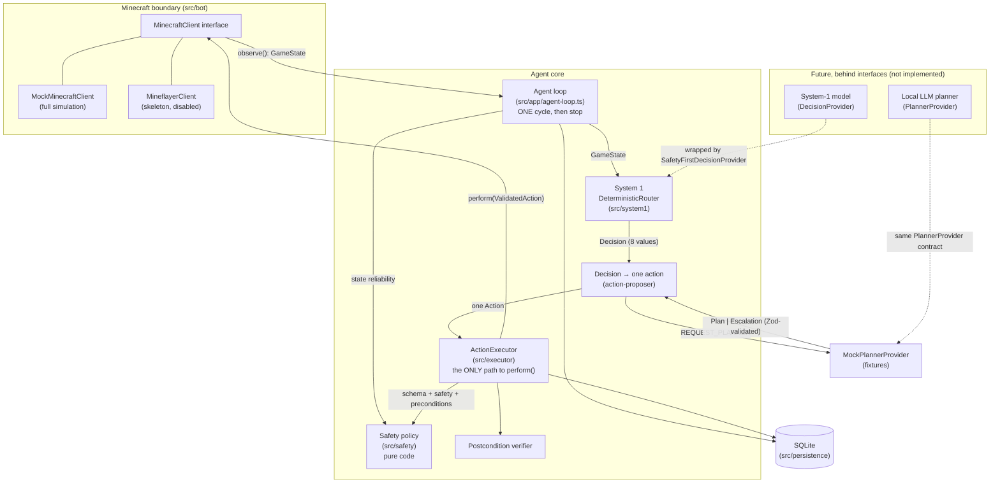

# Architecture

Milestone 1 is a **non-GPU foundation**: a typed, safety-first agent core that runs one
observe → decide → validate → execute → verify cycle against a mock Minecraft world.
There is no autonomous loop, no model, and no real server connection.

## Components



## Roles

| Component                                                        | Role                                                                                                                                                      | Authority                                                                                                                     |
| ---------------------------------------------------------------- | --------------------------------------------------------------------------------------------------------------------------------------------------------- | ----------------------------------------------------------------------------------------------------------------------------- |
| **MinecraftClient** (`src/bot`)                                  | The only boundary to the game. `observe()` returns a normalized `GameState`; `perform()` takes a `ValidatedAction` token.                                 | Performs actions, but only ones minted by the executor (runtime-checked).                                                     |
| **Safety policy** (`src/safety`)                                 | Pure functions: state reliability, dangers, per-action rules, protected items, boundaries, forbidden-modification denylist, repeated-failure cap.         | **Veto over everything.** No model can override it.                                                                           |
| **Deterministic router** (`src/system1/deterministic-router.ts`) | System 1: prioritized, transparent rules that map a state to one of 8 bounded decisions, with confidence, reason codes and facts.                         | Chooses _what kind_ of step; cannot execute.                                                                                  |
| **Future System-1 model**                                        | Optional small local classifier implementing `DecisionProvider`.                                                                                          | Must be wrapped in `SafetyFirstDecisionProvider`: safety-driven router decisions always win, invalid output becomes PAUSE.    |
| **Action proposer** (`src/system1/action-proposer.ts`)           | Turns one decision into exactly one allowlisted action (approaching a target first if it is out of reach).                                                | Proposes only.                                                                                                                |
| **Future LLM planner**                                           | Implements `PlannerProvider`: returns a strict `Plan` or an `Escalation`. Called only for `REQUEST_PLANNER`.                                              | **None.** Plans are validated; only step 1 can be proposed per cycle, and it goes through the executor like any other action. |
| **ActionExecutor** (`src/executor`)                              | The single controlled path: schema → safety → preconditions → persist → execute → observe → verify → persist.                                             | Sole minter of `ValidatedAction` (lint-enforced).                                                                             |
| **Persistence** (`src/persistence`)                              | SQLite (better-sqlite3): tasks, checkpoints, state snapshots, action logs, an append-only event log, safety violations, named locations, protected items. | Audit trail; failure history feeds the repeated-failure rule.                                                                 |

## One cycle

1. Observe (or receive) a `GameState`; reject it if it fails schema validation.
2. Overlay agent memory (a paused/blocked task stays halted; last action) and persist a snapshot.
3. Hard safety check of the _state_: unknown, stale or inconsistent → forced `PAUSE_AND_ASK_USER`,
   whatever any decision provider says.
4. Ask the `DecisionProvider` (the deterministic router) for one decision.
5. Convert it to exactly one proposed action (consulting the planner for `REQUEST_PLANNER`).
6. Validate the action (schema, safety policy, preconditions) and persist the result.
7. Execute through `MinecraftClient.perform()` only if validation passed.
8. Observe again and verify the action's postcondition.
9. Persist the outcome; pause or block the task if needed. **Stop.**

## Why code, not AI, enforces safety

- **Determinism and auditability.** A rule like "never deposit a protected item" must hold every
  time. Code does that; a model may not, especially under unusual state or adversarial text
  (item names, sign text or chat can all reach a model's context).
- **Fail-closed by construction.** The executor accepts `unknown` input and rejects anything that is
  not a schema-valid, allowlisted action. There is no path where a model output is "trusted".
- **Testability.** Every safety rule has unit tests (`tests/safety`). A model's behaviour
  cannot be exhaustively tested.
- **Separation of powers.** Models only _propose_ (a decision enum or a plan). The executor
  alone acts, and only through a token it mints after validation.

## Enforced boundaries

| Boundary                           | Enforcement                                                                                                                                                                                                        |
| ---------------------------------- | ------------------------------------------------------------------------------------------------------------------------------------------------------------------------------------------------------------------ |
| No shell / process spawning        | ESLint `no-restricted-imports` bans `child_process` everywhere.                                                                                                                                                    |
| Mineflayer isolated to the adapter | ESLint bans importing `mineflayer` outside `src/bot/mineflayer-client.ts`; the adapter imports it lazily.                                                                                                          |
| Only the executor performs actions | `mintValidatedAction` is lint-restricted to `src/executor/action-executor.ts`; clients call `assertValidatedAction()`, which rejects any object not minted (a `WeakSet` check), and tokens are deep-frozen copies. |
| Private servers only               | Config rejects public IPs and non-allowlisted hostnames; the adapter re-checks DNS resolution before connecting and refuses unless `enableLiveConnection` is true.                                                 |
| One action per cycle               | `runSingleCycle` has no loop.                                                                                                                                                                                      |

## Directory map

```
src/config       env + JSON config loading (Zod), private-network guard
src/domain       schemas/types: GameState, actions, tasks, safety, decisions, Known<T>
src/safety       safety policy, boundaries, protected items, forbidden-action classifier
src/system1      router, decision providers, action proposer
src/planner      plan schema, validator, planner interface, mock planner
src/bot          MinecraftClient interface, mock client, Mineflayer skeleton
src/executor     executor, preconditions, verifier, action log
src/persistence  SQLite open/migrate, repositories, migrations
src/app          agent loop, mock scenarios, CLI
```
